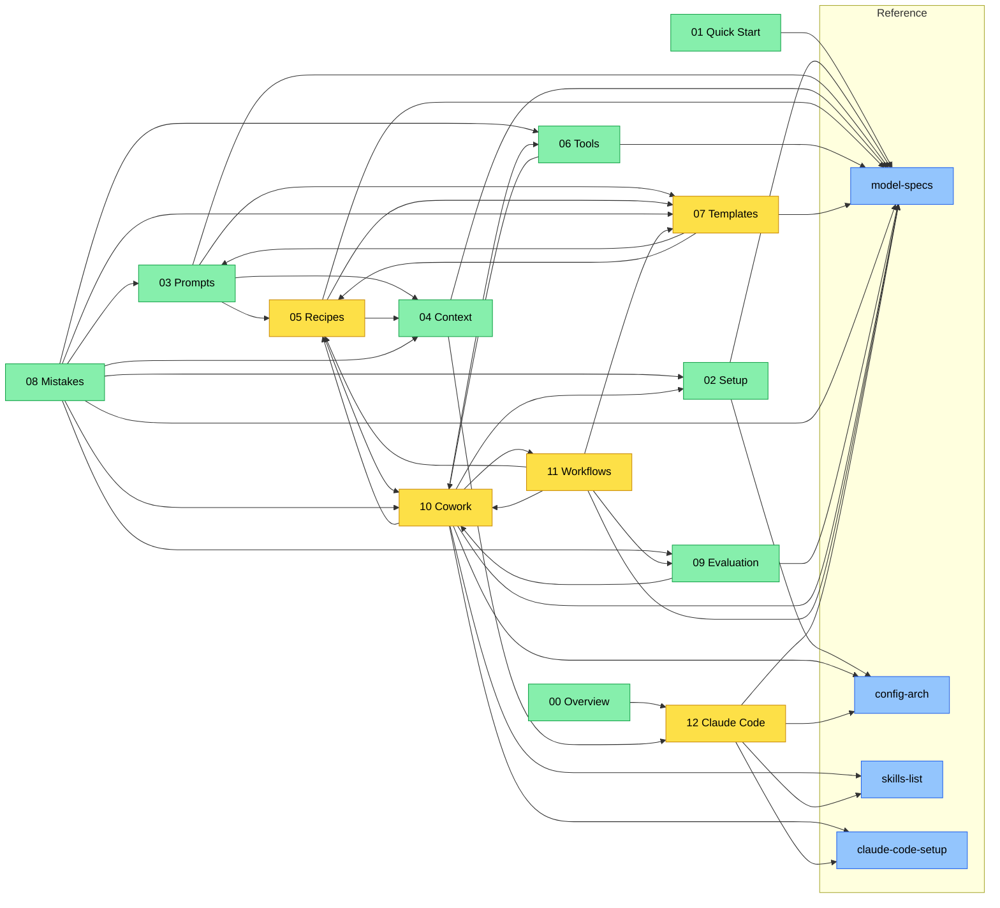

# Claude Guide cho Kỹ sư Phenikaa-X

**Version:** xem [VERSION](../VERSION) | **Cập nhật:** 2026-03-04
**Claude models:** Opus 4.6 / Sonnet 4.6 / Haiku 4.5

---
depends-on: [12-claude-code-documentation]
impacts: []
---

## Giới thiệu

Tài liệu này hướng dẫn sử dụng Claude AI hiệu quả cho công việc kỹ thuật hàng ngày -- từ viết prompt cơ bản đến quản lý context trong conversation dài, từ tạo tài liệu chuyên nghiệp đến phân tích lỗi hệ thống.

**Đối tượng chính:** Kỹ sư tự động hóa, R&D, Robotics tại Phenikaa-X (AMR, ROS, SLAM, Lidar).

**Đối tượng mở rộng:** Bất kỳ kỹ sư kỹ thuật nào muốn sử dụng Claude hiệu quả.

---

## Cấu trúc 13 Modules

| Module | Tên | Mô tả | Mức độ |
|--------|-----|-------|--------|
| **00** | Overview (file này) | Mục lục, learning paths, conventions | -- |
| **01** | Quick Start | Bắt đầu với Claude trong 15 phút | Beginner |
| **02** | Setup & Personalization | Projects, Styles, Memory, MCP | Beginner-Intermediate |
| **03** | Prompt Engineering | 6 nguyên tắc, 7 kỹ thuật, Module System | Intermediate |
| **04** | Context Management | Context Window, Drift, Handover | Intermediate |
| **05** | Workflow Recipes | 14 quy trình copy-paste | Intermediate |
| **06** | Tools & Features | Cheat sheet tính năng Claude | Beginner-Intermediate |
| **07** | Template Library | 22 templates T-01 đến T-22 | Mọi level |
| **08** | Mistakes & Fixes | 6 nhóm lỗi phổ biến và cách sửa | Beginner-Intermediate |
| **09** | Evaluation Framework | Đánh giá chất lượng output | Intermediate |
| **10** | Claude Desktop & Cowork | Cowork mode, Folder Instructions, Scheduled Tasks | Beginner-Intermediate |
| **11** | Cowork Workflows Library | 12 workflows copy-paste cho Cowork | Intermediate |
| **12** | Claude Code cho Documentation | Claude Code workflow, setup, Skills, subagents cho technical writing | Intermediate |

---

### Dependency Graph



**Legend:** 🟢 Core modules | 🔵 Reference files | 🟡 Workflow modules

---

## 3 Learning Paths

### Path A: Người mới bắt đầu (1-2 giờ)

Chưa từng dùng Claude hoặc mới dùng vài lần.

```
01 Quick Start (15 phút)
    |
02 Setup & Personalization (20 phút)
    |
07 Template Library (tra cứu khi cần)
    |
08 Mistakes & Fixes (15 phút)
```

**Kết quả:** Biết cách dùng Claude cơ bản, đã setup workspace, có templates sẵn sàng dùng.

> **Nếu dùng Claude Desktop:** Thêm Module 10 (Claude Desktop & Cowork) sau Module 02.

### Path B: Người muốn nâng cao (2-3 giờ)

Đã dùng Claude, muốn hiệu quả hơn.

```
03 Prompt Engineering (25 phút)
   → đặc biệt mục 3.5 (Task Decomposition) cho workflow nhiều bước
    |
04 Context Management (15 phút)
    |
05 Workflow Recipes (25 phút)
    |
09 Evaluation Framework (10 phút)
```

**Kết quả:** Viết prompt chuyên nghiệp, quản lý conversation dài, có quy trình cho từng loại task.

### Path C: Tra cứu nhanh (khi cần)

Đã nắm cơ bản, cần tìm thông tin cụ thể.

```
06 Tools & Features -- tra cứu tính năng
07 Template Library -- tìm template phù hợp
08 Mistakes & Fixes -- khi gặp vấn đề
```

> **Nếu dùng Claude Code:** Thêm [Module 12: Claude Code cho Documentation](12-claude-code-documentation.md) sau Module 10/11.

---

## Conventions trong tài liệu

### Nguồn trích dẫn

| Marker | Nghĩa |
|--------|-------|
| [Nguồn: Anthropic Docs] + URL | Thông tin từ tài liệu chính thức Anthropic |
| [Ứng dụng Kỹ thuật] | Ví dụ ứng dụng nguyên tắc chính thức vào bối cảnh Phenikaa-X |
| [Cập nhật MM/YYYY] | Thông tin mới hoặc thay đổi so với version trước |

### Format

- **Tiếng Việt** là ngôn ngữ chính, thuật ngữ kỹ thuật giữ **tiếng Anh**
- `{{variable_name}}` -- placeholder cần thay bằng giá trị thực
- XML tags trong code blocks -- copy-paste vào Claude
- Mermaid diagrams -- flowcharts và decision trees (hiển thị tốt trên các Markdown viewers hỗ trợ)
- Tables -- so sánh, tra cứu nhanh

### Ký hiệu trạng thái

- BAD/GOOD -- so sánh prompt kém vs tốt
- CẢNH BÁO -- thông tin safety quan trọng
- LƯU Ý -- tips và best practices

### Icon và Emoji

- Tài liệu này chỉ sử dụng icons trong allowlist: ⚠️ ✅ ❌ 🔴 🟡 🟢 🔵
- Icons chỉ xuất hiện trong bảng status và warning markers
- Prose dùng Obsidian callouts: `> [!WARNING]`, `> [!TIP]`, `> [!NOTE]`, `> [!IMPORTANT]`

---

## Thông tin cập nhật

### Version 7.0 (03/2026)

- **Thêm Module 12:** Claude Code cho Documentation & Technical Writing — 15 sections hướng dẫn CC workflow cho non-coding documentation (Plan Mode, Skills, Subagents, Git Integration, Batch & Automation, Plugins & MCP)
- **Thêm reference/claude-code-setup.md:** Cheat sheet workflow-first cho Claude Code — Quick Setup, Essential Commands, Permission Templates
- **Thêm skill upgrade-guide:** Scan stale data, broken refs, dependency issues trước update cycle
- **Thêm metadata depends-on/impacts:** Block dependency cho 13 modules — hỗ trợ cross-ref checking tự động
- **Thêm Mermaid dependency graph:** Module 00 — visualization 13 modules + 4 reference files
- **Terminology standardization:** Claude Code → CC (viết tắt sau first mention), Skills capitalization, model name prefix nhất quán
- **Module count fix:** Cập nhật "11/12 module files" → "13" across modules 00, 04, 10
- Bump version từ 6.0

> **Migration notes:** Đây là major version — thêm Module 12 (mới hoàn toàn) và reference/claude-code-setup.md. Thuật ngữ "Claude Code" giờ viết tắt "CC" sau first mention per section trong modules 10, 12, và reference files. "Skills" viết hoa khi nhắc đến feature name. Không có breaking changes về cấu trúc modules 00–11.

### Version 6.0 (03/2026)

- **Phase 4 Full Rewrite:** Rewrite toàn bộ ví dụ trong Modules 03, 05, 07, 08, 11 sang doc context thực tế (AMR, ROS, SLAM, Lidar)
- Thêm AMR tips, Model tips, Skill tips cho tất cả ví dụ và templates
- Module 05: rewrite 14 recipes theo hybrid pattern (doc context + tips)
- Module 07: thêm doc context + tips cho 22 templates T-01 đến T-22
- Module 11: thêm hybrid pattern cho 12 Cowork workflows (11.1–11.12)
- Cross-module fix: thêm language tags cho code blocks, link tất cả cross-refs (03, 05, 07, 08, 11)
- Thêm Skill-Recipe Mapping vào skills-list.md

> **Migration notes:** Đây là major rewrite — ví dụ trong 5 modules chuyển từ generic sang doc context Phenikaa-X. Cross-references giờ là clickable links thay vì text-only. Không có breaking changes về cấu trúc modules.

- Bump version từ 5.1

### Version 5.1 (03/2026)

- Thêm reference/model-specs.md — bảng so sánh Opus/Sonnet/Haiku với decision guide
- Thêm cột Audience (maintainer/end-user/both) và badge [Approved PX] vào skills-list
- Thêm cột Trust và section Khuyến nghị cài đặt vào skills-list
- Cập nhật headers 11 modules: link model-specs.md thay vì hardcode model names
- Thêm Icon & Emoji Rules vào CLAUDE.md, overview, release-checklist
- Xóa emoji vi phạm trong config-architecture.md
- Bump version từ 5.0

### Version 5.0 (03/2026)

- Thêm Module 11: Cowork Workflows Library — 12 workflows copy-paste cho AMR engineering (SOP từ notes, batch review, báo cáo tuần, Word↔Markdown, glossary enforcement, training materials, extract data PDF, tổ chức folder, release notes, meeting prep, incident report, diff report)
- Refactor Module 10: thêm §10.5 Scheduled Tasks, §10.14 Desktop Commander & Cross-session Memory, §10.15 Customize Tab, §10.17 Security Best Practices, §10.18 Troubleshooting — mở rộng từ 13 lên 18 sections
- Currency sweep Modules 05, 06, reference/skills-list: cập nhật model names (Sonnet 4.6 / Opus 4.6), enterprise plugins, skills mới
- Thêm `machine-readable/llms.txt` — machine-readable index theo convention Florian Bruniaux cho AI crawlers
- Update CLAUDE.md và project-state.md: phản ánh v5.0 scope, 12 modules, 2-tier architecture
- Cross-ref fixes: Module 00 thêm Module 11 vào table và file tree, Module 10 "Tiếp theo" section thêm link Module 11
- Bump version từ 4.2

### Version 4.2 (03/2026)

- Fix 12 Medium issues Sprint 3 (M-01, M-04, M-06–M-08, M-11, M-13, M-14, M-16–M-18): guide/05, guide/07, guide/08, guide/10, ref/skills-list
- Fix 12 accuracy/terminology issues Sprint 2 (8H + 4M): guide/00, guide/01, guide/03, guide/06, guide/08, guide/10, ref/skills-list
- Audit cycle hoàn tất: 24/25 issues resolved (9 Critical + 14 High + 12 Medium) — overall health 7.2 → 8.3/10
- Update CLAUDE.md: sửa module status, thêm Thinking terminology rule (Extended thinking ≠ Adaptive Thinking), cập nhật folder structure, skills/commands list
- Xóa `.claude/worktrees/` orphan artifact, dọn `_scaffold/memory-starter/` deprecated folder
- Sửa stale references: ET/AT terminology, Extended thinking UI setting vs API feature, deprecated session-state.md references
- Thêm deprecation notes cho config-architecture.md (session-state template)
- Bump version từ 4.1

> Lịch sử đầy đủ từ v3.0: xem [CHANGELOG.md](../CHANGELOG.md)

### Kiểm tra thông tin mới

Thông tin về Claude thay đổi nhanh. Luôn kiểm tra nguồn chính thức:

| Nguồn | URL | Nội dung |
|-------|-----|---------|
| Anthropic Docs | https://docs.anthropic.com | API docs, model specs, prompting guides |
| Anthropic Help Center | https://support.anthropic.com | Claude.ai features, troubleshooting |
| Anthropic News | https://www.anthropic.com/news | Announcements, new features |
| Models Overview | https://docs.anthropic.com/en/docs/about-claude/models/overview | Model specs mới nhất |

---

## Files trong bộ tài liệu

> **Cấu trúc dự án đầy đủ:** xem tại root `README.md`.

```
Guide Claude/
├── guide/                        ← 13 module files
│   ├── 00-overview.md            (file này) Mục lục, learning paths, conventions
│   ├── 01-quick-start.md         Quick Start 15 phút
│   ├── 02-setup-personalization.md   Setup & Personalization
│   ├── 03-prompt-engineering.md  Prompt Engineering (6 nguyên tắc, 7 kỹ thuật)
│   ├── 04-context-management.md  Context Management
│   ├── 05-workflow-recipes.md    Workflow Recipes (14 recipes)
│   ├── 06-tools-features.md      Tools & Features Cheat Sheet
│   ├── 07-template-library.md    Template Library (T-01 đến T-22)
│   ├── 08-mistakes-fixes.md      Mistakes & Fixes (6 nhóm lỗi)
│   ├── 09-evaluation-framework.md    Evaluation Framework
│   ├── 10-claude-desktop-cowork.md   Claude Desktop & Cowork
│   ├── 11-cowork-workflows.md    Cowork Workflows Library (12 workflows)
│   ├── 12-claude-code-documentation.md  Claude Code cho Documentation
│   └── reference/                Tài liệu tham chiếu bổ sung
│
├── .claude/                      ← Infrastructure (cho tác giả)
│   ├── CLAUDE.md                 Folder Instructions — Project context & rules
│   ├── settings.json             Hooks (SessionStart)
│   ├── commands/                 Slash commands (/start, /checkpoint...)
│   └── skills/                   Skills on-demand cho documentation workflow
│
├── _scaffold/                    ← Starter templates cho project Cowork mới
│   ├── README-scaffold.md        Hướng dẫn setup
│   ├── CLAUDE-template.md        Template Folder Instructions
│   ├── project-state-template.md Template context transfer doc
│   ├── VERSION                   Giá trị khởi đầu "1.0"
│   ├── skill-templates/          Template tạo skill mới (tham khảo)
│   ├── project-instructions/     Templates cho claude.ai Project Instructions
│   └── global-instructions/      Template Global CLAUDE.md cho Cowork
│
├── project-state.md              ← Project overview (cho người đọc)
└── VERSION                       ← Version number (single source of truth)
```

---

**Bắt đầu:** Nếu bạn mới, đọc Module 01. Nếu đã quen Claude, đọc Module 03.
