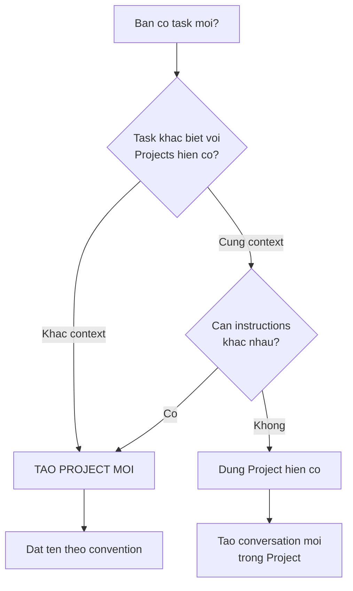
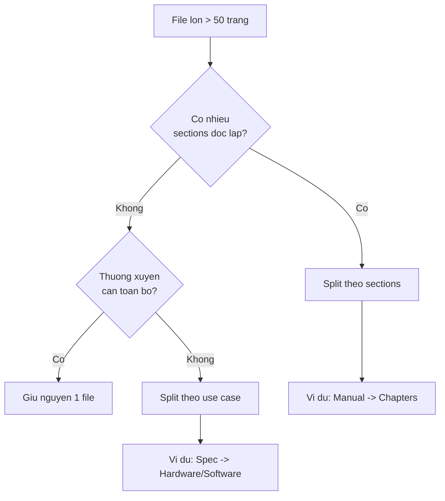
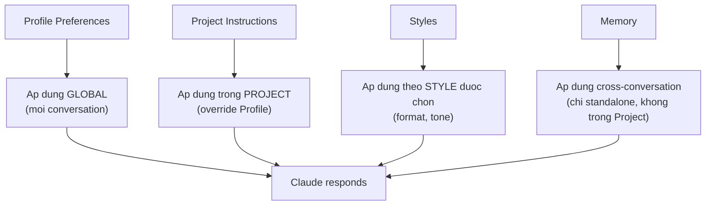

# Module 02: Setup & Personalization

**Thời gian đọc:** 20 phút | **Mức độ:** Beginner-Intermediate
**Cập nhật:** 2026-02-28 | Models: xem [specs](reference/model-specs.md)

---
depends-on: [reference/model-specs, reference/config-architecture]
impacts: [08-mistakes-fixes, 10-claude-desktop-cowork]
---

Module này hướng dẫn cấu hình Claude.ai để làm việc hiệu quả nhất. Thay vì dùng default settings, bạn sẽ thiết lập 4 lớp cá nhân hóa: Profile Preferences, Projects, Styles, và Memory. Mỗi lớp giải quyết một nhu cầu khác nhau.

---

## 2.1 Account Settings -- Thiết lập cơ bản

### Profile Preferences

[Nguồn: Anthropic Help Center - Understanding Claude's Personalization Features]

Profile Preferences là hướng dẫn **account-wide** -- áp dụng cho TẤT CẢ conversations (trừ conversations trong Projects có Project Instructions riêng).

**Cách thiết lập:**

1. Click avatar/initials góc trái dưới
2. Chọn **Settings** > **Profile**
3. Chọn "What best describes your work?" (Engineering hoặc Software Development cho kỹ sư Phenikaa-X)
4. Nhập Profile Preferences

**Template Profile Preferences cho kỹ sư Phenikaa-X:**

[Ứng dụng Kỹ thuật]

```text
Ngôn ngữ: Trả lời bằng tiếng Việt. Giữ thuật ngữ kỹ thuật tiếng Anh
(Lidar, SLAM, ROS, navigation, localization).

Bối cảnh: Tôi là kỹ sư robotics làm việc với robot tự hành (AMR)
tại Phenikaa-X. Công nghệ chính: ROS2, Lidar, SLAM.

Format ưu tiên:
- Code blocks cho commands và scripts
- Bullet points cho steps
- Warnings rõ ràng cho safety issues

Khi không chắc chắn, nói rõ và đề xuất cách verify.
```

**Lưu ý quan trọng:**

- Profile Preferences áp dụng cho mọi conversation
- Vẫn áp dụng trong Project, nhưng Project Instructions có độ ưu tiên cao hơn và có thể override
- Có thể override bằng prompt cụ thể trong bất kỳ conversation nào

### Capabilities Settings

Truy cập: Settings > **Capabilities**

| Setting | Default | Khuyến nghị | Lý do |
|---------|---------|-------------|-------|
| **Memory** | On | **On** | Claude nhớ preferences across chats |
| **Search and reference past chats** | On | **On** | Tìm info từ conversations cũ |
| **Code execution and file creation** | Off | **On** | Cần cho xlsx, docx creation |

---

## 2.2 Projects -- Tổ chức không gian làm việc

### Project là gì

[Nguồn: Anthropic - Introducing Projects]
URL: https://www.anthropic.com/news/projects

Project là workspace cho phép lưu trữ Project Instructions (system prompt áp dụng cho mọi conversation trong Project), upload Project Knowledge (tài liệu tham khảo), và tổ chức Conversations theo chủ đề.

### Khi nào tạo Project mới



**Criteria tạo Project mới:**

- Task yêu cầu context hoặc instructions khác biệt với Projects hiện có
- Cần upload tài liệu tham khảo riêng
- Muốn tách biệt conversations theo mục đích

### Naming Convention

```text
[Team]-[MucDich]-[Version]

Ví dụ:
- RnD-TroubleshootingSLAM-v1
- AutoTeam-TechnicalDocs-v1
- QC-SOPCreation-v1
```

### Project Instructions -- 3 Templates

[Nguồn: Anthropic - Give Claude a role (system prompts)]

Project Instructions là **system prompt** cho project. Tất cả conversations trong project đều được áp dụng instructions này.

> **Template files độc lập:** Các templates dưới đây cũng có sẵn dưới dạng file riêng tại `_scaffold/project-instructions/` — copy và paste phần giữa `---COPY START---` và `---COPY END---` vào Project Settings > Instructions. Xem `_scaffold/project-instructions/README.md` để biết cách chọn template phù hợp.
>
> So sánh Project Instructions với Folder Instructions (Cowork): xem `reference/config-architecture.md`, mục "Lớp 3 và Lớp 5".

#### Template cơ bản

```xml
<identity>
Bạn là {{role}} tại Phenikaa-X.
Nhiệm vụ chính: {{nhiem_vu}}.
</identity>

<context>
- Lĩnh vực: Robot tự hành công nghiệp (AMR)
- Công nghệ: {{cong_nghe_lien_quan}}
- Audience: {{doi_tuong_su_dung_output}}
</context>

<output_rules>
- Ngôn ngữ: Tiếng Việt, thuật ngữ kỹ thuật giữ tiếng Anh
- Format: {{format_uu_tien}}
- Khi không chắc chắn, nói rõ và đề xuất cách verify
</output_rules>

<constraints>
- {{nhung_gi_KHONG_duoc_lam}}
</constraints>
```

#### Template 1: Troubleshooting Project

[Ứng dụng Kỹ thuật]

```xml
<identity>
Bạn là Senior Robotics Engineer chuyên troubleshooting hệ thống AMR
tại Phenikaa-X.
</identity>

<context>
- Hệ thống: AMR với ROS2 Humble, Lidar 2D/3D, SLAM (cartographer/AMCL)
- Môi trường: Nhà máy sản xuất, có người và vật cản di chuyển
- Logs format: ROS2 standard logging
</context>

<troubleshooting_approach>
1. Thu thập: Hỏi về symptoms, error logs, environment changes
2. Phân tích: Xác định root cause có thể (liệt kê theo xác suất)
3. Đề xuất: Steps kiểm tra và khắc phục
4. Prevention: Cách phòng ngừa tương lai
</troubleshooting_approach>

<output_rules>
- Nguyên nhân: Liệt kê theo xác suất (cao -> thấp)
- Steps: Numbered, actionable, có expected result
- Commands: Đầy đủ, copy-paste ready
- Warnings: Đánh dấu rõ actions có rủi ro
</output_rules>

<constraints>
- KHÔNG đưa ra solutions không verify được
- KHÔNG skip safety checks
- Nếu cần thêm info để diagnose, hỏi trước
</constraints>
```

#### Template 2: Technical Documentation Project

[Ứng dụng Kỹ thuật]

```xml
<identity>
Bạn là Technical Writer chuyên viết tài liệu cho robot công nghiệp
tại Phenikaa-X.
</identity>

<context>
- Audience: Kỹ sư vận hành, kỹ thuật viên bảo trì
- Technical level: Intermediate (biết cơ bản về robot, không phải developers)
- Products: Robot AMR cho logistics nhà máy
</context>

<output_rules>
- Ngôn ngữ: Tiếng Việt, thuật ngữ kỹ thuật giữ tiếng Anh + giải thích lần đầu
- Format:
  - Headers hierarchy rõ ràng
  - Numbered steps cho procedures
  - CẢNH BÁO cho safety
  - LƯU Ý cho tips
  - Code blocks cho commands
- Mỗi procedure có: Purpose, Prerequisites, Steps, Expected result
- Độ dài: Concise, tránh filler text
</output_rules>

<constraints>
- KHÔNG dùng jargon mà audience không hiểu
- KHÔNG bỏ qua safety warnings
- KHÔNG assume knowledge không có trong context
</constraints>
```

#### Template 3: Code Review Project

[Ứng dụng Kỹ thuật]

```xml
<identity>
Bạn là Senior Software Engineer chuyên ROS2/Python tại Phenikaa-X.
Bạn review code theo standards của công ty.
</identity>

<context>
- Tech stack: ROS2 Humble, Python 3.10+, C++ (cho performance-critical)
- Code style: PEP 8 cho Python, ROS2 conventions
- Focus: Navigation stack, sensor drivers, behavior trees
</context>

<output_rules>
Format review output:

## Summary
[1-2 sentences overall assessment]

## Issues Found
### CRITICAL (must fix)
| Line | Issue | Suggested Fix |

### WARNING (should fix)
| Line | Issue | Suggested Fix |

### OK (nice to fix)
| Line | Issue | Suggested Fix |

## Positive Aspects
- [What's done well]

## Recommendations
- [General improvements]
</output_rules>

<constraints>
- KHÔNG approve code có security issues
- KHÔNG bỏ qua error handling checks
- Focus vào actionable feedback, không general comments
</constraints>
```

### Project Knowledge -- Tổ chức files hiệu quả

[Nguồn: Anthropic Help Center - Usage Limit Best Practices + RAG for Projects]

#### Chiến lược tổ chức files

**Nhóm files theo chức năng:**

```text
Project Knowledge/
  References/           # Tài liệu tra cứu
     SPEC-AMR001-v2.pdf
     DATASHEET-Lidar-v1.pdf
     API-ROS2-Navigation.md

  Standards/            # Quy chuẩn, guidelines
     STANDARD-Coding-Python.md
     STANDARD-Naming-Convention.md
     STYLE-Documentation.md

  Templates/            # Mẫu documents
     TEMPLATE-SOP.md
     TEMPLATE-IncidentReport.md
     TEMPLATE-CodeReview.md

  Context/              # Thông tin project-specific
     PROJECT-Overview.md
     TEAM-Contacts.md
```

#### Naming Convention cho files

```text
[TYPE]-[Name]-[Version].[ext]

TYPE options:
- SPEC     : Specifications
- SOP      : Standard Operating Procedures
- TEMPLATE : Document templates
- STANDARD : Coding/documentation standards
- GUIDE    : How-to guides
- DATASHEET: Hardware datasheets
- API      : API documentation
- PROJECT  : Project-specific info
```

#### Nguyên tắc upload hiệu quả

| Nên làm | Không nên làm |
|---------|---------------|
| Upload **core documents** ngay khi setup Project | Upload files "có thể cần sau này" |
| **Một file = một chủ đề** rõ ràng | Gộp nhiều chủ đề vào một file lớn |
| Đặt tên **descriptive** với prefix | Dùng tên file mặc định (doc1.pdf) |
| **Update version** khi có thay đổi | Giữ files cũ không còn relevant |
| Ưu tiên **text-based formats** (.md, .txt) | Upload scanned images của text |

#### Two-Layer Knowledge — Cowork-Primary Workflow

[Cập nhật 03/2026]

Khi dùng cả Project Chat và Cowork, phần lớn công việc nên diễn ra trên **Cowork** (đọc/sửa file trực tiếp, brainstorm có context, thực thi ngay). Project Chat phù hợp cho **pure exploration** hoặc **deep web research** — khi chưa cần action trên files.

**Nguyên tắc Two-Layer:**

| Layer | Chứa gì | Ở đâu | Vai trò |
|-------|---------|-------|---------|
| **Layer 1: Constitution** | `project-state.md` + Custom Instructions | Project Knowledge | Briefing context khi brainstorm trên Project Chat |
| **Layer 2: Working Directory** | Toàn bộ module files, drafts, `.claude/` | Cowork folder | Nơi làm việc chính (Cowork-primary) |

**Quy tắc:**

- **KHÔNG upload working documents** vào Project Knowledge — chúng sẽ stale ngay khi Cowork cập nhật.
- **`project-state.md`** là context transfer document — update trên Cowork khi cần, paste vào Project Chat khi cần brainstorm. Không cần update theo lịch cố định.
- Khi cần nội dung chi tiết trong Project Chat → **paste excerpt** từ file thật, không dựa vào Project Knowledge.

**Chi tiết:** Xem Module 04 (mục 4.9) và Recipe 5.11 (Module 05).

---

#### Khi nào split files lớn



**Ví dụ split cho Phenikaa-X:**

| File gốc | Split thành |
|----------|------------|
| `AMR_Complete_Manual.pdf` (200 trang) | `Manual-Safety.pdf`, `Manual-Operation.pdf`, `Manual-Maintenance.pdf` |
| `ROS2_All_Packages.md` | `ROS2-Navigation.md`, `ROS2-Localization.md`, `ROS2-Perception.md` |

**Giới hạn Project Knowledge:**

- Tổng dung lượng: khoảng 200,000 tokens
- Free plan: tối đa 5 Projects
- Pro plan: không giới hạn số Projects

---

## 2.3 Styles -- Tùy chỉnh cách Claude trả lời

### 4 Preset Styles

| Style | Đặc điểm | Khi nào dùng |
|-------|----------|--------------|
| **Normal** | Cân bằng, default | Đa số tình huống |
| **Concise** | Ngắn gọn, thẳng vấn đề | Q&A nhanh, tra cứu |
| **Explanatory** | Chi tiết, giải thích kỹ | Học concept mới, onboarding |
| **Formal** | Chuyên nghiệp, trang trọng | Tài liệu cho khách hàng, báo cáo |

**Cách chọn Style:**

1. Mở conversation
2. Click tên Style (góc trái, dưới tên model)
3. Chọn preset hoặc custom style

### Custom Styles

Bạn có thể tạo Custom Style bằng 2 cách:

**Cách 1: Upload writing sample.** Cung cấp 1-2 văn bản mẫu thể hiện phong cách bạn muốn. Claude sẽ học và bắt chước tone, structure, vocabulary.

**Cách 2: Viết instructions trực tiếp.** Mô tả cách bạn muốn Claude respond.

#### Custom Style cho Phenikaa-X -- Technical Documentation

[Ứng dụng Kỹ thuật]

```text
Name: Phenikaa-X Technical

Instructions:
- Ngôn ngữ: Tiếng Việt, thuật ngữ kỹ thuật giữ tiếng Anh
- Tone: Professional, direct, actionable
- Không dùng filler phrases ("như bạn biết", "điều quan trọng là")
- Format:
  - Headings rõ ràng
  - Numbered steps cho procedures
  - CẢNH BÁO và LƯU Ý cho safety/tips
  - Code blocks cho commands
- Độ dài: Vừa đủ, không thừa
- Khi không chắc chắn: nói rõ, đề xuất cách verify
```

#### Custom Style cho Internal Communication

[Ứng dụng Kỹ thuật]

```text
Name: Phenikaa-X Internal

Instructions:
- Ngôn ngữ: Tiếng Việt, thân thiện nhưng chuyên nghiệp
- Tone: Collaborative, supportive
- Format:
  - Summary ở đầu (TL;DR)
  - Bullet points cho action items
  - Deadline rõ ràng
  - Tag người chịu trách nhiệm
- Độ dài: Ngắn gọn, tối đa 1 trang
```

### Khi nào dùng Style nào

| Tình huống | Style khuyến nghị |
|-----------|-------------------|
| Debug session hàng ngày | Normal hoặc Concise |
| Viết tài liệu cho khách hàng | Formal hoặc Custom "Technical" |
| Hỏi đáp nhanh về ROS commands | Concise |
| Brainstorming giải pháp | Explanatory |
| Email nội bộ | Custom "Internal Communication" |
| Training materials | Explanatory |

---

## 2.4 Memory -- Claude nhớ gì giữa các conversations

### Cách hoạt động

[Nguồn: Anthropic Help Center - Using Claude's chat search and memory]
URL: https://support.claude.com/en/articles/11817273

Memory Synthesis là feature cho phép Claude tổng hợp và lưu thông tin từ các conversations trước để áp dụng vào conversations mới.

| Aspect | Chi tiết |
|--------|---------|
| **Scope** | Across conversations (không phải trong 1 conversation) |
| **Update** | Mỗi 24 giờ |
| **Content** | Tổng hợp insights, không phải full messages |
| **Control** | Toggle on/off trong Settings > Capabilities |

### Điều quan trọng cần nhớ

**Memory chỉ hoạt động trong conversations thường (standalone) — KHÔNG trong Projects.**

Khi bạn chat trong một Project, Memory feature không áp dụng. "Bộ nhớ" của Project đến từ **Project Instructions** và **Project Knowledge** — hai thứ bạn thiết lập thủ công, không phải do Claude tự học.

| Làm việc ở đâu | Memory có dùng? | Context đến từ đâu |
|----------------|:---------------:|---------------------|
| Conversation thường (standalone) | **Có** | Memory synthesis + conversation hiện tại |
| Conversation trong Project | **Không** | Project Instructions + Project Knowledge + conversation hiện tại |

> **Tóm lại:** Dùng Memory cho preferences cá nhân xuyên suốt (không cần Project). Dùng Project Instructions + Knowledge để "nhớ" context trong một dự án cụ thể.

### Quản lý Memory

**Cách bật/tắt:** Settings > Capabilities > Memory: On/Off

**Review và chỉnh sửa:**

- Bạn có thể xem những gì Claude đã nhớ
- Xóa memories không còn đúng
- Chỉnh sửa memories bị sai

**Best practices:**

- Review memories định kỳ (mỗi 2-4 tuần)
- Xóa memories outdated (ví dụ: đã đổi project, đổi role)
- Không rely hoàn toàn -- explicit context trong conversation vẫn quan trọng hơn
- Dùng **Incognito Mode** khi không muốn Claude lưu memory từ conversation hiện tại

---

## 2.5 MCP Connectors -- Kết nối dịch vụ ngoài

[Nguồn: Anthropic Help Center - Setting up and using Integrations]

MCP (Model Context Protocol) Connectors cho phép Claude truy cập dữ liệu từ các dịch vụ bên ngoài.

### Connectors có sẵn

| Connector | Use case |
|-----------|----------|
| **Google Drive** | Đọc documents, spreadsheets từ Drive |
| **Slack** | Tìm kiếm conversations, context từ Slack |
| **Gmail** | Tham chiếu emails |
| **GitHub** | Truy cập repositories, code |
| **Notion** | Đọc và cập nhật Notion pages |
| **Jira** | Xem và quản lý tickets |

[Cập nhật 02/2026] Danh sách connectors tiếp tục mở rộng. Kiểm tra Settings > Connected Apps để xem connectors mới nhất.

### Cách kết nối

1. Vào Settings > Connected Apps
2. Click **Connect** cho service cần thiết
3. Authorize access (đăng nhập và cấp quyền)

### Lưu ý khi sử dụng

- Mỗi connector tốn **context tokens** khi fetch data -- chỉ connect khi thực sự cần
- Data từ connectors được load vào context window -- ảnh hưởng đến conversation capacity
- Review quyền truy cập định kỳ -- disconnect những service không còn dùng

---

## 2.6 Setup Checklist

Danh sách thiết lập cho kỹ sư Phenikaa-X, theo thứ tự ưu tiên.

### Bước 1: Profile Preferences (5 phút)

- [ ] Vào Settings > Profile
- [ ] Chọn "Engineering" hoặc "Software Development"
- [ ] Nhập Profile Preferences (dùng template ở mục 2.1)

### Bước 2: Capabilities (2 phút)

- [ ] Vào Settings > Capabilities
- [ ] Bật Memory (On)
- [ ] Bật "Search and reference past chats" (On)
- [ ] Bật "Code execution and file creation" (On)

### Bước 3: Tạo Project đầu tiên (10 phút)

- [ ] Click "Projects" trên sidebar
- [ ] Tạo project mới với tên theo convention (ví dụ: `RnD-TroubleshootingSLAM-v1`)
- [ ] Nhập Project Instructions (dùng 1 trong 3 templates ở mục 2.2)
- [ ] Upload 2-3 core documents vào Project Knowledge

### Bước 4: Chọn hoặc tạo Style (5 phút)

- [ ] Vào Settings > Styles
- [ ] Thử 4 preset styles để chọn style phù hợp nhất cho công việc hàng ngày
- [ ] (Tùy chọn) Tạo Custom Style nếu cần (dùng template ở mục 2.3)

### Bước 5: MCP Connectors (5 phút, tùy chọn)

- [ ] Vào Settings > Connected Apps
- [ ] Kết nối Google Drive nếu team dùng Google Workspace
- [ ] Kết nối Slack nếu cần search conversations
- [ ] Kết nối GitHub nếu làm việc với code repositories

### Sau khi hoàn thành

Test setup bằng cách gửi một prompt đơn giản trong Project vừa tạo:

```text
Tôi vừa setup Project này.
Hãy xác nhận bạn đã đọc Project Instructions
và tóm tắt lại những gì bạn hiểu về role và context của mình.
```

Nếu Claude trả lời đúng vai trò và context bạn đã thiết lập, setup thành công.

---

## 2.7 Tổng hợp: 4 lớp cá nhân hóa



| Lớp | Phạm vi | Độ ưu tiên | Khi nào thiết lập |
|-----|---------|-----------|-------------------|
| **Profile Preferences** | Tất cả conversations | Thấp nhất (bị override bởi Project Instructions) | 1 lần, cập nhật khi đổi role |
| **Project Instructions** | Conversations trong Project | Cao nhất | Mỗi khi tạo Project mới |
| **Styles** | Conversation đang dùng Style đó | Song song với Instructions | Chọn theo task |
| **Memory** | Standalone conversations (cross-conversation) | Bổ sung | Tự động (hoặc tắt) |

**Quy tắc ưu tiên:** Khi có conflict, Project Instructions > Profile Preferences. Memory chỉ áp dụng trong standalone conversations — không hoạt động trong Projects.

---

**Tiếp theo:**

- Module 03: Prompt Engineering -- cách viết prompt hiệu quả với 6 nguyên tắc và 7 kỹ thuật
- Module 10: Claude Desktop & Cowork -- nếu dùng Claude Desktop, cấu hình Cowork mode với Global/Folder Instructions
- Module 04: Context Management -- quản lý context window, handover giữa các conversation
