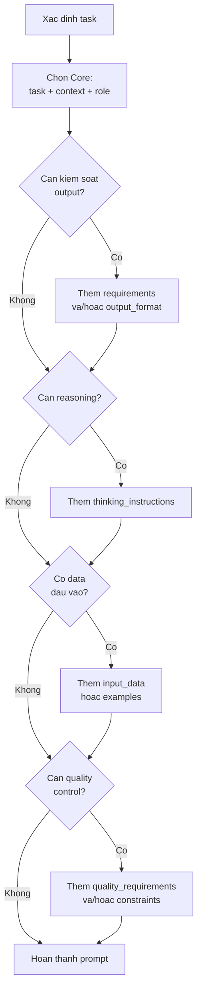
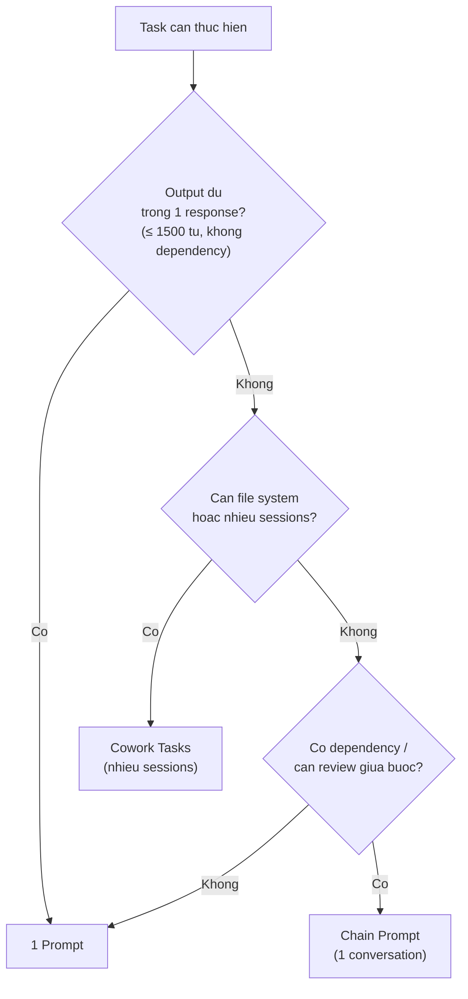

# Module 03: Prompt Engineering

**Thời gian đọc:** 25-30 phút | **Mức độ:** Beginner --> Advanced
**Cập nhật:** 2026-03-01 | Models: xem [specs](reference/model-specs.md)

---

Module này là xương sống của toàn bộ bộ tài liệu. Bạn sẽ học cách viết prompt từ cơ bản đến nâng cao, theo đúng best practices chính thức từ Anthropic.

Cấu trúc đi từ nền tảng lên chuyên sâu:

- **3.1 Nền tảng** -- công thức nhanh, XML tags, quy tắc format [Beginner]
- **3.2 Sáu Nguyên tắc Cốt lõi** -- nguyên tắc bất biến khi viết prompt [Beginner]
- **3.3 Bảy Kỹ thuật Ứng dụng** -- kỹ thuật cho từng loại task cụ thể [Intermediate]
- **3.4 Module System Nâng cao** -- hệ thống 13 modules lắp ghép prompt phức tạp [Advanced]
- **3.5 Task Decomposition** -- khi nào và cách tách task thành nhiều prompts/sessions [Advanced]

---

## 3.1 Nền tảng

### Claude 4.x -- Hai đặc điểm cần biết

Trước khi viết prompt, hiểu hai đặc điểm quan trọng của Claude 4.x (Opus 4.6, Sonnet 4.6):

**1. Tuân thủ chặt chẽ (Strict instruction following):** Claude 4.x làm đúng những gì bạn yêu cầu. "Viết đúng 3 câu" sẽ cho ra đúng 3 câu. Điều này có nghĩa: nếu bạn không yêu cầu chi tiết, output sẽ ngắn. Nếu muốn output dài và chi tiết, hãy nói rõ.

**2. Mặc định ngắn gọn (Concise by default):** So với các phiên bản trước, Claude 4.x trả lời gọn hơn. Muốn giải thích chi tiết, hãy yêu cầu cụ thể: "Giải thích chi tiết với ví dụ minh họa" thay vì chỉ "Giải thích".

[Nguồn: Anthropic Docs - Prompting Best Practices]
URL: https://docs.anthropic.com/en/docs/build-with-claude/prompt-engineering/claude-prompting-best-practices

### Công thức nhanh C-T-R

Mọi prompt hiệu quả đều chứa 3 yếu tố cơ bản:

```text
C -- Context:    Bối cảnh, tình huống, đối tượng
T -- Task:       Nhiệm vụ cụ thể cần làm
R -- Requirements: Yêu cầu về format, độ dài, tone, giới hạn
```

**Ví dụ áp dụng:**

Prompt kém:
```text
Viết SOP cho quy trình bảo trì.
```

Prompt tốt:
```text
[Context]
SOP Pre-operation Check cho AMR-Fleet tại nhà máy Phenikaa-X.
Audience: Kỹ thuật viên bảo trì Level 2 (biết cơ bản về robot, không biết ROS).
Timeline: Cần hoàn thiện trước Q2/2026 để đưa vào chương trình training.

[Task]
Viết SOP Pre-operation Check theo format chuẩn công ty.

[Requirements]
- Format: Numbered steps + Pass/Fail criteria cho mỗi checkpoint
- Tối đa 2 trang
- Tiếng Việt, thuật ngữ kỹ thuật giữ tiếng Anh
- Include: Safety warnings đặt trước bước nguy hiểm (không đặt sau)
```

> [!NOTE] **AMR Context** — C-T-R áp dụng trực tiếp cho debug: [Context] = specs robot + triệu chứng lỗi, [Task] = loại phân tích cần làm, [Requirements] = format output mong muốn (log analysis, step-by-step diagnosis...).

> [!TIP] **Model:** Sonnet 4.6 — Tác vụ viết tài liệu có cấu trúc rõ ràng, không cần reasoning phức tạp. Xem [decision flowchart](reference/model-specs.md#chọn-model)

Công thức C-T-R đủ dùng cho hầu hết task thường ngày. Khi cần kiểm soát chặt hơn, chuyển sang XML tags (phần tiếp theo).

[Ứng dụng Kỹ thuật]

### XML Tags -- Cấu trúc prompt rõ ràng

XML tags giúp Claude phân biệt rõ các phần trong prompt, giảm nhầm lẫn giữa instruction và content. Đặc biệt hữu ích khi prompt có nhiều yếu tố (dữ liệu đầu vào, yêu cầu, ví dụ).

[Nguồn: Anthropic Docs - Use XML tags]
URL: https://docs.anthropic.com/en/docs/build-with-claude/prompt-engineering/use-xml-tags

#### Danh sách tags thường dùng

| Tag | Mục đích | Khi nào dùng |
|-----|----------|-------------|
| `<role>` | Định nghĩa vai trò của Claude | Cần expertise cụ thể |
| `<task>` | Mô tả nhiệm vụ | Mọi prompt (core) |
| `<context>` | Bối cảnh, thông tin nền | Mọi prompt (core) |
| `<requirements>` | Yêu cầu format, độ dài, ngôn ngữ | Cần kiểm soát output |
| `<output_format>` | Cấu trúc output mong muốn | Cần output theo template |
| `<examples>` | Ví dụ input-output mẫu | Format phức tạp, task mới |
| `<constraints>` | Ràng buộc, những gì KHÔNG được làm | Cần giới hạn rõ ràng |
| `<input_data>` | Dữ liệu đầu vào (logs, data) | Có data cần xử lý |
| `<thinking_instructions>` | Hướng dẫn quá trình suy luận | Task cần phân tích sâu |
| `<quality_requirements>` | Yêu cầu độ chính xác | Thông tin quan trọng, cần verify |

#### Quy tắc đặt tên tags

- Lowercase + underscore: `<task_description>`, `<input_data>` (không phải `<TaskDescription>`)
- Mô tả rõ ràng: tên tag phản ánh nội dung bên trong
- Nhất quán: dùng cùng tag name xuyên suốt project

#### Template chuẩn (copy-paste)

```xml
<role>
{{vai_trò_chuyên_môn}}
</role>

<task>
Viết {{loại_tài_liệu}} cho {{mô_tả_nội_dung}}.
</task>

<context>
- Hệ thống/Thiết bị: {{tên_hệ_thống}}
- Người đọc: {{audience}}
- Môi trường: {{môi_trường}}
- Mục đích: {{mục_đích}}
</context>

<requirements>
- Format: {{format_mong_muốn}}
- Sections bắt buộc: {{danh_sách_sections}}
- Độ dài: {{giới_hạn}}
- Ngôn ngữ: {{yêu_cầu_ngôn_ngữ}}
</requirements>

<output_format>
{{cấu_trúc_mong_muốn}}
</output_format>
```

### Variables -- Placeholder cho tái sử dụng

Dùng `{{variable_name}}` để tạo template tái sử dụng. Mỗi lần dùng, thay {{placeholder}} bằng giá trị thực.

**Quy tắc đặt tên:**

- Lowercase + underscore: `{{machine_id}}`, `{{error_log}}`
- Mô tả rõ: `{{sensor_data}}` thay vì `{{data}}`
- Không dùng space: `{{machine_id}}` không phải `{{machine id}}`

**Variables phổ biến cho kỹ sư Phenikaa-X:**

| Variable | Mô tả | Ví dụ giá trị |
|----------|--------|---------------|
| `{{machine_id}}` | ID robot/thiết bị | AMR-001 |
| `{{error_log}}` | Log lỗi | Lidar timeout error |
| `{{sensor_data}}` | Dữ liệu sensor | Lidar scan output |
| `{{slam_version}}` | Phiên bản SLAM | cartographer 2.0 |
| `{{ros_distro}}` | ROS distribution | ROS2 Humble |
| `{{map_file}}` | File bản đồ | warehouse_map.yaml |

[Ứng dụng Kỹ thuật]

### Bốn kỹ thuật kiểm soát format output

Anthropic khuyến nghị 4 cách chính để kiểm soát format output của Claude:

**1. Nói Claude làm gì, thay vì không làm gì**
- Thay vì: "Không dùng Markdown"
- Nên: "Viết bằng prose liền mạch, không bullet points"

**2. Dùng XML format indicators**
- "Viết phần giải thích trong tag `<explanation>`"
- Claude sẽ output nội dung trong tag đó

**3. Format prompt khớp với output mong muốn**
- Prompt ít Markdown --> output ít Markdown
- Prompt có bullet points --> output dễ có bullet points

**4. Chỉ dẫn chi tiết cho preference cụ thể**
- "Viết bằng prose, dùng paragraphs hoàn chỉnh, không dùng bold hay italic, chỉ dùng heading khi cần"

[Nguồn: Anthropic Docs - Prompting Best Practices, section "Control the format of responses"]

---

## 3.2 Sáu Nguyên tắc Cốt lõi

Sáu nguyên tắc này là nền tảng bất biến khi viết prompt, không phụ thuộc vào task hay domain cụ thể.

### Nguyên tắc 1: Rõ ràng và Cụ thể (Be Clear and Specific)

Claude hoạt động tốt nhất khi nhận chỉ dẫn rõ ràng, tường minh. Hãy nghĩ Claude như đồng nghiệp mới: thông minh nhưng chưa biết bối cảnh của bạn. Prompt càng cụ thể, kết quả càng chính xác.

**Nguyên tắc vàng:** Đưa prompt cho đồng nghiệp ít bối cảnh nhất đọc. Nếu họ bối rối, Claude cũng sẽ bối rối.

[Nguồn: Anthropic Docs - Be clear and direct]
URL: https://docs.anthropic.com/en/docs/build-with-claude/prompt-engineering/be-clear-and-direct

**So sánh:**

Prompt kém:
```text
Viết Style Guide cho tài liệu kỹ thuật.
```
Vấn đề: Style Guide cho ai? Loại tài liệu nào? Bao gồm những rules gì? Format như thế nào?

Prompt tốt:
```xml
<task>
Viết Style Guide cho tài liệu kỹ thuật Phenikaa-X.
</task>

<context>
- Audience (người đọc Style Guide): Technical Writers và kỹ sư viết SOP/Technical Specs
- Loại tài liệu áp dụng: SOP vận hành, Technical Specifications, User Manuals
- Tiêu chuẩn tham chiếu: Microsoft Writing Style Guide, IEC 82079-1
</context>

<requirements>
- Sections bắt buộc: Terminology, Heading hierarchy, Code formatting, Source markers
- Độ dài: 3-4 trang
- Format: Bảng rule + ví dụ minh họa cho mỗi rule
- Ngôn ngữ: Tiếng Việt, giữ thuật ngữ kỹ thuật tiếng Anh
</requirements>
```

> [!NOTE] **AMR Context** — Áp dụng tương tự khi viết SOP vận hành: thay "Style Guide cho tài liệu kỹ thuật" bằng "Hướng dẫn vận hành AMR-001 cho kỹ thuật viên bảo trì mới — chưa có kinh nghiệm AMR, format checklist với pass/fail criteria."

> [!TIP] **Model:** Sonnet 4.6 — Tác vụ viết tài liệu có cấu trúc — Sonnet đủ mạnh, nhanh hơn và tiết kiệm token hơn Opus. Xem [decision flowchart](reference/model-specs.md#chọn-model)

**Checklist nhanh:**

- Mô tả task cụ thể, không mơ hồ
- Cung cấp context: ai, cái gì, ở đâu, tại sao
- Chỉ rõ output format mong muốn
- Chia thành steps nếu task phức tạp
- Test: "Đồng nghiệp đọc prompt này, họ có hiểu không?"

---

### Nguyên tắc 2: Dùng Ví dụ (Use Examples / Multishot Prompting)

Ví dụ là cách đáng tin cậy nhất để điều hướng output format, tone, và cấu trúc của Claude. Vài ví dụ tốt (few-shot prompting) cải thiện đáng kể độ chính xác và nhất quán.

[Nguồn: Anthropic Docs - Use examples (multishot prompting)]
URL: https://docs.anthropic.com/en/docs/build-with-claude/prompt-engineering/multishot-prompting

**Ba quy tắc cho ví dụ tốt:**

1. **Relevant:** Sát với use case thực tế
2. **Diverse:** Đa dạng, cover edge cases
3. **Structured:** Wrap trong `<example>` tags để Claude phân biệt với instructions

**Tip:** 3-5 ví dụ cho kết quả tốt nhất. Bạn cũng có thể nhờ Claude đánh giá ví dụ hoặc tạo thêm ví dụ dựa trên bộ ban đầu.

**So sánh:**

Prompt kém:
```text
Viết Change Log entry cho bản cập nhật SOP này.
```
Vấn đề: Claude không biết format entry mong muốn — table, prose, hay theo template riêng?

Prompt tốt:
```xml
<task>
Viết Change Log entry cho bản cập nhật SOP vừa thực hiện.
</task>

<examples>
<example>
<input>
Cập nhật SOP-001: Thêm bước kiểm tra pin trước khi khởi động.
Người yêu cầu: Trưởng bộ phận An toàn. Ngày: 2026-01-15.
</input>
<output>
| 2026-01-15 | v1.2 | Thêm bước 2.1: Kiểm tra pin (>20%) trước khởi động | Yêu cầu ATLD-2026-01 |
</output>
</example>
<example>
<input>
Sửa Mục 3.2: Đổi thời gian warm-up từ 30s thành 60s. Theo kết quả test thực tế.
Ngày: 2026-02-01.
</input>
<output>
| 2026-02-01 | v1.3 | Cập nhật Mục 3.2: Thời gian warm-up 30s → 60s | Kết quả test TM-2026-003 |
</output>
</example>
</examples>

<update_info>
{{mô_tả_thay_đổi_cụ_thể}}
</update_info>
```

> [!NOTE] **AMR Context** — Dùng cùng pattern để format error log analysis nhất quán: cung cấp 2-3 ví dụ log đã phân tích (input + output mẫu), rồi paste log mới cần phân tích vào `<error_log>`. Claude sẽ phân tích theo đúng format.

> [!TIP] **Model:** Sonnet 4.6 — Few-shot prompting với format đơn giản, không cần reasoning sâu. Xem [decision flowchart](reference/model-specs.md#chọn-model)

**Checklist nhanh:**

- Cung cấp 3-5 ví dụ cho complex tasks
- Ví dụ bao gồm cả input và output mong muốn
- Wrap ví dụ trong `<example>` tags
- Ví dụ diverse, cover edge cases
- Ví dụ sát với actual use case

---

### Nguyên tắc 3: Hướng dẫn Suy luận (Chain of Thought)

Với task phức tạp (debugging, so sánh, phân tích), hướng dẫn Claude suy nghĩ từng bước cho kết quả chính xác hơn. Có thể dùng `<thinking_instructions>` để chỉ dẫn các bước suy luận, và `<thinking>` / `<answer>` tags để tách quá trình lý luận khỏi kết luận.

[Nguồn: Anthropic Docs - Let Claude think (chain of thought)]
URL: https://docs.anthropic.com/en/docs/build-with-claude/prompt-engineering/chain-of-thought

**Lưu ý:** Khi bật Extended thinking (UI toggle), Claude TỰ ĐỘNG suy luận từng bước. Bạn không cần luôn nói "think step-by-step". Chỉ dùng chain-of-thought khi muốn kiểm soát quy trình suy luận cụ thể mà không bật Extended thinking.

**So sánh:**

Prompt kém:
```text
Review Technical Spec này có ổn không?
```
Vấn đề: Review theo tiêu chí nào? Focus vào khía cạnh nào? Output format là gì?

Prompt tốt:
```xml
<task>
Review Technical Specification cho hệ thống Navigation của AMR-Fleet v2.1.
</task>

<document>
{{paste_technical_spec}}
</document>

<thinking_instructions>
Suy nghĩ theo các bước:
1. Completeness: Spec có đủ sections theo chuẩn IEC 82079-1 không? Thiếu gì?
2. Consistency: Terminology có nhất quán trong toàn document không?
3. Clarity: Phần nào ambiguous, dễ hiểu sai bởi audience mục tiêu?
4. Technical accuracy: Performance specs có realistic và measurable không?
5. Summary: Liệt kê issues theo priority Critical / Warning / Minor.
</thinking_instructions>
```

> [!NOTE] **AMR Context** — Chain of Thought đặc biệt hiệu quả khi debug localization failure: "Phân tích theo thứ tự: 1. Sensor data có hợp lệ? 2. SLAM algorithm converge chưa? 3. Map quality có đủ điểm đặc trưng? 4. Odometry drift có vượt threshold? 5. Nguyên nhân xác suất cao nhất?"

> [!TIP] **Model:** Opus 4.6 — Review tài liệu kỹ thuật phức tạp với reasoning đa chiều — Opus cho kết quả phân tích sâu hơn Sonnet. Xem [decision flowchart](reference/model-specs.md#chọn-model)

**Checklist nhanh:**

- Dùng CoT cho tasks phức tạp: analysis, debugging, comparison
- Chỉ dẫn thinking steps nếu cần guided reasoning
- Dùng `<thinking>` và `<answer>` tags để tách reasoning và conclusion
- Cân nhắc trade-off: CoT chậm hơn nhưng chính xác hơn
- KHÔNG cần CoT cho câu hỏi đơn giản

---

### Nguyên tắc 4: Cải tiến Lặp lại (Iterative Refinement)

Đừng kỳ vọng perfect output từ lần đầu. Prompt engineering là quá trình: viết prompt --> review output --> điều chỉnh --> lặp lại. Feedback cụ thể giúp Claude cải thiện nhanh hơn.

[Nguồn: Anthropic Docs - Prompt Engineering Overview]
URL: https://docs.anthropic.com/en/docs/build-with-claude/prompt-engineering/overview

**So sánh:**

Feedback kém:
```text
Làm tốt hơn.
```
Vấn đề: Claude không biết "tốt hơn" nghĩa là gì — về nội dung, format, hay độ chi tiết?

Feedback tốt:
```text
Cảm ơn, nhưng cần điều chỉnh phần Technical Specifications:

1. Section 2.1: Thêm unit cho mỗi measurement (hiện tại thiếu unit)
2. Bảng 3: Đổi từ prose description sang bảng parameter / value / range
3. Section 4: Giảm jargon — audience là kỹ thuật viên, không phải R&D engineer
4. Thêm: Mục "Failure modes" với ít nhất 3 scenarios phổ biến

Giữ nguyên Introduction và Scope — đã đúng format rồi.
```

> [!NOTE] **AMR Context** — Áp dụng khi sửa SOP sau lần đầu: "Bước 3: Thêm warning 'Dừng robot hoàn toàn trước khi mở cover'. Bước 7: Đổi sang numbered steps (đang là prose). Phần Safety checklist cuối — giữ nguyên, đã OK."

> [!TIP] **Model:** Sonnet 4.6 — Iteration nhanh cho tác vụ viết và chỉnh sửa văn bản. Xem [decision flowchart](reference/model-specs.md#chọn-model)

**Checklist nhanh:**

- Expect iteration, không expect perfect lần đầu
- Feedback cụ thể: "Thêm X", "Bỏ Y", "Đổi Z thành..."
- Giữ context: "Giữ nguyên phần A, chỉ sửa phần B"
- Acknowledge những gì đã tốt: "Phần X tốt rồi, nhưng..."
- Iterate nhiều rounds khi cần

---

### Nguyên tắc 5: Tận dụng Kiến thức của Claude (Leverage Claude's Knowledge)

Claude đã biết sẵn rất nhiều: ngôn ngữ lập trình, frameworks, engineering concepts, standards. Không cần giải thích kiến thức nền -- tập trung prompt vào vấn đề cụ thể và context riêng của bạn.

[Nguồn: Anthropic Docs - Prompt Engineering Overview]

**So sánh:**

Prompt kém:
```text
IEC 82079 là gì? Task-based writing là gì? Sau đó giúp tôi viết SOP.
```
Vấn đề: Lãng phí context window vào kiến thức Claude đã biết.

Prompt tốt:
```xml
<context>
SOP cho quy trình Pre-flight Check của AMR-Fleet tại Phenikaa-X.
Target audience: Kỹ thuật viên Level 2 (biết cơ bản về robot, không biết ROS).
</context>

<request>
Dựa trên best practices của IEC 82079-1 và task-based writing, viết SOP với:
1. Structure theo giai đoạn: Pre-check → Operation → Post-operation
2. Safety warning placement theo chuẩn ANSI Z535 (trước bước nguy hiểm)
3. Actionable steps: verb đầu câu, object rõ ràng, không ambiguous
4. Pass/Fail criteria đo lường được cho mỗi checkpoint
</request>
```

> [!NOTE] **AMR Context** — Tương tự với ROS/SLAM: thay vì giải thích "AMCL là gì", nói thẳng "AMCL node cho localization đang có particle filter diverge sau khi robot rotate nhanh. Nghi ngờ odometry noise model. Đề xuất cách diagnose và parameters cần tune."

> [!TIP] **Model:** Sonnet 4.6 — Tác vụ áp dụng kiến thức có sẵn vào context cụ thể — không cần Opus trừ khi vấn đề cực kỳ phức tạp. Xem [decision flowchart](reference/model-specs.md#chọn-model)

**Checklist nhanh:**

- Assume Claude biết: programming languages, frameworks, engineering concepts
- Focus vào specific problem, không basic explanation
- Cung cấp context cụ thể cho company/project
- Hỏi best practices -- Claude có kiến thức này
- Verify critical information từ official sources nếu cần chính xác tuyệt đối

---

### Nguyên tắc 6: Gán Vai trò (Give Claude a Role)

Gán role cụ thể giúp Claude focus hành vi và tone phù hợp. Role cụ thể hiệu quả hơn role chung.

[Nguồn: Anthropic Docs - Give Claude a role (system prompts)]
URL: https://docs.anthropic.com/en/docs/build-with-claude/prompt-engineering/system-prompts

**So sánh:**

Prompt kém:
```text
Review tài liệu này:
[tài liệu]
```
Vấn đề: Review theo tiêu chuẩn nào? Cho audience nào? Focus vào khía cạnh gì?

Prompt tốt:
```xml
<role>
Bạn là Technical Writer senior với 10 năm kinh nghiệm viết tài liệu công nghiệp.
Review theo standards: IEC 82079-1, clarity, completeness, và usability.
Đặc biệt chú ý: task-based structure, safety warning placement, terminology consistency.
</role>

<task>
Review SOP sau. Focus vào:
1. Structure và completeness (thiếu sections nào theo chuẩn?)
2. Clarity (steps nào ambiguous, dễ hiểu nhầm?)
3. Safety compliance (warnings đúng vị trí và format?)
4. Actionable suggestions cụ thể để cải thiện
</task>

<document>
{{paste_sop}}
</document>
```

> [!NOTE] **AMR Context** — Đổi role thành "Senior ROS Engineer với 10 năm kinh nghiệm": "Review code theo standards: readability, performance, ROS best practices. Đặc biệt chú ý: thread safety, memory management, error handling."

> [!TIP] **Model:** Sonnet 4.6 — Review tài liệu văn bản thông thường. Dùng Opus 4.6 khi review Technical Spec phức tạp hoặc code architecture cần phân tích sâu. Xem [decision flowchart](reference/model-specs.md#chọn-model)

**Checklist nhanh:**

- Chọn role phù hợp với task
- Specific role > generic role ("Technical Writer senior" > "người review")
- Bao gồm expertise area và tiêu chuẩn review cụ thể
- Có thể kết hợp roles nếu cần (writer + QA reviewer)
- Đặt role ở đầu prompt

---

### Anti-patterns -- Ba lỗi phổ biến nhất

| Lỗi | Ví dụ | Cách fix |
|-----|-------|----------|
| Quá mơ hồ | "Viết cái gì đó về robots" | Chỉ rõ: viết gì, cho ai, bao dài, format nào |
| Quá dài và lan man | 500 từ backstory trước khi đến task | Đặt task ở đầu, context ngắn gọn |
| Yêu cầu mâu thuẫn | "Chi tiết nhưng ngắn gọn, đơn giản nhưng kỹ thuật" | Chọn 1 hướng ưu tiên, hoặc chia thành 2 phiên bản |

---

## 3.3 Bảy Kỹ thuật Ứng dụng

Mỗi kỹ thuật dưới đây dành cho một loại task cụ thể. Tham khảo template hoàn chỉnh ở [Module 07 (Template Library)](../guide/07-template-library.md).

### Kỹ thuật 1: Tạo Nội dung (Content Creation)

**Khi nào dùng:** Tạo SOP mới, viết tài liệu kỹ thuật, draft training materials, tạo reports.

**Khi nào KHÔNG dùng:** Copy-paste template có sẵn, edit nhỏ trong document hiện có, dịch đơn giản.

**Modules thường dùng:** `<role>` + `<task>` + `<context>` + `<requirements>` + `<output_format>` + `<tone>`

**Lỗi thường gặp:**

| Lỗi | Cách khắc phục |
|-----|---------------|
| Output quá generic | Cung cấp context cụ thể về sản phẩm/company |
| Format không đúng | Cung cấp example hoặc template |
| Tone không phù hợp | Chỉ rõ audience và tone |
| Thiếu technical detail | Cung cấp technical specs làm reference |

**Tip:** Khi viết tài liệu dài, viết từng section riêng (mỗi message 1 section). Chất lượng giảm dần ở cuối document dài.

> [!TIP] **Model:** Sonnet 4.6 — Đủ mạnh cho mọi tác vụ tạo nội dung (SOP, spec, report). Dùng Opus 4.6 chỉ khi nội dung đòi hỏi reasoning phức tạp hoặc nhiều trade-off kỹ thuật. Xem [decision flowchart](reference/model-specs.md#chọn-model)

---

### Kỹ thuật 2: Phân tích Tài liệu (Document Analysis)

**Khi nào dùng:** Tóm tắt documents dài, Q&A từ specs, so sánh nhiều documents, trích xuất thông tin.

**Khi nào KHÔNG dùng:** Documents quá ngắn (<500 từ), cần real-time data.

**Modules thường dùng:** `<task>` + `<context>` + `<input_data>` (documents) + `<quality_requirements>`

**Best practice:** Đặt documents dài (>20K tokens) ở ĐẦU prompt, câu hỏi/yêu cầu ở CUỐI. Cách này cải thiện chất lượng lên tới 30%. Yêu cầu Claude quote trực tiếp từ tài liệu trước khi phân tích -- giảm hallucination.

[Nguồn: Anthropic Docs - Long context prompting]

**Lỗi thường gặp:**

| Lỗi | Cách khắc phục |
|-----|---------------|
| Claude không tìm được thông tin | Dùng câu hỏi cụ thể thay vì chung chung |
| Hallucination (bịa thông tin) | Yêu cầu quote trực tiếp từ document |
| Summary quá chung | Chỉ rõ aspects cần focus |
| Bỏ sót chi tiết quan trọng | Chia thành nhiều câu hỏi riêng |

> [!TIP] **Model:** Sonnet 4.6 — Xử lý văn bản dài, Q&A từ documents hiệu quả. Xem [decision flowchart](reference/model-specs.md#chọn-model)

---

### Kỹ thuật 3: Phân tích Dữ liệu (Data Analysis)

**Khi nào dùng:** Phân tích trends từ logs, tóm tắt sensor data, nhận diện anomalies, tạo reports từ data.

**Khi nào KHÔNG dùng:** Real-time streaming data, statistical modeling phức tạp, data cần specialized tools.

**Modules thường dùng:** `<task>` + `<context>` + `<input_data>` + `<requirements>` (analysis goals)

**Lỗi thường gặp:**

| Lỗi | Cách khắc phục |
|-----|---------------|
| Phân tích không focus | Chỉ rõ analysis goals cụ thể |
| Thiếu context về data | Mô tả data source và ý nghĩa |
| Output quá nhiều | Giới hạn vào key insights |

> [!TIP] **Model:** Sonnet 4.6 — Phân tích patterns và trends từ logs/data đầy đủ. Xem [decision flowchart](reference/model-specs.md#chọn-model)

---

### Kỹ thuật 4: Brainstorming và Giải quyết Vấn đề

**Khi nào dùng:** Generate solutions, nhận diện risks, khám phá alternatives, giải quyết vấn đề sáng tạo.

**Khi nào KHÔNG dùng:** Câu hỏi yes/no đơn giản, vấn đề đã có lời giải rõ ràng.

**Modules thường dùng:** `<task>` + `<context>` + `<constraints>` + `<evaluation_criteria>`

**Lỗi thường gặp:**

| Lỗi | Cách khắc phục |
|-----|---------------|
| Ý tưởng quá giống nhau | Yêu cầu "diverse approaches" |
| Giải pháp không thực tế | Chỉ rõ constraints thực tế |
| Thiếu đánh giá | Yêu cầu pros/cons cho mỗi option |

> [!TIP] **Model:** Sonnet 4.6 — Generate ideas và alternatives nhanh, đủ cho brainstorming. Xem [decision flowchart](reference/model-specs.md#chọn-model)

---

### Kỹ thuật 5: Kiểm soát Chất lượng (Reduce Hallucinations)

**Khi nào dùng:** Thông tin kỹ thuật quan trọng, câu hỏi factual, trả lời dựa trên tài liệu, nội dung safety-critical.

**Khi nào KHÔNG dùng:** Creative content, brainstorming, hỏi ý kiến.

**Modules thường dùng:** `<task>` + `<context>` + `<quality_requirements>` + `<input_data>` (source documents)

[Nguồn: Anthropic Docs - Reduce hallucinations]
URL: https://docs.anthropic.com/en/docs/test-and-evaluate/strengthen-guardrails/reduce-hallucinations

**Ba kỹ thuật chính:**

1. Cho phép Claude nói "Tôi không biết" -- thêm vào prompt: "Nếu không chắc chắn, nói rõ thay vì đoán."
2. Yêu cầu trích dẫn nguồn: "Cite source cho mỗi claim, hoặc ghi N/A"
3. Dùng markers phân biệt: `[FACT]`, `[INFERENCE]`, `[CẦN VERIFY]`

**Lỗi thường gặp:**

| Lỗi | Cách khắc phục |
|-----|---------------|
| Hallucination | Yêu cầu quote sources trước khi phân tích |
| Câu trả lời quá tự tin | Yêu cầu confidence level |
| Số liệu bịa | Yêu cầu "cite source or say N/A" |

> [!TIP] **Model:** Opus 4.6 — Nội dung safety-critical hoặc technical specs quan trọng cần accuracy cao. Dùng Sonnet cho tài liệu thông thường. Xem [decision flowchart](reference/model-specs.md#chọn-model)

---

### Kỹ thuật 6: Review Code/Script

**Khi nào dùng:** Review ROS nodes, Python scripts, configuration files, tìm bugs trong modules nhỏ.

**Khi nào KHÔNG dùng:** Code quá dài (>500 dòng -- chia nhỏ), cần runtime testing, security audit cần tools chuyên dụng.

**Modules thường dùng:** `<role>` (senior engineer) + `<task>` + `<input_data>` (code) + `<requirements>` (review criteria) + `<output_format>`

**Output format khuyến nghị:** Phân loại issues theo severity:

| Severity | Ý nghĩa | Hành động |
|----------|---------|----------|
| CRITICAL | Bugs, lỗi logic | Phải fix trước khi merge |
| WARNING | Performance, maintainability | Nên fix |
| OK | Style, minor improvements | Fix khi có thời gian |

**Lỗi thường gặp:**

| Lỗi | Cách khắc phục |
|-----|---------------|
| Review quá chung chung | Chỉ rõ review criteria |
| Không có actionable feedback | Yêu cầu "suggested fix" cho mỗi issue |
| Output quá nhiều | Ưu tiên: Critical > Warning > OK |

> [!TIP] **Model:** Opus 4.6 — Code review đòi hỏi phân tích logic sâu, detect subtle bugs. Dùng Sonnet cho review nhanh script đơn giản (<100 dòng). Xem [decision flowchart](reference/model-specs.md#chọn-model)

---

### Kỹ thuật 7: Tạo SOP (Standard Operating Procedure)

**Khi nào dùng:** Tạo SOP mới, chuẩn hóa procedures, draft initial SOP, document workflows hiện có.

**Khi nào KHÔNG dùng:** Minor update SOP hiện có, procedures safety-critical chưa qua expert review.

**Modules thường dùng:** `<role>` (technical writer) + `<task>` + `<context>` + `<requirements>` + `<output_format>`

**10 sections chuẩn cho SOP:**

1. Mục đích (Purpose)
2. Phạm vi (Scope)
3. Trách nhiệm (Responsibility)
4. Định nghĩa (Definitions)
5. Thiết bị/Vật tư (Equipment)
6. An toàn (Safety)
7. Quy trình (Procedure)
8. Xử lý sự cố (Troubleshooting)
9. Tài liệu liên quan (Related Documents)
10. Lịch sử thay đổi (Change Log)

**Lỗi thường gặp:**

| Lỗi | Cách khắc phục |
|-----|---------------|
| Steps không đủ chi tiết | Yêu cầu "actionable steps" |
| Thiếu safety warnings | Thêm safety section requirement |
| Quá kỹ thuật cho audience | Chỉ rõ audience level |

> [!TIP] **Model:** Sonnet 4.6 — SOP là tác vụ viết có cấu trúc rõ ràng, Sonnet đủ mạnh và nhanh hơn. Xem [decision flowchart](reference/model-specs.md#chọn-model)

---

## 3.4 Module System Nâng cao [Advanced]

Phần này dành cho người đã quen với 6 nguyên tắc và 7 kỹ thuật ở trên. Module System cho phép bạn lắp ghép prompt phức tạp từ các thành phần chuẩn hóa -- tương tự cách ROS dùng Launch Files để cấu hình nodes.

[Ứng dụng Kỹ thuật]

### Tổng quan 13 Modules

**3 Modules Cốt lõi** (luôn cần):

| Module | Mục đích | Bắt buộc? |
|--------|---------|-----------|
| `<role>` | Định nghĩa vai trò/expertise của Claude | Khuyến nghị |
| `<task>` | Mô tả nhiệm vụ cần thực hiện | **Bắt buộc** |
| `<context>` | Cung cấp bối cảnh, thông tin nền | **Bắt buộc** |

**10 Modules Tùy chọn** (thêm khi cần):

| Module | Mục đích | Dùng khi |
|--------|---------|---------|
| `<requirements>` | Yêu cầu format, độ dài, ngôn ngữ | Cần kiểm soát output |
| `<output_format>` | Cấu trúc output mong muốn | Cần output theo template |
| `<examples>` | Ví dụ input-output mẫu | Format phức tạp, task mới |
| `<constraints>` | Ràng buộc, giới hạn | Cần nói rõ KHÔNG được làm gì |
| `<thinking_instructions>` | Hướng dẫn quá trình suy luận | Task cần reasoning, phân tích |
| `<quality_requirements>` | Yêu cầu chất lượng, nguồn | Cần kiểm soát hallucination |
| `<tone>` | Giọng điệu, phong cách | Output có audience cụ thể |
| `<input_data>` | Dữ liệu đầu vào | Có data cần xử lý (logs, CSV) |
| `<evaluation_criteria>` | Tiêu chí đánh giá | So sánh, ranking options |
| `<chain_info>` | Thông tin chuỗi prompt | Prompt là bước trong workflow |

### Quy trình chọn Modules



### Tổ hợp Modules theo Kỹ thuật

| Kỹ thuật | Modules Core | Modules bổ sung |
|----------|-------------|----------------|
| Content Creation | `<role>` `<task>` `<context>` | `<requirements>` `<output_format>` `<tone>` |
| Document Analysis | `<task>` `<context>` | `<input_data>` `<quality_requirements>` |
| Data Analysis | `<task>` `<context>` | `<input_data>` `<requirements>` |
| Brainstorming | `<task>` `<context>` | `<constraints>` `<evaluation_criteria>` |
| Quality Control | `<task>` `<context>` | `<quality_requirements>` `<input_data>` |
| Code Review | `<role>` `<task>` `<context>` | `<input_data>` `<output_format>` `<constraints>` |
| SOP Generation | `<role>` `<task>` `<context>` | `<requirements>` `<output_format>` `<constraints>` |

### Structured Outputs cho Automation

Khi cần Claude output data có cấu trúc (JSON, table chuẩn) để đưa vào pipeline tự động hóa, dùng `<output_format>` với schema cụ thể.

[Nguồn: Anthropic Docs - Structured Outputs]
URL: https://docs.anthropic.com/en/docs/build-with-claude/structured-outputs

**Ví dụ:** Yêu cầu output JSON cho hệ thống tracking:

```xml
<task>
Phân tích error log và output kết quả dạng JSON.
</task>

<input_data>
{{error_log}}
</input_data>

<output_format>
Output JSON với cấu trúc sau:
{
  "error_id": "string",
  "severity": "CRITICAL | WARNING | INFO",
  "component": "string",
  "root_cause": "string",
  "recommended_action": "string",
  "estimated_fix_time": "string"
}
</output_format>
```

**Tip:** Claude 4.x tuân thủ JSON schema rất tốt. Cung cấp example JSON output nếu cấu trúc phức tạp.

> [!TIP] **Model:** Sonnet 4.6 — JSON structured output với schema rõ ràng — Sonnet tuân thủ schema chính xác. Xem [decision flowchart](reference/model-specs.md#chọn-model)

### Prompt Chaining -- Chia nhỏ task lớn

Khi task quá lớn cho 1 prompt, chia thành chuỗi prompts nối tiếp. Output của bước trước làm input cho bước sau.

**Khi nào dùng chaining:**

- Task quá lớn cho 1 response
- Các bước có dependencies (phải hoàn thành A trước khi làm B)
- Cần review giữa các bước
- Mỗi bước cần expertise khác nhau

**Pattern phổ biến:**

```text
Prompt 1: Đề xuất outline chi tiết
     |
     v  (Review, điều chỉnh)
Prompt 2: Viết section A theo outline
     |
     v  (Review)
Prompt 3: Viết section B
     |
     v
Prompt 4: Review tổng thể + finalize
```

**Tip:** Khi chuyển sang prompt tiếp theo, tóm tắt kết quả bước trước thay vì copy toàn bộ output. Tiết kiệm context window.

---

## 3.5 Task Decomposition — Khi nào và cách tách task [Advanced]

Module System (3.4) hướng dẫn cách cấu trúc **một** prompt phức tạp, nhưng chưa trả lời câu hỏi lớn hơn: khi nào nên tách thành nhiều prompts trong cùng conversation, và khi nào nên tách thành nhiều Cowork tasks riêng biệt? Tư duy tách task (task decomposition) quyết định chất lượng workflow tổng thể — một prompt đơn lẻ quá tải sẽ cho output sơ sài ở phần cuối, nhưng tách sai cách (mất dependency, thiếu context giữa các bước) còn tệ hơn không tách. Mục này cung cấp framework ra quyết định cho kỹ sư trước khi bắt tay vào bất kỳ task lớn nào.

[Ứng dụng Kỹ thuật]

### 3.5.1 Ba cấp độ thực thi

| Cấp độ | Dùng khi | Ví dụ |
|--------|----------|-------|
| **1 Prompt** | Output ≤ ~1500 từ, không có dependency giữa các phần, không cần review giữa chừng | Tóm tắt 1 tài liệu, viết 1 email, tạo 1 SOP ngắn |
| **Chain Prompt** (1 conversation) | Nhiều bước, output bước trước feed vào bước sau, cần review giữa bước, không cần file system | Outline → viết Section A → viết Section B → review tổng |
| **Cowork Tasks** (nhiều sessions) | Cần sửa/tạo file trực tiếp trên disk, task kéo dài hơn 1 session, cần rollback rõ ràng từng bước | Cập nhật 5 SOPs, restructure toàn bộ bộ tài liệu |



### 3.5.2 Năm tiêu chí tách task

#### Theo file/artifact

Mỗi file độc lập nên là một step riêng. Khi bạn cần cập nhật SOP cho AMR-001, AMR-002, AMR-003, đó là 3 steps — không phải 1 prompt yêu cầu "cập nhật tất cả". Lý do: mỗi file có context riêng (specs khác nhau, lịch sử lỗi khác nhau), và nếu gộp lại, Claude sẽ dành phần lớn "năng lượng" cho files đầu tiên, files cuối nhận output sơ sài hơn (xem Module 04 mục 4.8 về output quality degradation).

[Ứng dụng Kỹ thuật]

#### Theo giai đoạn nhận thức

Tách giai đoạn "hiểu và plan" khỏi giai đoạn "tạo output". Ví dụ: Step 1 yêu cầu Claude đề xuất outline cho bộ tài liệu bảo trì robot, bạn review và chỉnh outline, rồi Step 2 mới yêu cầu viết nội dung dựa trên outline đã duyệt. Cách này đảm bảo Claude không "chạy" theo hướng sai ngay từ đầu — sai outline thì toàn bộ nội dung sau đều sai (xem thêm Nhóm 6, Module 08 về lỗi lan truyền).

[Ứng dụng Kỹ thuật]

#### Theo dependency

Nếu Step B cần kết quả của Step A để làm đúng, bắt buộc phải tách và có review giữa hai bước. Ví dụ điển hình: tạo glossary thuật ngữ trước (Step A), review glossary, rồi mới viết SOP sử dụng glossary đó (Step B). Nếu gộp A và B vào 1 prompt, Claude có thể tạo glossary thiếu thuật ngữ rồi dùng chính glossary thiếu đó cho SOP — bạn không có cơ hội can thiệp.

[Ứng dụng Kỹ thuật]

#### Theo output size

Khi ước tính output tổng cộng vượt ~1500 từ, chất lượng phần cuối bắt đầu giảm rõ rệt (xem Module 04 mục 4.8 để hiểu cơ chế). Quy tắc thực hành: nếu output cần 5 sections và mỗi section ~500 từ (tổng ~2500 từ), nên tách thành ít nhất 2-3 prompts. Ước tính output size trước khi viết prompt là thói quen quan trọng — dễ hơn nhiều so với sửa output dài bị sơ sài.

#### Theo expertise domain

Khi các bước cần "vai trò" khác nhau, hãy tách và gán role riêng cho mỗi step. Ví dụ: Step 1 gán role "Technical Writer chuyên SOP" để viết nội dung, Step 2 gán role "QA Reviewer chuyên documentation standards" để kiểm tra SOP vừa viết. Mỗi role tập trung vào thế mạnh riêng, thay vì yêu cầu Claude vừa viết vừa tự review trong cùng 1 prompt — điều thường cho kết quả review hời hợt.

[Ứng dụng Kỹ thuật]

### 3.5.3 Ví dụ so sánh — "Tạo bộ SOP 5 robots"

**BAD:**

```text
Viết SOP đầy đủ cho AMR-001 đến AMR-005, mỗi SOP gồm: Mục đích, Phạm vi,
Quy trình vận hành, Xử lý sự cố, Bảo trì. Format thống nhất, tiếng Việt,
thuật ngữ kỹ thuật giữ tiếng Anh.
```

Hậu quả: AMR-001, AMR-002 nhận SOP chi tiết và đúng format. Từ AMR-003 trở đi, Claude bắt đầu rút ngắn sections, AMR-004 thiếu phần Xử lý sự cố, AMR-005 chỉ còn outline. Format giữa các SOP mất nhất quán — AMR-001 dùng numbered steps nhưng AMR-004 chuyển sang bullet points.

**GOOD:**

```text
Step 1: Tạo SOP template chuẩn (sections, format, conventions)
     → Review template, phê duyệt
Step 2: Viết SOP cho AMR-001 theo template
     → Review
Step 3: Viết SOP cho AMR-002 theo template
     → Review
Step 4-6: Tương tự cho AMR-003, AMR-004, AMR-005
Step 7: Review consistency toàn bộ 5 SOPs
```

Tại sao tốt hơn: Template đã duyệt ở Step 1 đóng vai trò "anchor" — mỗi SOP sau đều reference về cùng template, đảm bảo format nhất quán. Mỗi step chỉ yêu cầu output ~800-1000 từ (nằm trong vùng an toàn). Bạn có cơ hội review và sửa lỗi sau mỗi SOP thay vì phát hiện lỗi khi đã viết xong cả 5.

### 3.5.4 Anti-patterns

| Anti-pattern | Hậu quả | Fix |
|-------------|---------|-----|
| **"Nhồi hết"** — yêu cầu toàn bộ output lớn trong 1 prompt | Phần cuối sơ sài, format mất nhất quán, sections bị bỏ qua (xem Module 04 mục 4.8) | Tách theo output size: mỗi prompt ≤ 1500 từ output, dùng Pattern Outline-First |
| **Tách quá nhỏ** — mỗi đoạn văn hoặc mỗi câu thành 1 prompt riêng | Mất coherence giữa các phần, giọng văn không nhất quán, tốn thời gian gấp nhiều lần | Tách theo unit có nghĩa: 1 section, 1 file, 1 giai đoạn — không phải 1 paragraph |
| **Tách không theo dependency** — bước sau không nhận kết quả bước trước | Bước 2 tự tạo lại thông tin bước 1 đã có, dẫn đến mâu thuẫn giữa các phần | Include summary/output bước trước khi bắt đầu bước sau (dùng `<chain_info>`) |
| **Không review giữa bước** — chạy liên tục từ Step 1 đến Step N không kiểm tra | Lỗi ở Step 1 lan sang tất cả steps sau, phát hiện muộn phải làm lại toàn bộ (xem Module 08 Nhóm 6) | Đặt review checkpoint sau mỗi step quan trọng, đặc biệt sau step tạo template/outline |

**Xem thêm:** [Template T-19](../guide/07-template-library.md#t-19-task-decomposition-planner) (Task Decomposition Planner, Module 07), [Recipe 5.12](../guide/05-workflow-recipes.md) (Module 05)

---

## Ký hiệu Source Citation trong bộ tài liệu

Xuyên suốt bộ tài liệu này, nội dung được đánh dấu mức độ tin cậy:

| Ký hiệu | Ý nghĩa |
|----------|---------|
| `[Nguồn: Anthropic Docs]` | Từ tài liệu chính thức Anthropic, kèm URL |
| `[Ứng dụng Kỹ thuật]` | Ứng dụng nguyên tắc chính thức vào bối cảnh Phenikaa-X/kỹ thuật |
| `[CẦN XÁC MINH]` | Thông tin chưa verify được từ official docs |
| `[Cập nhật 02/2026]` | Thông tin mới cập nhật từ research tháng 2/2026 |

Bạn có thể tự verify bất kỳ thông tin nào bằng cách truy cập URL nguồn hoặc tìm kiếm trên docs.anthropic.com.

---

**Tiếp theo:**
- [Module 04: Context Management](../guide/04-context-management.md) -- quản lý conversation dài hiệu quả
- [Module 05: Workflow Recipes](../guide/05-workflow-recipes.md) -- quy trình theo task cụ thể
- [Module 07: Template Library](../guide/07-template-library.md) -- 22 templates copy-paste
