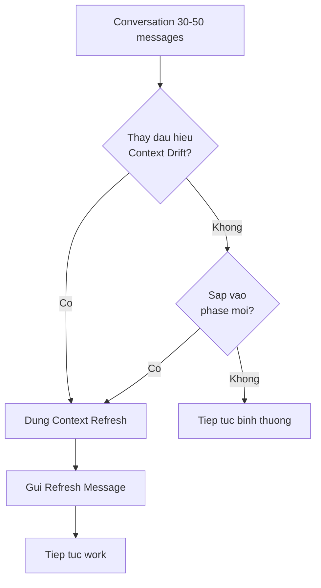
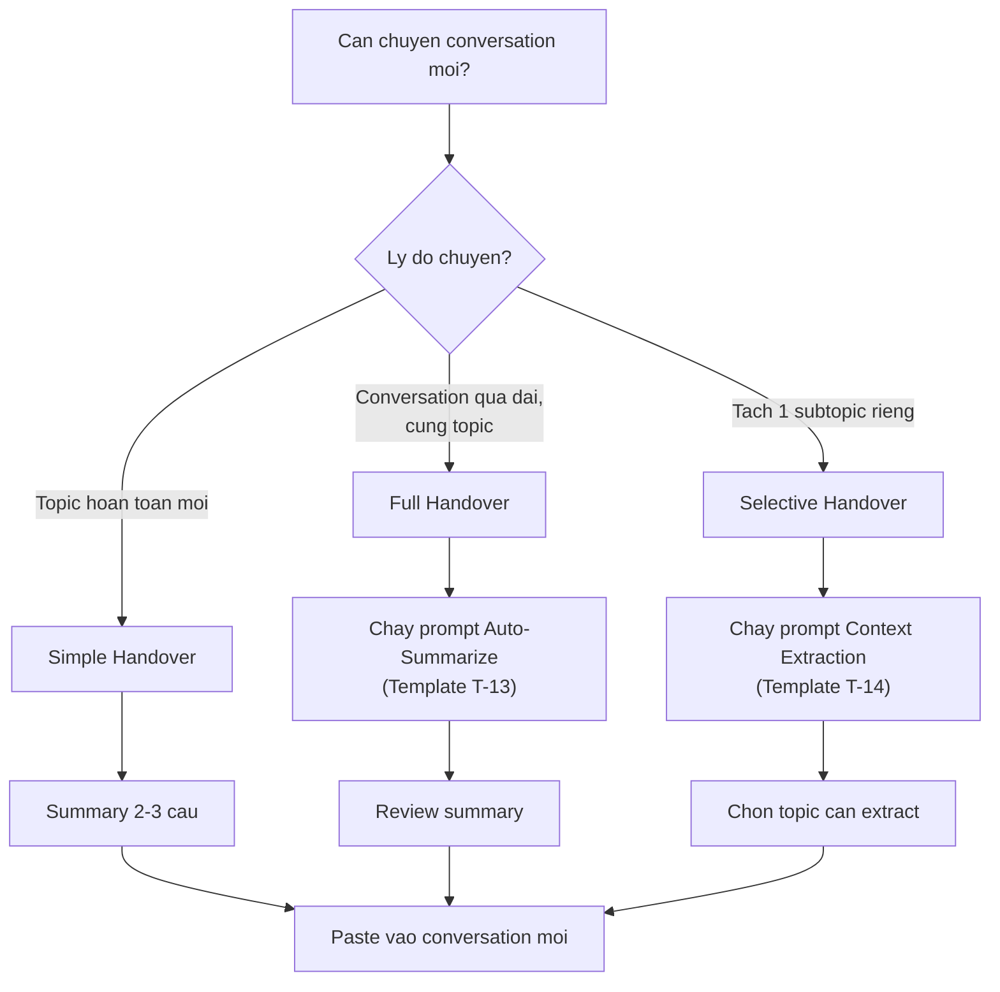
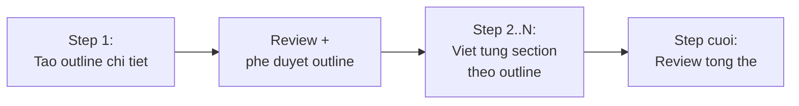
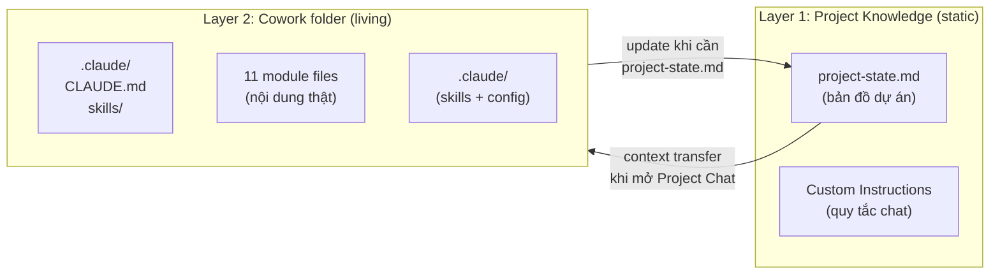

# Module 04: Context Management

**Thời gian đọc:** 15 phút | **Mức độ:** Intermediate
**Cập nhật:** 2026-03-01 | Claude Opus 4.6 / Sonnet 4.6

---

Đây là module mà hầu hết hướng dẫn Claude bỏ qua, nhưng lại ảnh hưởng trực tiếp đến chất lượng công việc hàng ngày. Nếu bạn từng gặp tình huống "chat dài thì Claude bắt đầu quên", module này giải thích tại sao và cách xử lý.

---

## 4.1 Context Window là gì?

Context Window là giới hạn tokens mà Claude có thể "nhìn thấy" cùng lúc trong một conversation -- bao gồm toàn bộ tin nhắn của bạn, responses của Claude, file uploads, và tool outputs.

[Nguồn: Anthropic Docs - Context Windows]
URL: https://docs.anthropic.com/en/docs/about-claude/context-windows

**So sánh cho kỹ sư:** Context Window giống RAM của máy tính. Mọi thứ trong conversation phải "nạp" vào RAM này. Khi đầy, thông tin cũ nhất bị đẩy ra hoặc được nén lại.

### Token Specifications

| Model | Context Window | Tương đương |
|-------|---------------|-------------|
| Claude Opus 4.6 | 200,000 tokens (chuẩn), 1M tokens (beta) | 500–700 trang / 2,500–3,500 trang |
| Claude Sonnet 4.6 | 200,000 tokens (chuẩn), 1M tokens (beta) | 500–700 trang / 2,500–3,500 trang |
| Claude Sonnet 4.5 | 200,000 tokens | 500–700 trang |
| Claude Haiku 4.5 | 200,000 tokens | 500–700 trang |

[Cập nhật 02/2026]

**Quy đổi tokens:**

- 1 token = khoảng 4 ký tự tiếng Anh
- 1 token = khoảng 1-2 ký tự tiếng Việt (có dấu tốn nhiều hơn)
- 1 từ tiếng Anh = khoảng 1-2 tokens
- Code thường tốn nhiều tokens hơn text thông thường

### Context Awareness [Cập nhật 02/2026]

Claude Opus 4.6, Sonnet 4.6, Sonnet 4.5 và Haiku 4.5 có khả năng **Context Awareness** -- Claude biết mình đang ở đâu trong context window và còn bao nhiêu "dung lượng". Điều này giúp Claude quản lý conversation dài tốt hơn, tự chủ động tóm tắt hoặc nhắc bạn khi sắp hết space.

[Nguồn: Anthropic Docs - Prompting Best Practices, section "Context awareness"]

---

## 4.2 Khi Conversation gần Limit

Khi conversation dài tiêu gần hết context window, Claude sẽ bắt đầu mất dần context cũ — oldest tokens bị drop. Trên paid plans, Claude có cơ chế tự động tóm tắt các messages cũ để duy trì conversation dài hơn.

**Tip:** Bật **"Code execution and file creation"** trong Settings > Capabilities để Claude có thể tự quản lý context tốt hơn khi conversation dài. Dù vậy, auto summarization không hoàn hảo — chi tiết nhỏ có thể bị mất. Với task cần chính xác cao (technical specs, configs cụ thể), nên dùng kỹ thuật Context Refresh (phần 4.4).

[Observation-based — behavior thực tế có thể thay đổi theo plan và version]

---

## 4.3 Context Drift -- Khi Claude bắt đầu "quên"

Context Drift là hiện tượng Claude dần mất đi hoặc lẫn lộn thông tin khi conversation dài. Đây không phải lỗi -- đó là hệ quả tự nhiên của cách context window hoạt động.

### Năm dấu hiệu nhận biết

| Dấu hiệu | Ví dụ |
|-----------|-------|
| Hỏi lại thông tin đã cung cấp | "Bạn đang dùng ROS version nào?" (đã nói ROS2 Humble ở message đầu) |
| Response không nhất quán | Trước recommend option A, giờ recommend option B không giải thích |
| Format thay đổi bất thường | Trước dùng table, giờ chuyển sang bullet points dù không yêu cầu |
| "Quên" constraints | Bỏ qua safety warnings đã đồng ý include |
| Bám cứng 1 hướng | Chỉ focus vào 1 solution, bỏ qua alternatives đã thảo luận |

### Ngưỡng tham khảo

| Số messages (ước tính) | Trạng thái | Khuyến nghị |
|------------------------|-----------|-------------|
| 1-30 | Optimal | Tiếp tục bình thường |
| 31-50 | Theo dõi | Quan sát dấu hiệu drift |
| 51-70 | Cân nhắc | Dùng Context Refresh, chuẩn bị handover |
| >70 | Nên handover | Tạo conversation mới (xem phần 4.5) |

**Lưu ý quan trọng:** Anthropic KHÔNG quy định số messages cụ thể. Giới hạn thực tế là **tokens**, không phải messages. Một message chứa 500 dòng code tốn gấp nhiều lần một message "OK". File uploads và tool usage (web search, artifacts) cũng chiếm context đáng kể.

[Ứng dụng Kỹ thuật]

---

## 4.4 Context Refresh -- Nhắc lại thông tin quan trọng

Context Refresh là kỹ thuật tóm tắt và nhắc lại thông tin quan trọng giữa conversation dài, giúp Claude "refresh" understanding về task hiện tại.

**Lưu ý:** "Context Refresh" KHÔNG phải official feature của Anthropic. Đây là technique thực tế để chống Context Drift.

[Ứng dụng Kỹ thuật]

### Khi nào dùng



### Template Context Refresh (copy-paste)

```xml
<context_refresh>
**Tóm tắt conversation đến giờ:**

**Mục tiêu chính:** {{main_goal}}

**Đã hoàn thành:**
- {{completed_1}}
- {{completed_2}}

**Decisions đã chốt:**
- {{decision_1}}
- {{decision_2}}

**Constraints đang áp dụng:**
- {{constraint_1}}
- {{constraint_2}}

**Đang làm:** {{current_task}}
</context_refresh>

Hãy tiếp tục với context này. {{next_request}}
```

### Ví dụ thực tế -- Debug session

```
<context_refresh>
**Tóm tắt conversation đến giờ:**

**Mục tiêu chính:** Fix Lidar timeout issue trên AMR-003

**Đã hoàn thành:**
- Xác định error pattern: timeout sau 5 giây
- Loại trừ hardware issue (đã swap Lidar, vẫn lỗi)
- Confirm network bandwidth là root cause

**Decisions đã chốt:**
- Implement QoS cho Lidar traffic
- Dùng DSCP EF marking

**Constraints:**
- Không được impact traffic của cameras
- Phải compatible với Cisco switch hiện có

**Đang làm:** Viết switch configuration
</context_refresh>

Tiếp tục giúp tôi viết ACL rules cho QoS policy.
```

---

## 4.5 Handover Workflows -- Chuyển conversation an toàn

Khi conversation quá dài hoặc cần tách topic, bạn cần chuyển sang conversation mới mà không mất context quan trọng. Có 3 kiểu handover tùy tình huống.

### Quy trình quyết định



### Ba kiểu Handover

#### 1. Simple Handover (effort thấp)

**Khi nào:** Topic mới hoàn toàn, không cần context cũ.

**Cách làm:** Tạo conversation mới, viết summary 2-3 câu đầu tiên:

```
Tôi vừa hoàn thành discussion về QoS configuration cho Lidar.
Bây giờ tôi muốn chuyển sang topic mới: viết SOP cho quy trình
calibration robot AMR-003.
```

#### 2. Full Handover (effort trung bình)

**Khi nào:** Tiếp tục cùng topic nhưng conversation đạt 50+ messages.

**Cách làm:** Dùng Template T-13 (Handover Summary) ở cuối conversation hiện tại. Claude sẽ tạo structured summary. Copy summary vào conversation mới.

**Template T-13: Handover Summary**

```xml
<task>
Tóm tắt conversation hiện tại để handover sang conversation mới.
</task>

<context>
- Project: {{tên_project_hoặc_topic}}
- Mục đích: Chuẩn bị context cho conversation tiếp theo
</context>

<summarize_instructions>
Tóm tắt conversation theo cấu trúc:

1. **Topic chính:** (1 câu)
2. **Đã thảo luận:** (tối đa 5 key points, mỗi point 1-2 câu)
3. **Quyết định đã đưa ra:** (decision + rationale)
4. **Outputs đã tạo:** (files, code, documents nếu có)
5. **Vấn đề tồn đọng:** (issues chưa resolve)
6. **Next steps:** (action items, thứ tự ưu tiên)
7. **Technical details quan trọng:** (configs, parameters đã thống nhất)
</summarize_instructions>

<output_format>
Format để copy trực tiếp vào conversation mới.
Markdown với headings rõ ràng.
Chỉ output summary, không giải thích.
</output_format>
```

**Workflow:** Paste T-13 vào cuối conversation --> Claude tạo summary --> Copy summary --> Paste vào conversation mới --> Tiếp tục làm việc.

#### 3. Selective Handover (effort trung bình)

**Khi nào:** Conversation có nhiều topics lẫn lộn, chỉ cần context về 1 topic cụ thể.

**Ví dụ:** Conversation dài về "phát triển hệ thống navigation cho AMR" chứa nhiều subtopics (path planning, obstacle avoidance, map management, safety). Bạn muốn tạo conversation riêng chỉ về obstacle avoidance.

**Cách làm:** Dùng Template T-14 (Context Extraction).

**Template T-14: Context Extraction**

```xml
<task>
Trích xuất context liên quan đến "{{specific_topic}}" từ conversation này.
</task>

<extraction_focus>
**Chỉ extract thông tin về:** {{specific_topic}}

**Bỏ qua:**
- Discussions không liên quan đến {{specific_topic}}
- Small talk, clarifications không quan trọng
- Thông tin đã outdated hoặc bị thay đổi
</extraction_focus>

<output_requirements>
1. Output có thể paste trực tiếp vào conversation mới
2. Đủ context để tiếp tục task mà không cần conversation cũ
3. Giữ nguyên technical details (numbers, configs, code snippets)
4. Không dư thừa thông tin không liên quan
</output_requirements>
```

**Workflow:** Paste T-14 vào cuối conversation --> Thay {{specific_topic}} bằng topic cần extract --> Claude trích xuất --> Copy --> Paste vào conversation mới.

---

## 4.6 Best Practices tổng hợp

### Quy tắc vàng cho conversation dài

1. **1 conversation = 1 task chính** hoặc chuỗi task liên quan chặt chẽ. Không trộn nhiều topic không liên quan vào 1 conversation.

2. **Dùng Projects cho context cần tái sử dụng.** Project Instructions luôn được ưu tiên bất kể conversation dài bao nhiêu. Context hay dùng lại nên đưa vào Project, không nhắc lại mỗi conversation.

3. **Refresh trước khi chuyển phase.** Khi conversation chuyển từ research sang implementation, hoặc từ analysis sang writing, gửi một Context Refresh message tóm tắt kết quả phase trước.

4. **Đặt tên conversation.** Dùng format `[YYYY-MM-DD]-[Topic]` để dễ tìm lại sau. Ví dụ: `[2026-02-28]-Lidar-QoS-Config`.

5. **Giữ file uploads cho cuối conversation.** Nếu cần Claude phân tích file, upload gần thời điểm cần dùng -- không upload đầu conversation rồi hỏi 50 messages sau. File ở xa trong context dễ bị "quên" hơn.

### Bảng quyết định nhanh

| Tình huống | Hành động |
|-----------|----------|
| Chat < 30 messages, mọi thứ OK | Tiếp tục |
| Chat 30-50, Claude bắt đầu hỏi lại | Context Refresh |
| Chat > 50, chuyển phase mới | Full Handover (T-13) |
| Chat có nhiều topic, cần tách 1 cái | Selective Handover (T-14) |
| Topic hoàn toàn mới | Simple Handover |
| Thông tin cần dùng mọi conversation | Đưa vào Project Instructions |

---

## 4.7 Context Engineering — Quản lý context có chiến lược

[Cập nhật 03/2026]

Các kỹ thuật từ 4.1 đến 4.6 xử lý context trong **một conversation**. Nhưng khi dự án kéo dài nhiều ngày, nhiều conversations, và sử dụng nhiều công cụ Claude (Chat, Projects, Cowork), bạn cần một chiến lược rộng hơn: **Context Engineering**.

**Context Engineering là gì?** Là việc thiết kế có chủ đích toàn bộ thông tin mà Claude nhận được — không chỉ prompt, mà cả files, instructions, memory, và cách phân bổ chúng giữa các công cụ.

[Nguồn: Anthropic — Effective context engineering for AI agents]
URL: https://www.anthropic.com/engineering/effective-context-engineering-for-ai-agents

### 4 thao tác trên context

| Thao tác | Nghĩa | Ví dụ thực tế |
|----------|-------|----------------|
| **WRITE** | Ghi thông tin ra ngoài để dùng lại sau | Cập nhật `project-state.md`, ghi commit message có rationale cho decisions quan trọng |
| **SELECT** | Chọn đúng thông tin đưa vào context | Upload chỉ glossary + style guide vào Project, không upload toàn bộ vault |
| **COMPRESS** | Nén thông tin để fit context | Tóm tắt 5 trang research thành 1 trang key findings trước khi upload |
| **ISOLATE** | Tách context giữa các task | Mỗi Cowork task = 1 scope riêng; dùng Project riêng cho từng dự án lớn |

[Nguồn: Manus Blog — Context Engineering for AI Agents]
URL: https://manus.im/blog/Context-Engineering-for-AI-Agents-Lessons-from-Building-Manus

### Áp dụng cho 3 công cụ Claude

Mỗi công cụ Claude có cơ chế "nhớ" khác nhau. Hiểu rõ cơ chế giúp bạn đặt thông tin đúng chỗ:

| Công cụ | Cơ chế nhớ qua sessions | Ưu điểm | Giới hạn |
|---------|------------------------|---------|----------|
| **Claude.ai Chat** | Memory tự động + search past chats | Cross-session continuity, không cần setup | Memory chọn lọc, không đầy đủ |
| **Claude Projects** | Project Knowledge (files) + Custom Instructions | Context ổn định, chia sẻ được với team | RAG có thể kích hoạt sớm (xem bên dưới) |
| **Cowork** | Global/Folder Instructions + files trong thư mục | File system = bộ nhớ vĩnh viễn, 1M tokens | Không memory tự động giữa tasks |

**Nguyên tắc chung:** Thông tin cần dùng lại nhiều lần → đưa vào **nơi persistent** (Project Knowledge, Global Instructions, files). Thông tin chỉ dùng 1 lần → giữ trong **prompt**.

### RAG trong Projects — Điều cần biết

[Cập nhật 03/2026]

Khi Project Knowledge đủ lớn, Claude tự động bật **RAG (Retrieval-Augmented Generation)** — thay vì đọc toàn bộ files, Claude search và lấy phần liên quan.

[Nguồn: Anthropic Help Center — RAG for Projects]
URL: https://support.anthropic.com/en/articles/11473015-retrieval-augmented-generation-rag-for-projects

**Điều quan trọng:** RAG có thể kích hoạt sớm hơn mong đợi. Cộng đồng báo cáo RAG bật khi chỉ upload ~13 files (~73K tokens, ~35% capacity), thay vì "gần giới hạn" như tài liệu mô tả.

[Nguồn: GitHub Issue #25759 — Claude Code, tháng 2/2026]
URL: https://github.com/anthropics/claude-code/issues/25759

**Khi RAG bật, Claude:**
- Search từng phần thay vì đọc toàn bộ
- Có thể bỏ sót cross-file connections
- Vẫn trả lời chính xác cho câu hỏi cụ thể, nhưng kém hơn ở câu hỏi cần tổng hợp nhiều files

**Chiến lược giảm thiểu:**

| Chiến lược | Cách làm |
|-----------|----------|
| **Consolidate files** | Gộp nhiều file nhỏ thành ít file lớn — ví dụ: thay vì 15 file reference riêng lẻ, tạo 3-4 file tổng hợp theo chủ đề |
| **Giữ dưới ~12 files** | Giảm số lượng files trong Project Knowledge để tránh trigger RAG sớm |
| **Đặt tên file rõ ràng** | Claude dùng tên file để quyết định search — tên mô tả giúp retrieve đúng hơn |
| **Reference cụ thể** | Trong prompt, gọi tên file cụ thể: "Dựa trên glossary.md, kiểm tra..." thay vì "Dựa trên tài liệu đã upload..." |

### External Memory — File system làm bộ nhớ

Với Cowork (không có memory tự động), **file system chính là bộ nhớ**. Pattern này lấy cảm hứng từ cách AI agents quản lý context bằng việc ghi ra file để đọc lại ở session sau.

[Nguồn: Manus Blog — Context Engineering for AI Agents]

> **DEPRECATED (03/2026):** Pattern `_memory/` folder đã deprecated. Git history (`git log`) thay thế hoàn toàn vai trò session persistence — ít overhead hơn, không cần maintain thêm files. Nội dung bên dưới giữ lại làm tham khảo cho ai đã dùng pattern này.

**Cấu trúc `_memory/` folder (deprecated):**

```
project-folder/
├── _memory/
│   ├── session-state.md     ← Trạng thái session hiện tại, active tasks, key files changed
│   └── decisions-log.md     ← Quyết định đã đưa ra + rationale (tích lũy)
├── (các files project khác)
└── ...
```

**Thay thế hiện tại:** Dùng `.claude/CLAUDE.md` (Folder Instructions) + `git log` + SessionStart hook. Xem Module 10, mục 10.13.

| Cũ (`_memory/`) | Mới (Git-based) |
|-----------------|-----------------|
| `session-state.md` — đọc đầu session | `git log --oneline -10` + SessionStart hook |
| `decisions-log.md` — rationale tích lũy | Commit messages có rationale + CLAUDE.md |
| 2 files cần maintain mỗi session | Không cần maintain — Git tự ghi |

**Xem thêm:**
- Module 10 (mục 10.13) — Claude Code cho Documentation Workflow
- Module 04 (mục 4.9) — Two-Layer Knowledge Model khi dùng Hybrid Workflow

---

## 4.8 Output Quality Degradation — Khi output dài thì chất lượng giảm

Từ mục 4.1 đến 4.7, Module 04 tập trung vào **input-side problems** — context window, context drift, và cách quản lý thông tin mà Claude nhận vào. Mục này bổ sung một vấn đề khác: **output-side problem**. Khi Claude tạo output dài trong một response duy nhất, chất lượng phần cuối giảm rõ rệt — ngay cả khi conversation vẫn ngắn và context window còn dư thừa. Đây là vấn đề riêng biệt với context drift và cần workaround riêng.

[Ứng dụng Kỹ thuật]

### Cơ chế — "Kinh nghiệm thực tế"

Claude tạo text theo cơ chế tuần tự: mỗi token (đơn vị nhỏ nhất của text) được sinh ra dựa trên tất cả tokens trước đó, bao gồm cả prompt gốc và phần output đã viết. Khi output đã dài, "khoảng cách" từ phần đang viết đến instructions ban đầu trong prompt tăng lên — tương tự khi bạn đọc trang 80 của một báo cáo mà không nhớ rõ mục tiêu được đặt ra ở trang 1. Kết quả: các sections cuối dần lệch khỏi yêu cầu ban đầu về format, mức độ chi tiết, và thậm chí nội dung. Đây không phải lỗi kỹ thuật có thể fix bằng một dòng prompt — đây là đặc tính kiến trúc của cách language models hoạt động.

**Analogy cho kỹ sư:** Hiện tượng này giống sensor drift trong IMU — sai số tích lũy dần theo thời gian hoạt động, không phải sai đột ngột. Bạn không fix IMU drift bằng cách đọc lại manual, bạn fix bằng cách re-calibrate định kỳ. Tương tự, bạn không fix output degradation bằng prompt tốt hơn, bạn fix bằng cách tách output thành nhiều phần và "re-calibrate" (nhắc lại instructions) giữa các phần.

[CẦN XÁC MINH] Cơ chế mô tả trên dựa trên kinh nghiệm thực tế và hiểu biết chung về transformer architecture, không phải tài liệu chính thức từ Anthropic giải thích cụ thể vấn đề này.

### Biểu hiện có thể quan sát

Bạn không cần đo đạc kỹ thuật để phát hiện output quality degradation — các biểu hiện sau đây dễ nhận biết bằng mắt:

| Biểu hiện | Khi nào thường xuất hiện |
|-----------|-------------------------|
| Sections cuối ngắn hơn, ít detail hơn sections đầu | Output > ~2000 từ |
| Format thay đổi giữa chừng (numbered steps chuyển sang bullet points, hoặc ngược lại) | Output > ~1500 từ |
| Nội dung lặp lại ý từ section trước, đôi khi gần nguyên văn | Output > ~2500 từ |
| Sections đã hứa trong outline bị bỏ qua hoặc gộp vào 1-2 câu | Output > ~3000 từ |

### Ngưỡng thực tế

Đây là kinh nghiệm thực tế từ quá trình sử dụng Claude cho documentation tasks, **không phải official spec từ Anthropic**. Con số có thể khác tùy loại task (viết prose vs tạo bảng vs code), model (Opus vs Sonnet), và độ phức tạp nội dung.

| Output size (ước tính) | Mức rủi ro | Khuyến nghị |
|------------------------|-----------|-------------|
| < 800 từ | Thấp | Viết trong 1 prompt, không cần workaround |
| 800–1500 từ | Trung bình | Theo dõi chất lượng cuối output, cân nhắc tách nếu có nhiều sections |
| 1500–3000 từ | Cao | Nên tách thành nhiều prompts, dùng Pattern Outline-First |
| > 3000 từ | Rất cao | Bắt buộc tách, mỗi prompt chỉ viết 1-2 sections |

[CẦN XÁC MINH] Ngưỡng trên dựa trên quan sát thực tế, chưa có benchmark chính thức từ Anthropic.

### Ba workaround patterns

#### Pattern 1 — Outline-First (khuyến nghị)



Tại sao hiệu quả: outline đã được bạn duyệt đóng vai trò "anchor" — mỗi lần viết section mới, bạn include outline vào prompt, Claude reference về đó thay vì phải "nhớ" instructions gốc qua hàng nghìn từ output. Pattern này giải quyết cả output degradation lẫn risk lỗi lan truyền (xem Module 08 Nhóm 6).

#### Pattern 2 — Section với Context Carry

Khi viết section N, include summary ngắn gọn (~3-5 câu) của section N-1 trong prompt. Cách này đặc biệt hữu ích khi các sections có dependency nội dung — ví dụ section "Xử lý sự cố" cần reference đến quy trình ở section "Vận hành". Template prompt:

```xml
<chain_info>
Section trước (tóm tắt): {{summary_section_N-1}}
</chain_info>

<task>
Viết section tiếp theo: {{tên_section_N}}, theo outline đã duyệt.
</task>
```

#### Pattern 3 — Chunked với Review Checkpoint

Yêu cầu Claude dừng sau mỗi section lớn và hỏi "Tiếp tục không?". Thêm instruction vào prompt: "Viết hết section [tên], sau đó dừng lại và hỏi tôi có muốn tiếp tục không. Không tự viết section tiếp theo." Pattern này ít kiểm soát hơn Pattern 1 (không có outline anchor) nhưng đơn giản hơn và đủ dùng cho tasks có ít dependency giữa sections.

**Xem thêm:** Module 08 Nhóm 3 — output quality degradation là nguyên nhân phổ biến của output kém chất lượng khi viết tài liệu dài. Module 03 mục 3.5 — Task Decomposition giải quyết vấn đề này ở cấp độ planning, trước khi bắt đầu viết.

---

## 4.9 Two-Layer Knowledge Model — Giải quyết Desync

[Cập nhật 03/2026]

Mục 4.7 giải quyết **external memory trong Cowork** (file system làm bộ nhớ). Mục này giải quyết vấn đề lớn hơn: khi dùng **Hybrid Workflow** (Project + Cowork), hai lớp thông tin tồn tại song song và có nguy cơ mâu thuẫn nhau.

### Vấn đề: Desync

| Nơi chứa thông tin | Cơ chế cập nhật | Rủi ro |
|--------------------|-----------------|--------|
| **Project Knowledge** | Manual — bạn upload file | Static snapshot, stale khi Cowork thay đổi |
| **Cowork folder** | Claude ghi file trực tiếp | Luôn mới nhất, nhưng Project Chat không thấy |
| **Chat history** | Tự động, trong conversation | Mất khi conversation kết thúc |

**Vấn đề cốt lõi:** Project Knowledge không tự cập nhật khi Cowork sửa file. Nếu bạn upload 11 module files vào Project Knowledge, sau đó Cowork update Module 04, Project Chat vẫn đọc phiên bản cũ — và không có cảnh báo. Đây là **silent error** nguy hiểm hơn lỗi rõ ràng vì bạn không biết mình đang dùng thông tin sai.

[Ứng dụng Kỹ thuật]

### Giải pháp: Two-Layer Knowledge



**Layer 1 — Constitution (Project Knowledge):**

- `project-state.md` — **context transfer document**: trạng thái modules, quyết định gần nhất, cây thư mục — upload khi cần briefing Project Chat
- Project Instructions — quy tắc hành vi của Claude trong Project Chat

**Layer 2 — Working Directory (Cowork folder):**

- 11 module files — nội dung thật, được Cowork đọc và sửa trực tiếp
- `.claude/` — Folder Instructions (CLAUDE.md) và skills

**Nguyên tắc:** Layer 1 là **bản đồ**, Layer 2 là **lãnh thổ**. Bản đồ cần phản ánh đúng lãnh thổ — nhưng chỉ update khi bạn thực sự cần dùng Project Chat, không phải theo lịch cố định.

### Context Transfer Document: project-state.md

`project-state.md` là file duy nhất cần upload vào Project Knowledge. File này chứa:

- Phase hiện tại và mục tiêu dự án
- Bảng trạng thái 11 modules (version, ghi chú thay đổi)
- Cây thư mục thực tế
- Bảng quyết định gần nhất (tổng hợp từ `git log`)
- Conventions và workflow guidelines
- Hướng dẫn cho Claude khi đọc file này

Xem file thực tế tại: `Guide Claude/project-state.md`

### Khi nào cần update project-state.md

Update `project-state.md` (re-export và upload lại vào Project Knowledge) khi:

- **Sau milestone** — hoàn thành module, chốt section lớn, version bump
- **Trước khi mở Project Chat** cho task mới — nếu Cowork đã thay đổi đáng kể kể từ lần upload trước
- **Khi cần tư vấn từ Project Chat** về nội dung đang thay đổi nhanh

Không cần update nếu: chỉ dùng Cowork, hoặc Project Chat chỉ hỏi về kiến thức chung (không cần biết trạng thái file hiện tại).

**Prompt export (chạy trên Cowork khi cần update):**

```
Đọc git log --oneline -20 và kiểm tra trạng thái
từng module file trong thư mục.

Cập nhật project-state.md với:
1. Bảng trạng thái modules — version hiện tại và ghi chú thay đổi gần nhất
2. Cây thư mục — đọc file system thực tế
3. Quyết định gần nhất — tổng hợp từ git log

Giữ nguyên: Phase, Conventions, Hướng dẫn cho Claude.

Output: project-state.md hoàn chỉnh, sẵn sàng upload vào Project Knowledge.
```

**Chi tiết quy trình upload:** Module 10, mục 10.8.2.

### Decision Matrix: Dùng Project Chat hay Cowork?

| Tình huống | Dùng | Lý do |
|-----------|------|-------|
| Brainstorm, tư vấn kiến trúc, review tổng thể | **Project Chat** | Custom Instructions + Project Knowledge giữ context nhất quán |
| Tạo/sửa file, tổ chức thư mục, batch operations | **Cowork** | Đọc ghi file system trực tiếp |
| Research + web search | **Claude.ai Chat** | Web search tool, không cần file access |
| Review draft với glossary/style guide | **Project Chat** | So sánh với references trong Project Knowledge |
| Update nội dung module cụ thể | **Cowork** | Output thẳng vào file, không cần copy-paste |
| Hỏi về quyết định cũ, tại sao làm vậy | **Project Chat** (sau khi upload project-state.md mới) | decisions-log được embed vào project-state.md |
| Task ngắn, 1 session, không cần file output | **Chat thông thường** | Overhead thấp nhất |

### Khi nào áp dụng Two-Layer

| Tình huống | Cần Two-Layer? |
|-----------|----------------|
| Chỉ dùng Chat, không có Cowork | Không cần |
| Files trong Project Knowledge ổn định, không thay đổi thường xuyên | Không cần |
| Dùng Hybrid Workflow + files thay đổi thường xuyên qua Cowork | **CẦN** |
| Dự án dài, nhiều sessions, nhiều quyết định | **CẦN** |
| Phase Development (đang iterate) | **CẦN** |

### Rủi ro và mitigation

| Rủi ro | Mitigation |
|--------|------------|
| Project Chat mất auto-reference vào module files | Chấp nhận — Claude phải được cung cấp content cụ thể qua paste; đổi lại: không có stale content |
| project-state.md lỗi thời khi mở Project Chat | Update trước khi dùng Project Chat cho task mới — xem prompt export ở trên |
| Không nhớ lần cuối update là khi nào | Kiểm tra `last_updated` field trong `project-state.md` — hoặc check git log nếu dùng version control |
| Team member không hiểu model | Thêm "Knowledge Model" block vào Custom Instructions — xem `project-state.md` |

> **Lưu ý:** Two-Layer Knowledge là best practice từ thực tế sử dụng Hybrid Workflow, không phải tính năng chính thức do Anthropic thiết kế. Workflow này ưu tiên Cowork làm primary — Project Chat dùng khi cần context phong phú hoặc brainstorm.

---

**Tiếp theo:**
- Module 05: Workflow Recipes -- quy trình cụ thể cho từng loại task, bao gồm Hybrid Workflow (Recipe 5.11)
- Module 10: Claude Desktop & Cowork -- cấu hình external memory cho Cowork
- Module 02: Setup & Personalization -- cấu hình Projects, Styles, Memory
