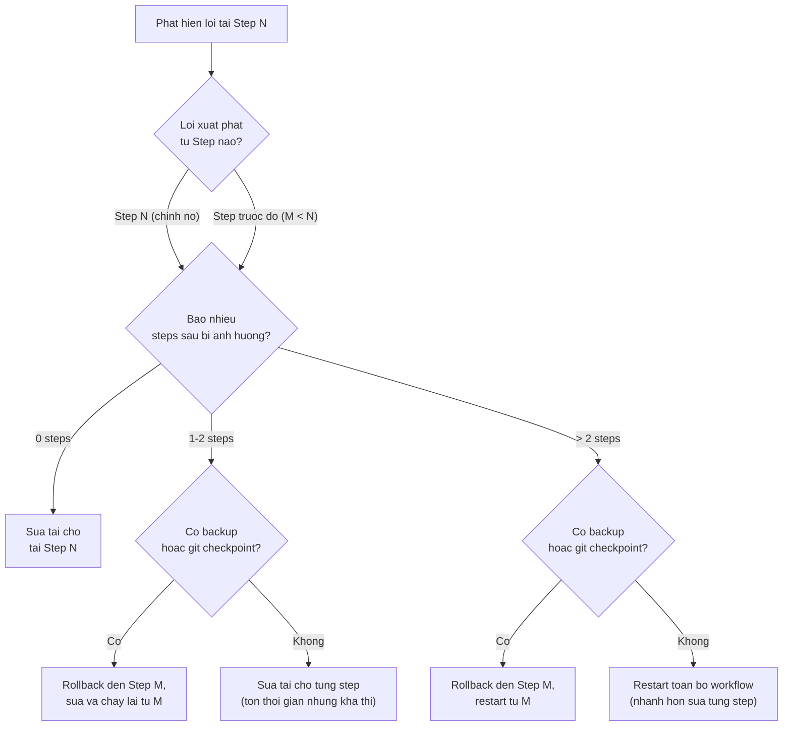

# Module 08: Mistakes & Fixes -- Lỗi thường gặp và cách khắc phục

**Thời gian đọc:** 15 phút | **Mức độ:** Beginner-Intermediate
**Cập nhật:** 2026-03-01 | Models: xem [specs](reference/model-specs.md)

---
depends-on: [reference/model-specs, 02-setup-personalization, 03-prompt-engineering, 04-context-management, 06-tools-features, 07-template-library, 09-evaluation-framework, 10-claude-desktop-cowork]
impacts: []
---

Module này tổng hợp những lỗi phổ biến nhất khi sử dụng Claude và cách khắc phục cụ thể. Chia thành 6 nhóm theo nguyên nhân gốc.

---

## 8.1 Nhóm 1: Prompt không rõ ràng

Đây là nguyên nhân #1 cho kết quả không như ý. Claude làm chính xác những gì bạn yêu cầu -- vấn đề là yêu cầu chưa đủ rõ.

### Lỗi: Prompt quá chung chung

**Sai:**

```text
Viết Style Guide cho tài liệu kỹ thuật.
```

**Đúng:**

```text
Viết Style Guide cho tài liệu kỹ thuật Phenikaa-X.
Scope: SOP vận hành và Technical Specifications.
Audience: Technical Writers và kỹ sư viết tài liệu (không phải end-users).
Sections bắt buộc: Terminology, Heading levels, Code formatting, Source citation.
Format: Bảng rule + ví dụ cho mỗi rule. Độ dài: tối đa 4 trang.
```

**Tại sao:** Prompt đầu thiếu: scope, audience, sections cần có, format, và độ dài. Claude phải đoán tất cả.

> [!NOTE] **AMR Context** — "Viết SOP kiểm tra Lidar trước khi vận hành robot AMR-003. Audience: kỹ thuật viên bảo trì (biết cơ bản về robot, không phải developer). Format: checklist với criteria pass/fail. Độ dài: tối đa 2 trang."

> [!TIP] **Model:** Sonnet 4.6 — Tác vụ viết tài liệu có cấu trúc. Xem [decision flowchart](reference/model-specs.md#chọn-model)

### Lỗi: Thiếu context quan trọng

**Sai:**

```text
Review tài liệu này cho tôi.
```

**Đúng:**

```text
Review Technical Spec "AMR Navigation System v2.1" (đính kèm).
Document type: Technical Specification, audience: R&D engineers.
Focus: Completeness và accuracy của performance specs, consistency với v2.0.
Đã tự check: Structure và format — OK. Cần help về technical content.
```

**Quy tắc:** Cung cấp 4 thông tin: Tài liệu gì? Audience là ai? Focus vào khía cạnh nào? Đã tự kiểm tra gì rồi?

> [!NOTE] **AMR Context** — "Robot AMR-003 chạy ROS2 Humble, dùng Cartographer SLAM. Lỗi: robot dừng đột ngột sau 2 giờ vận hành trong nhà máy 2000m2. Log error: [paste log]. Đã thử: restart node, re-calibrate Lidar — vẫn lỗi."

> [!TIP] **Model:** Sonnet 4.6 — Review văn bản kỹ thuật. Dùng Opus 4.6 khi phân tích lỗi phức tạp cần reasoning sâu. Xem [decision flowchart](reference/model-specs.md#chọn-model)

### Lỗi: Yêu cầu nhiều thứ trong 1 prompt

**Sai:**

```text
Viết Style Guide, review 3 SOPs hiện có theo Style Guide đó,
và tạo template mới cho Technical Specification.
```

**Đúng:** Tách thành 3 conversations hoặc 3 messages riêng biệt. Mỗi lần focus 1 task.

> [!NOTE] **AMR Context** — "Viết SOP cho 5 quy trình vận hành robot, review code navigation stack, và tạo báo cáo sự cố tuần trước." — Cùng vấn đề: 3 tasks khác nhau, cần tách riêng.

> [!TIP] **Model:** Sonnet 4.6 cho mỗi task riêng. Xem [decision flowchart](reference/model-specs.md#chọn-model)

---

## 8.2 Nhóm 2: Kỳ vọng sai về khả năng Claude

### Lỗi: Nghĩ Claude "biết" dự án của bạn

Claude không biết gì về dự án của bạn trừ khi bạn cung cấp. Mỗi conversation mới bắt đầu từ zero (trừ khi dùng Projects hoặc Memory).

**Fix:** Dùng Projects. Upload tài liệu dự án vào Project Knowledge. Viết Project Instructions mô tả context. Xem [Module 02](../guide/02-setup-personalization.md).

### Lỗi: Tin tuyệt đối kết quả Claude

Claude có thể tạo thông tin sai (hallucination) -- đặc biệt với số liệu cụ thể, thông tin mới sau training cutoff, hoặc chi tiết kỹ thuật rất chuyên sâu.

**Fix:** Luôn verify thông tin quan trọng. Thêm vào prompt:

```text
Nếu không chắc chắn, nói rõ mức độ tin cậy.
Đánh dấu [FACT] cho thông tin chắc chắn, [INFERENCE] cho suy luận.
```

### Lỗi: Yêu cầu Claude truy cập internet mà không bật Web Search

**Fix:** Bật Web Search: Message input > "Search and tools" > Toggle "Web Search".

### Lỗi: Yêu cầu Claude nhớ từ conversation trước

Mỗi conversation là độc lập. Claude không tự động nhớ conversation trước (trừ khi Memory được bật và có đủ thời gian cập nhật).

**Fix:** Dùng Handover ([Module 04, mục 4.5](../guide/04-context-management.md)) hoặc Projects ([Module 02](../guide/02-setup-personalization.md)).

---

## 8.3 Nhóm 3: Quản lý conversation kém

### Lỗi: Conversation quá dài, Claude bắt đầu "quên"

**Dấu hiệu:** Claude hỏi lại thông tin đã cung cấp, response không nhất quán, format thay đổi bất thường.

**Fix:** Dùng Context Refresh khi thấy dấu hiệu drift. Tạo conversation mới với Handover khi vượt 50 messages. Chi tiết: [Module 04](../guide/04-context-management.md).

### Lỗi: Yêu cầu output quá dài trong 1 prompt, phần cuối sơ sài

**Dấu hiệu:** Phần đầu tài liệu chi tiết, format đúng yêu cầu, nhưng từ giữa trở đi chất lượng giảm rõ — sections ngắn dần, format thay đổi (numbered steps chuyển sang bullet points), nội dung lặp lại, hoặc sections đã hứa trong outline bị bỏ qua hoàn toàn.

**Fix:** Đây là đặc tính kỹ thuật của cách language models tạo text, không phải lỗi do prompt. Workaround chính: tách output thành nhiều prompts, mỗi prompt chỉ viết 1-2 sections, dùng Pattern Outline-First (tạo outline trước → duyệt → viết từng section). Chi tiết cơ chế và 3 workaround patterns: [Module 04 mục 4.8](../guide/04-context-management.md).

### Lỗi: Upload file đầu conversation, hỏi về file ở message thứ 40

File ở xa trong context dễ bị "quên".

**Fix:** Upload file gần thời điểm cần dùng. Hoặc nhắc lại: "Tham khảo file [tên] tôi đã upload ở đầu conversation."

### Lỗi: Trộn nhiều topic không liên quan vào 1 conversation

**Fix:** 1 conversation = 1 task chính hoặc chuỗi tasks liên quan chặt chẽ.

---

## 8.4 Nhóm 4: Sử dụng tools không hiệu quả

### Lỗi: Bật Extended thinking cho mọi câu hỏi

Extended thinking tốn thời gian và tokens. Không cần cho Q&A đơn giản.

**Fix:** Chỉ bật cho: debug phức tạp, phân tích multi-module, so sánh giải pháp, code review lớn. Tắt cho: hỏi đáp nhanh, viết email, format tài liệu.

### Lỗi: Connect quá nhiều MCP Connectors

Connector chỉ tốn tokens khi được gọi trong conversation. Tuy nhiên, connect quá nhiều tăng complexity và rủi ro chia sẻ data không cần thiết.

**Fix:** Chỉ connect services thực sự cần. Disconnect khi xong.

### Lỗi: Không dùng Projects cho công việc lặp lại

Mỗi conversation lại phải giải thích context, standards, format từ đầu.

**Fix:** Tạo Project với Instructions và Knowledge. Chi tiết: [Module 02](../guide/02-setup-personalization.md).

### Lỗi: Thêm "think step-by-step" khi đã bật Extended thinking

Khi Extended thinking đã bật, Claude TỰ ĐỘNG suy luận từng bước. Thêm instructions thừa có thể làm giảm hiệu quả.

[Nguồn: Anthropic Docs - Extended Thinking Tips]

**Fix:** Khi bật Extended thinking, viết prompt đơn giản và rõ ràng. Bỏ chain-of-thought instructions.

---

## 8.5 Nhóm 5: Lỗi liên quan đến model

### Hallucination -- Claude tạo thông tin sai

**Tình huống phổ biến:**

- Bịa số liệu thống kê
- Tạo citations không tồn tại
- Khẳng định sai về chi tiết kỹ thuật
- Nói "theo tài liệu X..." nhưng tài liệu X không nói vậy

**Fix (trong prompt):**

```xml
<quality_requirements>
- Chỉ đưa thông tin bạn chắc chắn. Nếu không chắc, nói rõ.
- Không bịa số liệu. Nếu không có data, nói "Tôi không có data cụ thể cho..."
- Đánh dấu [FACT] cho thông tin xác minh được, [INFERENCE] cho suy luận.
</quality_requirements>
```

**Fix (sau khi nhận response):** Yêu cầu Claude self-check:

```text
Review lại response trước. Có thông tin nào bạn không chắc chắn 100% không?
Nếu có, đánh dấu và đề xuất cách verify.
```

> [!NOTE] **AMR Context** — Khi hỏi về specs kỹ thuật AMR: "Nếu không chắc về thông số này, nói rõ mức độ tin cậy. Đánh dấu [FACT] cho thông tin từ datasheet, [INFERENCE] cho suy luận từ kinh nghiệm."

> [!TIP] **Model:** Opus 4.6 — Nội dung safety-critical (specs robot, thông số an toàn) cần accuracy cao. Dùng Sonnet cho tài liệu hành chính thông thường. Xem [decision flowchart](reference/model-specs.md#chọn-model)

### Claude từ chối không cần thiết

Đôi khi Claude từ chối task hoàn toàn hợp lệ vì hiểu sai ý định.

**Fix:** Giải thích rõ mục đích:

```
Mục đích: Tôi đang viết tài liệu an toàn cho đội vận hành robot.
Đây là tài liệu nội bộ, không phải để gây hại.
Hãy giúp tôi liệt kê các rủi ro an toàn khi vận hành AMR trong nhà máy.
```

### Claude quá "chiều" bạn (Sycophancy)

Claude có xu hướng đồng ý với người dùng. Claude 4.x đã cải thiện nhiều nhưng vẫn có thể xảy ra.

**Fix:**

- Thêm vào Profile Preferences: "Hãy phản biện thẳng thắn. Nếu approach của tôi có vấn đề, nói rõ thay vì đồng ý."
- Hỏi chủ động: "Có vấn đề gì với approach này không?" hoặc "Devil's advocate: tại sao cách này có thể thất bại?"
- Yêu cầu đánh giá honest: "Đánh giá thẳng thắn tài liệu này -- tôi cần criticism, không cần khen."

### Claude viết "giọng AI"

Mặc định, Claude có patterns riêng (hay dùng "delve into", "it's important to note", cấu trúc câu lặp lại).

**Fix:**

- Tạo Custom Style với mẫu viết của bạn (upload 2-3 bài bạn đã viết)
- Thêm instruction: "Viết tự nhiên, tránh các cụm từ AI phổ biến"
- Chỉ rõ giọng văn cụ thể: "Giọng technical concise, không dùng buzzwords"
- Luôn đọc lại và chỉnh sửa output -- AI là starting point, không phải final product

### Output quá dài hoặc quá ngắn

**Quá dài -- Fix:**

```text
Giới hạn response trong 300 từ.
Chỉ đưa key points, không cần giải thích chi tiết.
```

**Quá ngắn -- Fix:**

```text
Giải thích chi tiết với ví dụ cụ thể.
Mỗi section ít nhất 3-5 câu.
Include cả edge cases và exceptions.
```

---

## 8.6 Nhóm 6: Lỗi lan truyền trong Workflow nhiều bước

Nhóm 1–5 đề cập lỗi xảy ra trong phạm vi 1 prompt hoặc 1 conversation. Nhóm 6 khác về bản chất: lỗi xuất hiện trong workflow nhiều bước (chain prompting hoặc Cowork tasks), sau đó lan truyền và nhân lên qua các bước sau. Đây là nhóm lỗi phổ biến nhất trong Cowork và chain prompting — và cũng tốn thời gian sửa nhất vì thường chỉ phát hiện ở bước cuối.

[Ứng dụng Kỹ thuật]

### Cơ chế lỗi lan truyền

Hãy hình dung một documentation workflow 4 bước: Step 1 tạo outline cho bộ tài liệu bảo trì robot, Step 2 viết section Prerequisites, Step 3 viết section Quy trình, Step 4 viết section Xử lý sự cố. Nếu outline ở Step 1 thiếu section Prerequisites (do prompt không yêu cầu rõ), thì Step 2 không biết phải viết gì — Claude có thể bỏ qua hoặc viết một section khác thay thế. Step 3 viết quy trình mà không có prerequisites reference, nên thiếu các bước kiểm tra đầu vào. Step 4 review phát hiện vấn đề — nhưng lúc này phải viết lại từ Step 1.

**Analogy cho kỹ sư:** Giống calibrate sai sensor ở đầu pipeline — mọi node downstream đều nhận signal sai. Fix đúng là re-calibrate sensor (sửa Step gốc), không phải chỉnh từng node downstream (patch từng step sau).

### Bảng lỗi gốc và hậu quả

| Lỗi gốc tại Step N | Hậu quả tại Step N+1, N+2... |
|--------------------|-------------------------------|
| Outline thiếu section | Tất cả content steps bỏ sót section đó — phát hiện muộn phải thêm vào từng file |
| Sai terminology ở step đầu (dùng "calibration" thay vì "alignment") | Terminology sai lan toàn bộ document, inconsistent với glossary công ty |
| Template sai format (thiếu cột, sai heading level) | Tất cả files tạo từ template đều sai format, sửa hàng loạt |
| Glossary định nghĩa sai 1 thuật ngữ | Mọi SOP dùng glossary đó đều dùng sai thuật ngữ |

### Prevention patterns

#### Pattern A — Backup prompt cho Cowork

Thêm instruction sau vào Global Instructions hoặc đầu mỗi Cowork task:

```text
Trước khi sửa bất kỳ file nào, tạo bản backup với suffix _backup.
Ví dụ: SOP-AMR-001.md → SOP-AMR-001_backup.md.
Chỉ xóa backup khi tôi xác nhận output OK.
```

#### Pattern B — Validation prompt giữa các bước

Sau mỗi step quan trọng (đặc biệt step tạo template, outline, hoặc glossary), chạy validation prompt trước khi tiếp tục:

```xml
<task>
Kiểm tra output vừa tạo trước khi tiếp tục bước tiếp theo.
</task>

<validation_checklist>
1. Đếm số sections/items — có khớp với yêu cầu ban đầu không?
2. Có thông tin nào bạn không chắc chắn mà đã viết như sự thật không?
3. Có mâu thuẫn nào giữa output này và context/instructions đã cho không?
</validation_checklist>

<output_format>
Trả lời 3 câu hỏi trên. Nếu phát hiện vấn đề, liệt kê cụ thể.
</output_format>
```

> [!NOTE] **AMR Context** — Dùng validation prompt sau khi Claude tạo SOP template: "Kiểm tra template vừa tạo: 1. Có đủ 10 sections chuẩn SOP không? 2. Terminology có nhất quán với Glossary đã cung cấp không? 3. Có section nào ambiguous không?"

> [!TIP] **Model:** Sonnet 4.6 — Validation là tác vụ kiểm tra checklist đơn giản, không cần Opus. Xem [decision flowchart](reference/model-specs.md#chọn-model)

#### Pattern C — Git approach

Dành cho người đã dùng Git — cách đơn giản nhất để rollback khi Cowork task sai:

```bash
git add . && git commit -m "checkpoint: trước khi chạy task [tên task]"
```

Chạy lệnh trên trước mỗi Cowork task. Nếu output sai, rollback bằng `git checkout .` để quay về checkpoint.

### Recovery decision framework



**Rule of thumb:** Cố patch output sai bằng prompt tiếp theo thường tốn thời gian hơn restart từ step gốc — và kết quả kém nhất quán hơn.

### Cowork-specific risks

| Risk | Tình huống | Prevention |
|------|-----------|------------|
| **Overwrite file gốc** | Claude sửa trực tiếp file gốc thay vì tạo bản mới, không thể undo | Dùng Pattern A (backup prompt), hoặc Git checkpoint trước mỗi task |
| **Sửa nhầm file** (tên gần giống) | Folder có `SOP-AMR-001.md` và `SOP-AMR-001-draft.md`, Claude sửa nhầm file draft | Chỉ rõ file path đầy đủ trong prompt, không dùng tên file rút gọn |
| **Tạo file mới thay vì sửa file cũ** | Yêu cầu "cập nhật SOP", Claude tạo file mới bên cạnh file cũ thay vì edit | Viết rõ: "Sửa file [tên chính xác], không tạo file mới" |
| **Cascade edit** (sửa A, Claude tự ý sửa B) | Yêu cầu sửa glossary, Claude tự ý sửa luôn SOP reference glossary đó | Giới hạn scope trong prompt: "Chỉ sửa file [tên]. Không sửa file khác." |

**Xem thêm:** [Module 10 mục 10.7](../guide/10-claude-desktop-cowork.md) (An toàn Cowork), [Module 09 mục 9.6](../guide/09-evaluation-framework.md) (Review giữa các bước), [Module 03 mục 3.5](../guide/03-prompt-engineering.md#task-decomposition--khi-nào-và-cách-tách-task-advanced) (Task Decomposition — prevention ở cấp độ planning)

---

## 8.7 Bảng tra cứu nhanh: Vấn đề > Giải pháp

| Vấn đề | Giải pháp nhanh | Module tham khảo |
|--------|----------------|-----------------|
| Kết quả không liên quan | Thêm context và constraints | [03](../guide/03-prompt-engineering.md) (Prompt Engineering) |
| Claude "quên" giữa conversation | Context Refresh hoặc Handover | [04](../guide/04-context-management.md) (Context Management) |
| Hallucination | Thêm `<quality_requirements>`, yêu cầu self-check | [03](../guide/03-prompt-engineering.md), [09](../guide/09-evaluation-framework.md) |
| Output sai format | Cung cấp template hoặc ví dụ trong prompt | [03](../guide/03-prompt-engineering.md) (Nguyên tắc 2: Use Examples) |
| Output dài bị sơ sài ở cuối | Tách thành nhiều prompts, dùng Outline-First | [04](../guide/04-context-management.md) (mục 4.8), [03](../guide/03-prompt-engineering.md) (mục 3.5) |
| Lỗi lan truyền qua nhiều bước | Validation checkpoint, backup trước mỗi step | 08 (Nhóm 6) |
| Mỗi chat phải giải thích lại context | Tạo Project với Instructions | [02](../guide/02-setup-personalization.md) (Setup) |
| Không biết dùng tool nào | Tra cứu bảng tools | [06](../guide/06-tools-features.md) (Tools & Features) |
| Cần template có sẵn | Tra cứu Template Library | [07](../guide/07-template-library.md) (Templates) |
| Output quá chung | Thêm role, audience, ví dụ mong muốn | [03](../guide/03-prompt-engineering.md) (Nguyên tắc 1, 6) |

---

## 8.8 Quick Troubleshooting Flowchart

```text
Output khong dung y?
|-- Qua ngan/dai         --> Chi ro do dai mong muon
|-- Sai format           --> Cho example cu the
|-- Sai noi dung         --> Cung cap them context
|-- Khong follow rules   --> Nhac lai rules o cuoi prompt
|-- Giong van khong phu hop --> Doi Style hoac tao Custom Style
|-- Claude tu choi       --> Giai thich muc dich ro rang

Claude khong nho context?
|-- Chat thuong          --> Dung Projects
|-- Da trong Project     --> Kiem tra instructions
|-- Can nho dai han      --> Bat Memory

Chat luong giam?
|-- Chat qua dai         --> Bat dau chat moi
|-- Task qua phuc tap    --> Chia nho (prompt chaining)
|-- Model khong du manh  --> Thu model cao hon
```

---

## 8.9 Mindset quan trọng nhất

**Claude là công cụ, không phải phép thuật.**

**Những gì Claude làm tốt:** Viết nhanh draft đầu tiên. Review và tìm lỗi trong tài liệu. Reformat và restructure nội dung. Tổng hợp thông tin từ nhiều nguồn. Tạo templates và frameworks. Brainstorm ý tưởng.

**Những gì bạn vẫn cần làm:**

- **Quyết định final** -- AI đề xuất, bạn quyết.
- **Verify thông tin quan trọng** -- đặc biệt technical specs, legal, financial.
- **Review và edit** -- output AI là starting point, không phải product cuối.
- **Cung cấp domain expertise** -- Claude biết rộng, bạn biết sâu trong lĩnh vực của mình.
- **Đặt câu hỏi đúng** -- chất lượng input quyết định chất lượng output.

---

## 8.10 Tài nguyên bổ sung

- [Claude Help Center](https://support.claude.com/) -- FAQ chính thức
- [Anthropic Docs](https://docs.anthropic.com/) -- Tài liệu kỹ thuật
- [Prompt Engineering Course](https://anthropic.skilljar.com) -- Khóa học miễn phí từ Anthropic
- [Claude Blog](https://claude.com/blog/) -- Tips và updates

---

**Tiếp theo:**

- [Module 09: Evaluation Framework](../guide/09-evaluation-framework.md) -- cách đánh giá chất lượng output
- [Module 03: Prompt Engineering](../guide/03-prompt-engineering.md) -- hiểu sâu nguyên tắc để tránh lỗi từ đầu
