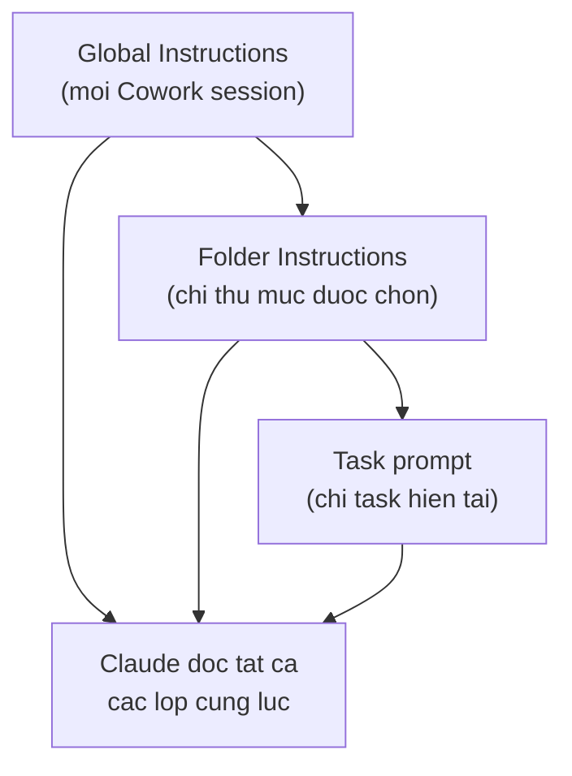
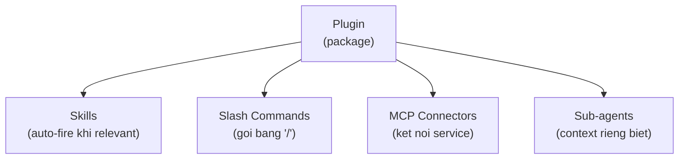
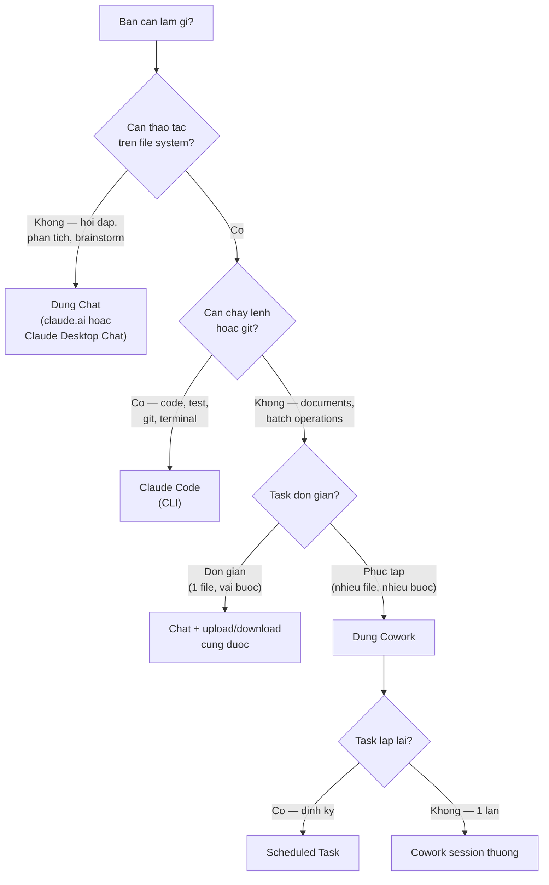
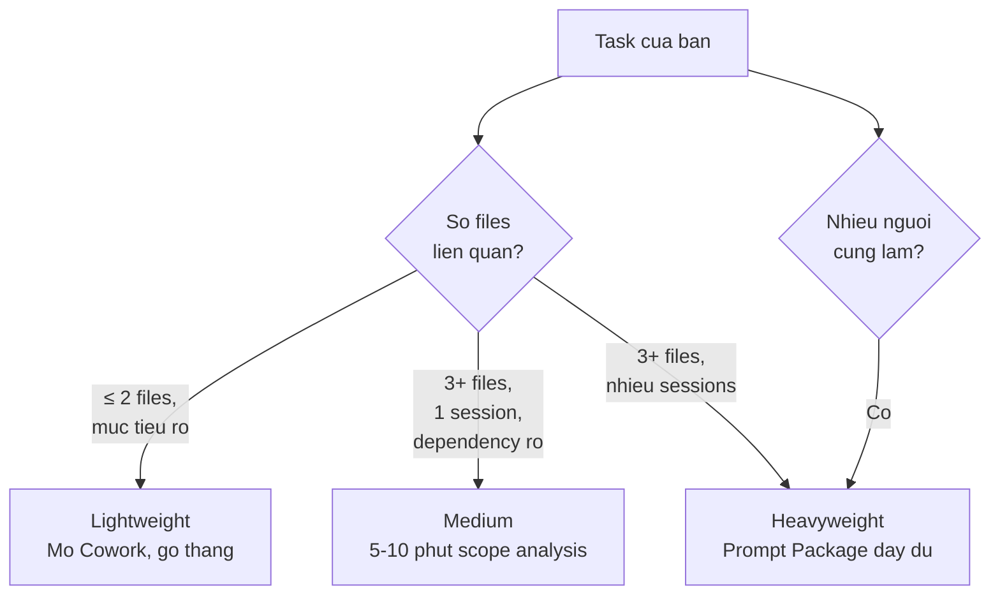
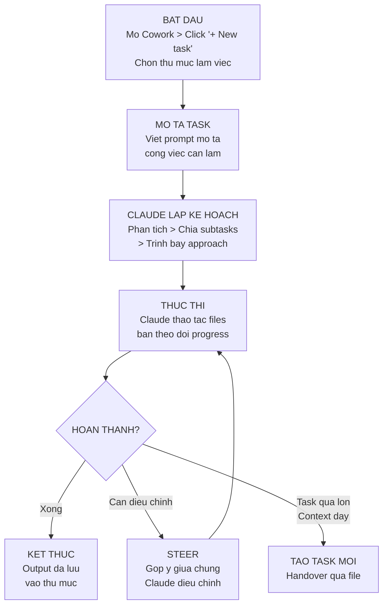
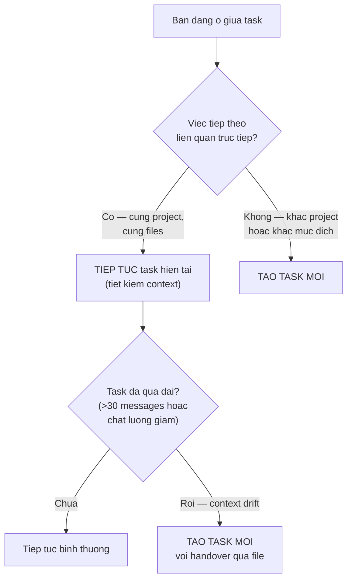

# Module 10: Claude Desktop & Cowork

**Thời gian đọc:** 25 phút | **Mức độ:** Beginner-Intermediate
**Cập nhật:** 2026-03-01 | Models: xem [specs](reference/model-specs.md)

---
depends-on: [reference/model-specs, reference/config-architecture, reference/skills-list, reference/claude-code-setup, 02-setup-personalization, 05-workflow-recipes, 06-tools-features, 11-cowork-workflows]
impacts: [05-workflow-recipes, 06-tools-features, 08-mistakes-fixes, 09-evaluation-framework, 11-cowork-workflows]
---

Module này hướng dẫn sử dụng Claude Desktop — ứng dụng native trên máy tính — với tính năng Cowork cho phép Claude thao tác trực tiếp trên file system. Nếu bạn chỉ dùng Claude qua web (claude.ai), đây là bước tiếp theo để tăng năng suất.

> **Lưu ý:** Cowork hiện là **research preview** — tính năng có thể thay đổi. Module này cập nhật đến 03/2026.

[Nguồn: Anthropic Help Center — Get started with Cowork]
URL: https://support.claude.com/en/articles/13345190-get-started-with-cowork

---

## 10.1 Claude Desktop vs Claude.ai — Khác gì?

Claude Desktop là ứng dụng native cho macOS và Windows, cung cấp 3 chế độ làm việc:

[Nguồn: Navigating the Claude desktop app: Chat, Cowork, Code]
URL: https://claude.com/resources/tutorials/navigating-the-claude-desktop-app

| Chế độ | Mục đích | Ai dùng |
|--------|----------|---------|
| **Chat** | Giống claude.ai — hỏi đáp, phân tích, viết | Mọi người |
| **Cowork** | Thao tác file, automation, task phức tạp nhiều bước | Knowledge workers, team leads |
| **Code** | Viết code, test, deploy, Git integration | Developers |

**Cách hiểu nhanh:** Chat = hỏi Claude. Cowork = Claude làm việc trên file của bạn. Code = Claude viết code cùng bạn.

### Cowork là gì

[Nguồn: Introducing Cowork]
URL: https://claude.com/blog/cowork-research-preview

Cowork dùng cùng kiến trúc agent với Claude Code, nhưng hướng đến non-coding tasks. Khi bạn bật Cowork và chọn thư mục làm việc, Claude có thể đọc, tạo, sửa, xóa file trong thư mục đó — tự động, nhiều bước, không cần bạn can thiệp từng bước.

**Ví dụ thực tế:**

| Task | Chat (claude.ai) | Cowork |
|------|-------------------|--------|
| Viết SOP cho AMR | Claude viết text, bạn copy-paste vào file | Claude tạo file .md hoặc .docx trực tiếp trong thư mục |
| Review 5 tài liệu | Upload từng file, review từng cái | Claude đọc cả 5 file trong thư mục, tạo báo cáo review |
| Chuyển Word → Markdown | Upload file, copy output | Claude đọc .docx, tạo .md, lưu cạnh nhau |
| Kiểm tra thuật ngữ nhất quán | Paste text + glossary | Claude scan toàn bộ folder theo glossary |

### Yêu cầu

- **Plan:** Pro, Max, Team, hoặc Enterprise (không hỗ trợ Free plan)
- **Nền tảng:** macOS hoặc Windows
- **App:** Claude Desktop (download tại https://claude.ai/download)

---

## 10.2 Cấu hình Cowork — 3 lớp instructions

Cowork có 3 lớp cấu hình, xếp theo scope từ rộng đến hẹp:



| Lớp | Scope | Khi nào cấu hình | Ai nên cấu hình |
|-----|-------|-------------------|------------------|
| **Global Instructions** | Mọi Cowork session | 1 lần, update khi đổi role/workflow | Mỗi người dùng |
| **Folder Instructions** | Chỉ khi chọn thư mục đó | Khi thư mục có project riêng | Team lead hoặc project owner |
| **Task prompt** | Chỉ task hiện tại | Mỗi khi bắt đầu task | Mọi người |

**Quy tắc ưu tiên:** Khi có conflict, lớp hẹp hơn được ưu tiên (Folder > Global). Task prompt luôn có quyền cao nhất.

---

## 10.3 Global Instructions

**Vị trí:** Claude Desktop → Settings → Cowork → Click "Edit" bên cạnh "Global instructions"

**Mục đích:** Thiết lập context mặc định cho mọi session — role, ngôn ngữ, file conventions, response rules. Giống "Profile Preferences" của claude.ai nhưng dành cho Cowork.

### Template Global Instructions cho kỹ sư Phenikaa-X

[Ứng dụng Kỹ thuật]

```markdown
# Context — {{Họ tên}} @ Phenikaa-X

## Identity
- Tôi là {{chức vụ/vai trò}} tại Phenikaa-X.
- Lĩnh vực: {{mô tả ngắn — ví dụ: phát triển robot tự hành AMR cho nhà máy}}.

## Language Rules
- Trả lời bằng tiếng Việt. Giữ thuật ngữ kỹ thuật tiếng Anh.
- Khi tôi yêu cầu English output → chuyển hoàn toàn sang tiếng Anh.

## Toolchain & File Conventions
- File format mặc định: {{format — ví dụ: Markdown (.md)}}.
- Khi tạo file mới → dùng {{format}} trừ khi tôi yêu cầu format khác.
- Khi cần output Word/Excel/PPT/PDF → hỏi confirm trước khi tạo.

## Response Rules
1. Khi không chắc chắn → nói rõ + đề xuất cách verify.
2. Khi thao tác file → giải thích ngắn gọn sẽ làm gì trước khi thực hiện.

## File Operations
- KHÔNG tự ý xóa hoặc overwrite file mà không hỏi.
- Khi edit file có sẵn → cho tôi xem thay đổi trước khi save.
```

**Ví dụ đã điền — Team Lead tự động hóa:**

[Ứng dụng Kỹ thuật]

```markdown
# Context — Nguyễn Văn A @ Phenikaa-X

## Identity
- Tôi là Automation Team Leader tại Phenikaa-X.
- Lĩnh vực: triển khai và vận hành hệ thống AMR trong nhà máy.

## Language Rules
- Trả lời bằng tiếng Việt. Giữ thuật ngữ kỹ thuật tiếng Anh
  (AMR, ROS, SLAM, Lidar, navigation, localization).
- Khi tôi yêu cầu English output → chuyển hoàn toàn sang tiếng Anh.

## Toolchain & File Conventions
- File format mặc định: Markdown (.md).
- Khi tạo file mới → dùng Markdown trừ khi tôi yêu cầu format khác.
- Khi cần output Word/Excel/PPT/PDF → hỏi confirm trước khi tạo.
- Naming convention: lowercase, dấu gạch ngang (ví dụ: sop-charging-v1.md).

## Response Rules
1. Khi không chắc chắn → nói rõ + đề xuất cách verify.
2. Khi thao tác file → giải thích ngắn gọn sẽ làm gì trước khi thực hiện.
3. Khi đề xuất → trình bày options có pro/con để tôi quyết định.

## File Operations
- KHÔNG tự ý xóa hoặc overwrite file mà không hỏi.
- Khi edit file có sẵn → cho tôi xem thay đổi trước khi save.
```

---

## 10.4 Folder Instructions

**Vị trí:** Claude Desktop → Settings → Cowork → "Folder instructions" → "Use this to give Claude instructions for working in this folder."

**Mục đích:** Thêm context riêng cho từng thư mục — project conventions, file structure, scope boundaries. Chỉ active khi chọn thư mục đó.

[Nguồn: Anthropic Help Center — Get started with Cowork]

**Đặc điểm quan trọng:** Claude có thể **tự cập nhật** folder instructions trong session. Khi Claude học thêm về project qua quá trình làm việc, nó có thể đề xuất hoặc tự thêm thông tin vào folder instructions.

### Khi nào tạo Folder Instructions

| Tình huống | Cần Folder Instructions? |
|------------|:---:|
| Thư mục chứa project có naming convention riêng | ✅ |
| Thư mục cần context đặc thù (decisions, phase, references) | ✅ |
| Thư mục chia sẻ với team — cần nhất quán | ✅ |
| Thư mục tạm, dùng 1 lần | ❌ |
| Task đơn giản, context đủ trong prompt | ❌ |

### Template Folder Instructions

[Ứng dụng Kỹ thuật]

```markdown
# Folder: {{TÊN PROJECT / THƯ MỤC}}

## Mục đích
Thư mục này chứa {{mô tả nội dung}}.

## File Structure
- {{mô tả cấu trúc — ví dụ:}}
- docs/       — tài liệu chính thức
- drafts/     — bản nháp đang viết
- templates/  — mẫu tài liệu
- logs/       — log files từ hệ thống

## Conventions
- Naming: {{quy tắc — ví dụ: lowercase, dấu gạch ngang, có version}}
- Format: {{format mặc định}}
- Language: {{ngôn ngữ — ví dụ: tiếng Việt, thuật ngữ kỹ thuật tiếng Anh}}

## Project Context
{{bối cảnh cần thiết — phase, decisions, references}}

## Rules
- {{quy tắc riêng cho thư mục — ví dụ:}}
- Không sửa files trong docs/ mà không hỏi trước.
- File mới tạo trong drafts/ phải có header: tên, ngày, version.
```

**Ví dụ đã điền — Thư mục SOP cho Automation Team:**

[Ứng dụng Kỹ thuật]

```markdown
# Folder: SOP-AMR-Operations

## Mục đích
Thư mục này chứa tất cả SOP (Standard Operating Procedures)
cho vận hành hệ thống AMR tại nhà máy Phenikaa-X.

## File Structure
- approved/    — SOP đã duyệt, đang áp dụng
- drafts/      — SOP đang soạn hoặc chờ review
- templates/   — Template SOP chuẩn
- archive/     — SOP cũ, không còn áp dụng

## Conventions
- Naming: sop-[mã robot]-[tên quy trình]-v[X].md
  Ví dụ: sop-amr003-daily-check-v2.md
- Format: Markdown với header chuẩn (tên SOP, version, ngày, người soạn)
- Language: Tiếng Việt, giữ thuật ngữ kỹ thuật tiếng Anh

## Project Context
- Đội vận hành gồm 8 kỹ thuật viên, trình độ trung cấp-cao đẳng
- Robot models: AMR-001 đến AMR-005
- Tech stack: ROS2 Humble, Cartographer SLAM, 2D Lidar

## Rules
- KHÔNG sửa files trong approved/ — tạo bản mới trong drafts/ rồi hỏi tôi.
- Mỗi SOP phải có: Mục đích, Prerequisites, Steps (numbered), Expected Results.
- Safety warnings dùng format: ⚠️ CẢNH BÁO: [nội dung]
```

**Ví dụ thực tế — Folder Instructions đang dùng cho Guide Claude project:**

[Ứng dụng Kỹ thuật]

Đây là nội dung `.claude/CLAUDE.md` thực tế của dự án "Claude Guide cho Kỹ sư Phenikaa-X" — một Folder Instructions thực tế cho project nhiều module, nhiều sessions.

```markdown
# Folder Instructions — Claude Guide Project

## Project overview
Đây là dự án "Claude Guide cho Kỹ sư Phenikaa-X" — bộ tài liệu 13 modules hướng dẫn sử dụng Claude AI.

## Folder structure
- guide/ — 13 module files (00-overview đến 12-claude-code-documentation) + reference/
- project-state.md — project overview
- VERSION — single source of truth cho version number

## Conventions
- Language: Tiếng Việt, thuật ngữ kỹ thuật giữ tiếng Anh
- Source markers: [Nguồn: ...] cho official, [Ứng dụng Kỹ thuật] cho applied examples
- File naming: lowercase, dấu gạch ngang, có số thứ tự module (01-, 02-...)

## Rules
- KHÔNG sửa file trong guide/ mà không tạo backup (.bak) trước
- Khi edit module: đọc VERSION để biết version hiện tại
- Khi bump version: sửa VERSION trước, sau đó update module headers
```

**Nhận xét cấu trúc:** Folder Instructions này giữ ngắn (~200 words), tập trung vào folder-specific context (structure, conventions, memory protocol, rules). Không lặp lại Global Instructions (language rules, file safety đã có ở Global).

### Tips quản lý Folder Instructions

- **Giữ ngắn gọn.** Chỉ viết những gì khác biệt so với Global Instructions. Không lặp.
- **Cập nhật khi chuyển phase.** Project thay đổi → folder instructions cần update.
- **Để Claude đề xuất.** Sau vài session, hỏi: "Có gì cần thêm vào folder instructions không?"

### 10.4.1 Folder Instructions vs Project Instructions — So sánh và khi nào dùng

[Ứng dụng Kỹ thuật]

Đây là cặp khái niệm dễ nhầm nhất vì cùng phục vụ một mục đích (hướng dẫn Claude trong một nhóm công việc cụ thể) nhưng trên hai surface khác nhau.

| Tiêu chí | Project Instructions (claude.ai) | Folder Instructions (Cowork) |
|---|---|---|
| **Surface** | Claude.ai — web/app | Cowork — Claude Desktop |
| **Vị trí lưu** | Project Settings UI (không phải file) | `project/.claude/CLAUDE.md` (file) |
| **Format** | Free text hoặc XML | Markdown |
| **Versioning** | Không — không track được lịch sử | Có — Git trackable |
| **Chia sẻ với team** | Không trực tiếp | Có — commit vào repo |
| **Scope** | Tất cả conversations trong Project | Tất cả Cowork tasks trong folder |
| **Giới hạn độ dài** | ~2,000–4,000 tokens (UI limit) | Không giới hạn cứng (thực tế nên < 500 words) |
| **Claude có thể tự update** | Không | Có — Claude có thể đề xuất hoặc tự thêm |
| **Khi nào nội dung thay đổi** | Mỗi lần role/mục đích project thay đổi | Mỗi lần project structure hoặc phase thay đổi |
| **Templates** | `_scaffold/project-instructions/` | `_scaffold/.claude/CLAUDE-template.md` |

**Decision tree — chọn loại nào:**

```text
Tôi muốn hướng dẫn Claude cho một nhóm công việc cụ thể

└─ Tôi đang dùng surface nào?
   │
   ├── Claude.ai (web/mobile)
   │   └── → Project Instructions
   │       (Project Settings > Instructions)
   │
   └── Cowork (Claude Desktop)
       └── → Folder Instructions
           (project/.claude/CLAUDE.md)

Nội dung rule này dùng cho bao nhiêu projects?
   │
   ├── Tất cả projects/tasks → Global level
   │   ├── claude.ai: Profile Preferences
   │   └── Cowork: Global CLAUDE.md (~/.claude/CLAUDE.md)
   │
   └── Chỉ project này → Project/Folder level
       ├── claude.ai: Project Instructions
       └── Cowork: Folder Instructions
```

**Khi dùng cả hai cùng lúc (workflow kết hợp claude.ai + Cowork):**

Một số kỹ sư dùng claude.ai để brainstorm và planning, sau đó chuyển sang Cowork để thực thi. Trong trường hợp này, cần maintain cả hai:
- Project Instructions (claude.ai): role, context kỹ thuật, output format
- Folder Instructions (Cowork): folder structure, memory protocol, safety rules

Hai file có thể overlap nhau ở phần context chung — đó là bình thường. Quan trọng là Folder Instructions không cần lặp Global CLAUDE.md, còn Project Instructions không cần biết về folder structure.

**Xem thêm:** `guide/reference/config-architecture.md` — bảng so sánh đầy đủ tất cả 6 lớp cấu hình.

---

## 10.5 Scheduled Tasks — Tự động hóa định kỳ

[Nguồn: Anthropic Help Center — Schedule recurring tasks in Cowork]
URL: https://support.claude.com/en/articles/13854387-schedule-recurring-tasks-in-cowork
[Cập nhật 03/2026]

Scheduled Tasks cho phép Cowork tự động chạy task theo lịch — daily, weekly, hourly — miễn máy tính bật và Claude Desktop đang mở.

> ⚠️ **Quan trọng:** Scheduled tasks **chỉ chạy khi máy tính đang bật và Claude Desktop app đang mở**. Nếu máy ngủ hoặc app đóng, task sẽ bỏ lỡ — Cowork sẽ chạy bù khi hệ thống available trở lại. [Nguồn: Anthropic Support]

Mỗi scheduled task chạy trong **Cowork session riêng biệt** — có access đến toàn bộ tools, plugins, và MCP servers đã kết nối, giống như bạn tự tay mở session và chạy task đó.

### Cách tạo

**Cách 1 — Qua lệnh `/schedule`:**

1. Trong bất kỳ Cowork session nào, gõ `/schedule`
2. Claude hướng dẫn setup từng bước

**Cách 2 — Qua giao diện:**

1. Click **"Scheduled"** trên sidebar trái
2. Click **"+ New task"**
3. Điền 4 thành phần:

| Thành phần | Mô tả | Ví dụ |
|------------|-------|-------|
| **Name** | Tên task ngắn gọn | "Daily AMR Log Summary" |
| **Prompt instructions** | Mô tả đầy đủ việc cần làm | "Đọc tất cả log files trong logs/ từ hôm qua. Tổng hợp errors theo robot ID. Tạo file daily-report-[ngày].md" |
| **Frequency** | Lịch chạy: hourly / daily / weekly / weekdays / manual | `daily` lúc 08:00 |
| **Model choice** | Sonnet (đủ cho hầu hết tasks) hoặc Opus (khi cần reasoning sâu) | Sonnet 4.6 |

### Use cases cho Phenikaa-X

[Ứng dụng Kỹ thuật]

| Task | Tần suất | Prompt mẫu |
|------|----------|-------------|
| Tổng hợp test logs AMR theo tuần | Weekly (sáng thứ Hai) | "Đọc tất cả file trong `logs/test/` từ 7 ngày qua. Tổng hợp: số lần lỗi theo robot ID, top 3 loại lỗi phổ biến, robot nào cần bảo trì. Tạo file `weekly-amr-summary-[tuần].md` trong `reports/`." |
| Kiểm tra trạng thái ROS services hàng ngày | Daily (08:00) | "Đọc `ros-services/status.json` và `ros-services/logs/`. Báo cáo: node nào đang chạy, node nào offline, có lần restart bất thường trong 24h qua không. Tạo file `daily-ros-status-[ngày].md`." |
| Review tính nhất quán SOP | Weekly | "So sánh tất cả SOP trong `approved/` với `glossary.md`. Báo cáo thuật ngữ không nhất quán và đề xuất sửa." |
| Backup và version check | Daily | "Kiểm tra files nào thay đổi trong 24h qua. Tạo changelog entry trong `CHANGELOG.md`." |

### Giới hạn quan trọng

- Nếu bỏ lỡ (máy ngủ, app đóng) → Cowork sẽ chạy bù khi hệ thống available
- **Không dùng cho workloads quan trọng** — Cowork là research preview
- Bắt đầu với task low-risk, tránh sensitive data

---

## 10.6 Plugins & Skills

[Cập nhật 03/2026]

Skills mở rộng khả năng của Claude cho task chuyên biệt bằng cách cung cấp instructions, scripts, và resources mà Claude load theo nhu cầu. Plugins đóng gói nhiều skills cùng slash commands và connectors thành bộ cài đặt theo role hoặc function. Section này giải thích cách phân biệt, chọn, và cài đặt.

### 10.6.1 Khái niệm — Skill, Plugin, và các thành phần khác

Skill là thư mục chứa file SKILL.md (instructions kèm metadata) cùng scripts và resources tùy chọn. Claude đọc metadata (~100 tokens mỗi skill) khi khởi động session. Khi task của người dùng match với mô tả của skill, Claude tự động load full nội dung SKILL.md vào context, rồi load thêm scripts và references khi cần. Cơ chế "progressive disclosure" này giúp cài nhiều skills mà không chiếm context thừa — Claude chỉ biết skill tồn tại cho đến khi thực sự cần dùng. **Lưu ý:** auto-activation dựa trên LLM reasoning (đọc mô tả skill và đánh giá relevance), không phải keyword matching cứng — không đảm bảo kích hoạt 100% trong mọi trường hợp.

Plugin là package đóng gói nhiều thành phần: skills, slash commands, connectors, và sub-agents. Cài plugin một lần, skills bên trong tự kích hoạt khi relevant, slash commands cần gõ "/" để gọi. Plugin là cách chia sẻ và phân phối skills theo role hoặc team. MCP Connector kết nối Claude với service bên ngoài (Notion, Jira, Google Drive). MCP cung cấp DATA từ service, skill cung cấp WORKFLOW để làm việc với data đó — hai thứ bổ sung nhau, không thay thế.

Project Knowledge là static files luôn loaded trong conversation cụ thể, khác skill vì skill chỉ load on-demand khi cần. Custom Instructions là preferences áp dụng cho mọi conversation (ngôn ngữ, tone, format), khác skill vì không task-specific mà mang tính cá nhân hóa toàn cục.

| Feature | Bản chất | Cách load | Khi nào dùng |
|---------|---------|-----------|-------------|
| **Skill** | Instructions cho task chuyên biệt (SKILL.md + scripts) | On-demand — load khi task match | Cần Claude thực hiện workflow cụ thể (tạo file, review docs, viết technical content) |
| **Plugin** | Bundle: skills + commands + connectors + sub-agents | Cài 1 lần → auto khi relevant | Cần bộ công cụ hoàn chỉnh cho 1 role (productivity, PM, data) |
| **MCP Connector** | Kết nối với service bên ngoài | Connect 1 lần → available mọi session | Cần truy cập data từ service (Google Drive, Notion, Jira) |
| **Project Knowledge** | Static reference files | Always loaded trong Project | Context ổn định: glossary, style guide, templates |
| **Custom Instructions** | Preferences cá nhân | Always applied mọi chat | Quy tắc chung: ngôn ngữ, format, response style |



[Nguồn: Anthropic API Docs — Agent Skills overview]
URL: https://platform.claude.com/docs/en/agents-and-tools/agent-skills/overview

### 10.6.2 Phân loại: Loại kỹ thuật × Độ tin cậy

Skills và Plugins được phân loại theo 2 trục. Trục "Loại kỹ thuật" cho biết đây là gì và cách hoạt động: Pre-built Skill tự activate khi Claude nhận diện task phù hợp, Standalone Skill cần cài đặt thủ công, Plugin đóng gói nhiều thành phần và cài qua marketplace. Trục "Độ tin cậy" cho biết nguồn gốc và mức độ review: Official từ Anthropic đã qua internal review, Verified có badge trong Plugin Directory, Community từ cộng đồng chưa được audit chính thức.

|  | Official (Anthropic) | Verified (Plugin Directory) | Community |
|--|---------------------|----------------------------|-----------|
| **Pre-built Skill** | docx, xlsx, pptx, pdf | — | — |
| **Standalone Skill** | doc-coauthoring, internal-comms, skill-creator | Partner skills (Notion, Figma, Atlassian) | skillhub.club, GitHub repos |
| **Plugin** | productivity, product-management, data + 8 plugins khác | Plugins có badge "Anthropic Verified" tại claude.com/plugins | GitHub plugin marketplaces |

[Ứng dụng Kỹ thuật]

Pre-built Skills (docx, xlsx, pptx, pdf) đã có sẵn trên mọi surface — dùng ngay khi cần tạo file chuyên nghiệp mà không phải cấu hình gì thêm. Official Plugins phù hợp khi cần bộ workflow cho vai trò cụ thể, ví dụ productivity cho quản lý task hàng ngày, product-management cho viết PRD và roadmap. Community Skills mở rộng khả năng cho documentation workflow nhưng bắt buộc phải audit file SKILL.md và thư mục scripts/ trước khi cài đặt.

Danh sách chi tiết từng skill với URL, mô tả, và hướng dẫn cài đặt: xem file `guide/reference/skills-list.md`.

### 10.6.3 Skills khuyến nghị cho Documentation Workflow

[Ứng dụng Kỹ thuật]

| Công việc | Skill/Plugin khuyến nghị | Loại | Nguồn | Surface |
|-----------|-------------------------|------|-------|---------|
| Tạo file Word/Excel/PPT/PDF | docx, xlsx, pptx, pdf | Pre-built Skill | Official | claude.ai, Cowork, Claude Code |
| Viết tài liệu có cấu trúc | doc-coauthoring | Standalone Skill | Official | Cowork, Claude Code |
| Viết internal communications | internal-comms | Standalone Skill | Official | Cowork, Claude Code |
| Review tài liệu | docs-review | Standalone Skill | Community | Cowork, Claude Code |
| Voice & tone consistency | voice-and-tone | Standalone Skill | Community | Cowork, Claude Code |
| Markdown cho Obsidian | obsidian-markdown | Standalone Skill | Community | Cowork, Claude Code |
| Mermaid diagrams | mermaidjs-v11 | Standalone Skill | Community | Cowork, Claude Code |
| Quản lý task & workflow | productivity (plugin) | Plugin | Official | Cowork |
| Product management | product-management (plugin) | Plugin | Official | Cowork |

**Starter Pack — bộ cài đặt tối thiểu cho kỹ sư mới:** Pre-built Skills (docx, xlsx, pptx, pdf) đã có sẵn, không cần thao tác. Cài thêm 1 official plugin là productivity để quản lý task. Bổ sung 3-4 community skills ưu tiên cho documentation: doc-coauthoring (nếu chưa có sẵn), obsidian-markdown, docs-review, và voice-and-tone. Cài thêm khi workflow yêu cầu — không cần cài tất cả cùng lúc.

### 10.6.4 Cài đặt theo từng surface

**claude.ai (Web/App).** Pre-built Skills đã tích hợp sẵn — chỉ cần bật Settings > Capabilities > Code execution and file creation. Custom Skills: vào Settings > Features > upload file .skill (ZIP chứa SKILL.md + resources) [Cần xác minh path — UI có thể thay đổi]. Custom Skills trên claude.ai chỉ available cho user đó, không share được cho team members.

[Nguồn: Anthropic API Docs — Agent Skills overview]
URL: https://platform.claude.com/docs/en/agents-and-tools/agent-skills/overview

**Cowork (Claude Desktop).** Pre-built Skills có sẵn. Plugins: mở Cowork sidebar > Plugins > Browse hoặc Search > Install. Official plugins (productivity, product-management...) đã có trong marketplace mặc định. Community plugins từ GitHub: mở Cowork sidebar > Plugins > Search > nhập tên plugin hoặc GitHub repo > Install. Standalone skills: upload qua Claude Desktop > Settings > Skills.

[Nguồn: Anthropic Help Center — Use plugins in Cowork]
URL: https://support.claude.com/en/articles/13837440-use-plugins-in-cowork

**Claude Code (Terminal).** Dùng plugin marketplace: `/plugin marketplace add anthropics/skills` rồi `/plugin install <tên-skill>`. Community: `/plugin marketplace add <github-user>/<repo>` rồi install. Cài thủ công: copy thư mục skill vào `~/.claude/skills/` (personal) hoặc `.claude/skills/` (project-level).

[Nguồn: Anthropic API Docs — Agent Skills overview]
URL: https://platform.claude.com/docs/en/agents-and-tools/agent-skills/overview

CẢNH BÁO: Skills KHÔNG sync giữa các surface. Skill cài trên claude.ai không tự có trên Cowork hay Claude Code, và ngược lại. Cần cài riêng cho từng surface bạn sử dụng.

### 10.6.5 Skills thực tế trong dự án — Ví dụ từ Guide Claude Project

[Ứng dụng Kỹ thuật]

Skills được lưu tại `.claude/skills/` trong thư mục project — đây là project-level skills, chỉ active khi làm việc trong folder này. Khác với Global Skills (active mọi folder) và Plugin Skills (cài qua marketplace).

**Cấu trúc `.claude/skills/` trong Guide Claude project:**

```text
.claude/
├── CLAUDE.md              ← Folder Instructions (xem mục 10.4)
└── skills/                ← Project-level skills
    ├── session-start/     ← Orient đầu session, đọc git history, gợi ý next action
    ├── cross-ref-checker/ ← Scan stale references trước khi release
    ├── module-review/     ← Checklist 5 tiêu chí quality review
    └── version-bump/      ← Workflow chốt version: VERSION + changelog + project-state
```

**4 skills hiện có và cách dùng:**

| Skill | Trigger phrase | Mục đích |
|-------|----------------|---------|
| `session-start` | "bắt đầu", "tiếp tục", "còn lại gì" | Đọc git history, orientation 5 dòng, gợi ý next action |
| `cross-ref-checker` | "kiểm tra cross-references", "scan stale" | Tìm file paths lỗi, version refs hardcode, _memory/ patterns cũ |
| `module-review` | "review module X", "đánh giá chất lượng" | Checklist: accuracy, consistency, completeness, clarity, actionability |
| `version-bump` | "bump version", "release vX.X" | Cập nhật VERSION → changelog → project-state theo đúng thứ tự |

**Khi nào tạo project-level Skill thay vì dùng Global Skill:**
- Workflow chỉ relevant cho project này (không cần share sang project khác)
- Skill cần biết folder structure cụ thể (paths, conventions của project)
- Team project cần share cùng workflow — đặt trong `.claude/skills/` thay vì cài riêng lẻ

### 10.6.6 An toàn & Governance

**Official vs Community risk.** Official skills đã được Anthropic review nội bộ. Community skills — đặc biệt từ GitHub cá nhân — có thể chứa instructions khiến Claude thực thi code hoặc truy cập file không mong muốn. Luôn audit trước khi cài.

**Audit trước khi cài.** Với bất kỳ community skill nào: đọc toàn bộ file SKILL.md, kiểm tra thư mục scripts/ tìm network calls hoặc file access bất thường, test trên thư mục không chứa sensitive data trước khi dùng thật.

**Team governance.** Hiện tại claude.ai chưa hỗ trợ centralized admin management cho custom skills — mỗi user phải upload riêng. Với Team/Enterprise plan, admins có thể tạo private plugin marketplace kết nối GitHub repo nội bộ, kiểm soát plugins nào employees được cài.

**Open standard.** Skills tuân theo Agent Skills specification tại agentskills.io — đây là open standard được Anthropic khởi xướng và OpenAI đã adopt. Skill tạo cho Claude có thể hoạt động trên các tools khác adopt cùng standard (OpenAI Codex CLI, Gemini CLI, OpenCode...).

[Nguồn: Anthropic API Docs — Agent Skills overview — Security]
URL: https://platform.claude.com/docs/en/agents-and-tools/agent-skills/overview

### 10.6.7 Tạo Project-level Skill — Workflow từng bước

[Ứng dụng Kỹ thuật]

**Khi nào tạo skill mới thay vì dùng prompt thông thường:**

```text
Tôi cần thực hiện workflow X nhiều lần

└─ Workflow có nhiều bước tuần tự không?
   ├── Không → Dùng Prompt Template (Module 07)
   └── Có → Cần chạy tự động theo lịch không?
       ├── Có → Scheduled Task (mục 10.5)
       └── Không → Cần biết folder structure/context cụ thể không?
           ├── Có → Project-level Skill (.claude/skills/)
           └── Không → Global Skill hoặc Plugin
```

**5 bước tạo skill:**

**Bước 1 — Xác định trigger và scope**

Trả lời 3 câu hỏi trước khi viết bất kỳ dòng nào:
- Người dùng nói gì để gọi skill này? (trigger phrases)
- Skill cần input gì để chạy được? (pre-conditions)
- Skill produce ra gì? (output rõ ràng)

**Bước 2 — Map workflow thành steps**

Viết workflow ra giấy/Obsidian trước — không viết thẳng vào SKILL.md. Với mỗi step: tên ngắn gọn, Claude cần làm gì cụ thể, expected output của step đó.

Ví dụ mapping cho skill `module-review`:
```text
Step 1: Đọc file module đầy đủ
Step 2: Đánh giá theo 5 tiêu chí (accuracy, consistency, completeness, clarity, actionability)
Step 3: Output review report theo format cố định (bảng kết quả + action items)
Step 4: Hỏi user muốn fix ngay hay export checklist ra file
```

**Bước 3 — Tạo folder và file đúng cấu trúc**

```bash
# Tạo folder (không phải file đơn)
mkdir -p your-project/.claude/skills/your-skill-name

# Tạo SKILL.md bên trong folder
touch your-project/.claude/skills/your-skill-name/SKILL.md
```

> **Lỗi phổ biến:** Tạo `your-skill.md` đặt thẳng trong `.claude/skills/` → Cowork không nhận. Phải là `your-skill-name/SKILL.md` (folder/file).

**Bước 4 — Viết SKILL.md theo format chuẩn**

Copy template từ `_scaffold/skill-templates/SKILL-template/SKILL-template.md`. Anatomy bắt buộc:

```markdown
---
name: tên-skill-kebab-case
description: Mô tả một câu — PHẦN QUAN TRỌNG NHẤT cho trigger detection
---

# Skill Title — Tên đầy đủ

## Trigger
Kích hoạt khi user nói:
- "phrase 1"
- "phrase 2"

## Pre-conditions
Trước khi chạy, cần có:
- Input 1

## Quy trình
### Bước 1 — Tên bước
[mô tả cụ thể Claude làm gì]

## Output
[Mô tả output trông như thế nào]

## Rules
- KHÔNG làm X nếu thiếu Y
- Luôn confirm với user trước khi Z
```

**Điểm quan trọng nhất:** Trường `description` trong YAML frontmatter quyết định Claude có nhận ra skill hay không. Viết description rõ, bao gồm cả "khi nào dùng" lẫn "làm gì".

| Kém | Tốt |
|-----|-----|
| `description: Review module` | `description: Checklist review một module theo 5 tiêu chí chất lượng. Trigger khi user nói "review module X", "kiểm tra module", hoặc trước khi bump version.` |

**Bước 5 — Test skill**

1. Đóng và mở lại Cowork session (để Claude reload skills)
2. Gõ một trong các trigger phrases
3. Verify Claude activate đúng skill và follow workflow
4. Nếu Claude không nhận: kiểm tra lại folder structure và description field

**Đăng ký skill trong Folder Instructions** (khuyến nghị):

Sau khi tạo skill, thêm vào `.claude/CLAUDE.md`:
```markdown
## Skills
- `skill-name` — Mô tả ngắn và trigger phrase chính
```

Không bắt buộc nhưng giúp Claude nhận biết skill ngay từ đầu session thay vì phải phát hiện dần.

**Ví dụ tham khảo:** 4 skills thực tế của project này tại `.claude/skills/` — đọc từng SKILL.md để học format từ ví dụ thật (xem mục 10.6.5).

---

### 10.6.8 Plugins — Workflow thực tế từ chọn đến cài

[Ứng dụng Kỹ thuật]

**Khi nào dùng Plugin thay vì Skill đơn lẻ:**

| Tôi cần... | Dùng gì |
|---|---|
| Một workflow cụ thể (ví dụ: review docs) | Standalone Skill |
| Cả bộ công cụ cho một vai trò (PM, Technical Writer) | Plugin |
| Kết nối với service bên ngoài (Notion, Jira) | MCP Connector |
| Skills + MCP đóng gói sẵn cho một role | Plugin (bao gồm skills + MCP) |

**Quy trình chọn và cài Plugin:**

```text
1. Xác định nhu cầu: Tôi cần làm gì lặp đi lặp lại?
      ↓
2. Tìm kiếm:
   - Official plugins: claude.com/plugins (Anthropic marketplace)
   - Community: GitHub search "claude plugin [use-case]"
      ↓
3. Evaluate trước khi cài:
   - Official/Verified? → Cài được
   - Community? → PHẢI audit trước (checklist dưới)
      ↓
4. Cài và test trên thư mục không có sensitive data
      ↓
5. Rollout sau khi confirm hoạt động đúng
```

**Audit checklist cho Community Plugin:**

- [ ] Đọc toàn bộ `SKILL.md` — có instructions bất thường không?
- [ ] Kiểm tra `scripts/` — có network calls ra ngoài không?
- [ ] Kiểm tra file access scope — có đọc files ngoài workspace không?
- [ ] Xem commit history trên GitHub — plugin có được maintain không?
- [ ] Tìm reviews hoặc issues từ người dùng khác

**Starter Pack thực tế cho kỹ sư Phenikaa-X:**

Pre-built Skills (docx, xlsx, pptx, pdf) đã có sẵn, không cần cài. Bắt đầu với 3 thứ này:
1. Plugin `productivity` (Official) — quản lý task, to-do, daily workflow
2. Skill `doc-coauthoring` (Official) — viết tài liệu có cấu trúc
3. Skill `internal-comms` (Official) — viết email, report nội bộ

Bổ sung khi có nhu cầu cụ thể, không cài hàng loạt trước: `obsidian-markdown` nếu sync Obsidian, `docs-review` nếu review nhiều, `voice-and-tone` nếu cần consistency văn phong.

**Danh sách Official Plugins hiện có:**

[Nguồn: Anthropic Blog — Cowork plugins across enterprise, 24/02/2026]
[Cập nhật 03/2026]

**11 Official Plugins:** Asana, Canva, Cloudflare, Figma, GitHub, Google Drive, Jira, Linear, Notion, Sentry, Slack.

#### Enterprise Connectors mới (02/2026)

[Cập nhật 03/2026]

Từ 24/02/2026, Anthropic ra mắt 13 enterprise connectors mới, phân loại theo lĩnh vực:

| Loại | Connectors |
|------|-----------|
| **Google Workspace** | Calendar, Drive, Gmail |
| **Sales & Outreach** | Apollo, Clay, Outreach, Similarweb |
| **Legal & Finance** | DocuSign, LegalZoom, FactSet, MSCI |
| **Development** | Harvey, WordPress |

[Ứng dụng Kỹ thuật] Connectors phù hợp cho Team Phenikaa-X:

| Nhu cầu | Plugin/Connector khuyến nghị |
|---------|------------------------------|
| Code review, PR tracking AMR firmware | GitHub |
| Quản lý task sprint của Automation Team | Jira hoặc Linear |
| Knowledge base kỹ thuật, SOP library | Notion |
| Nếu công ty dùng Google Workspace | Calendar + Drive + Gmail |

**Private Marketplace (Team & Enterprise plans):** Admins tạo private marketplace từ GitHub repo nội bộ — kiểm soát plugins nào employees được cài, phân phối internal plugins không public.

---

### 10.6.9 Configuration Lifecycle — Maintain cấu hình theo thời gian

[Ứng dụng Kỹ thuật]

Cấu hình không phải setup một lần là xong. Đây là phần kỹ sư hay bỏ qua nhất.

**Khi nào cần review/update cấu hình:**

| Trigger | Cần update gì |
|---|---|
| Claude model mới (Sonnet/Opus version mới) | Review lại templates — capabilities có thể thay đổi |
| Tech stack của team thay đổi | Profile Preferences + Project Instructions |
| Project chuyển phase | Folder Instructions — update structure + rules |
| Claude không follow rule đã set | Xem phần debug dưới |
| Thêm thành viên mới vào team | Đảm bảo họ có Folder Instructions (nên nằm trong Git repo) |
| 3–6 tháng trôi qua | Review Global CLAUDE.md và Profile Preferences |

**Cách test xem config có hoạt động không:**

1. **Test Profile Preferences / Global CLAUDE.md:** Mở conversation mới → không nhắc gì thêm → hỏi câu kỹ thuật → Claude có tự trả lời tiếng Việt với thuật ngữ tiếng Anh không?

2. **Test Project Instructions:** Mở conversation mới trong Project → hỏi câu generic → Claude có tự maintain role đã set không?

3. **Test Folder Instructions:** Mở Cowork session mới → không nói gì → Claude có nhận diện project context và báo orientation không (nếu có skill `session-start`)?

4. **Test Skill:** Gõ trigger phrase → Claude có activate đúng workflow không? Nếu không: kiểm tra lại `description` field trong SKILL.md và folder structure.

**Debug khi config không hoạt động:**

```text
Claude không follow rule → kiểm tra theo thứ tự:

1. Rule đặt đúng lớp chưa?
   Ví dụ: rule về folder structure đặt trong Profile Preferences → không hoạt động cho Cowork

2. Rule có conflict với lớp cao hơn không?
   Folder Instructions override Global CLAUDE.md
   Project Instructions override Profile Preferences

3. Rule có quá mơ hồ không?
   Sai:  "Viết rõ ràng"
   Đúng: "Mỗi procedure phải có 4 phần: Purpose, Prerequisites, Steps, Expected Result"

4. Folder Instructions có quá dài không?
   Nếu > 500 words, phần cuối có thể không được đọc hết → rule ở cuối không được áp dụng
```

**Xem thêm:** `guide/reference/config-architecture.md` — bảng toàn bộ 6 lớp cấu hình với scope và volatility.

---

## 10.7 An toàn khi dùng Cowork

[Nguồn: Anthropic Help Center — Use Cowork safely]
URL: https://support.claude.com/en/articles/13364135-use-cowork-safely

### Nguyên tắc chính

**1. Giới hạn thư mục.** Chỉ cho Cowork truy cập thư mục cần thiết. KHÔNG chọn thư mục gốc (C:\ hoặc ~/) hay thư mục chứa thông tin nhạy cảm (tài chính, credentials).

**2. Dùng thư mục chuyên dụng.** Tạo thư mục riêng cho Cowork, tách biệt với sensitive data.

```text
Tốt:  D:\PhenikaaX\SOPs\          (chỉ chứa SOP files)
Xấu:  C:\Users\                    (chứa mọi thứ)
Xấu:  D:\PhenikaaX\               (quá rộng, có thể chứa credentials)
```

**3. Quan sát pattern, không cần verify từng lệnh.** Cowork thực hiện nhiều bước — bạn không cần kiểm tra từng bước. Thay vào đó, chú ý nếu Claude có hành vi bất thường (xóa file không liên quan, truy cập folder ngoài scope).

**4. Scheduled Tasks — bắt đầu low-risk.** Thử với task đơn giản trước (summary, report). Tránh task có consequential actions (xóa file, gửi email) cho đến khi tin tưởng.

**5. Cowork KHÔNG được capture trong audit logs.** Với Team/Enterprise plans, hoạt động Cowork hiện không nằm trong Compliance API hay data exports. KHÔNG dùng Cowork cho regulated workloads.

### File Recovery — Khi output sai

Dù đã phòng ngừa tốt, đôi khi cần rollback khi Claude tạo output không như mong muốn. Ba cách theo thứ tự ưu tiên — thử từ đơn giản đến phức tạp:

**Cách 1 — Backup file (đơn giản nhất):**
Nếu đã tạo backup theo Pattern A (Module 08 Nhóm 6):
"Xóa [file hiện tại]. Đổi tên [file_backup] thành [tên file gốc]."

**Cách 2 — Git rollback (cho người dùng Git):**
"git checkout [tên file]" để rollback 1 file về lần commit gần nhất, hoặc "git checkout ." để rollback tất cả thay đổi chưa commit trong thư mục.

**Cách 3 — Rebuild (khi không có backup):**
Khi không có backup và không có Git: rebuild từ task nguồn. Đây là lý do Prevention patterns trong Module 08 Nhóm 6 quan trọng — lần này tạo checkpoint.

**Nguyên tắc tổng quát:**
Cố sửa output sai bằng prompt tiếp theo thường tốn thời gian hơn restart — và kết quả kém nhất quán hơn. Xem Module 08 Nhóm 6 để biết recovery decision framework đầy đủ.

---

## 10.8 Chat / Cowork / Claude Code — Khi nào dùng gì?



### Bảng quyết định nhanh

| Tình huống | Dùng | Lý do |
|-----------|------|-------|
| Hỏi cách fix lỗi SLAM | Chat | Chỉ cần hỏi đáp, không thao tác file |
| Brainstorm giải pháp kỹ thuật | Chat | Tương tác qua lại, không cần file access |
| Research style guide trước khi viết standard | Chat (Project) | Cần Project Knowledge + memory |
| Upload log để phân tích lỗi | Chat | 1 file, phân tích trong conversation |
| Tạo 1 SOP mới từ outline | Cowork | Claude tạo file .md trực tiếp |
| Review 5 SOP kiểm tra tính nhất quán | Cowork | Claude đọc nhiều file, so sánh, tạo report |
| Chuyển 10 file Word sang Markdown | Cowork | Batch operation trên nhiều file |
| Kiểm tra glossary hàng tuần | Scheduled Task | Lặp lại, tự động |
| Fix bug, refactor code, chạy tests | Claude Code | Terminal access, chạy lệnh trực tiếp |
| Multi-file code changes với git workflow | Claude Code | Đọc/ghi code files + git operations trong 1 session |
| Viết README, docstrings, technical docs cho code | Claude Code | Đọc code context trực tiếp, output vào file cùng thư mục |

### Phân chia công việc giữa Chat, Project, Cowork, và Claude Code

[Cập nhật 03/2026]

| Phase | Chat (claude.ai) | Project | Cowork | Claude Code |
|-------|-------------------|---------|--------|------------|
| **Research** | Brainstorm, web search, tổng hợp | Tra cứu reference files đã upload | — | — |
| **Plan** | Thảo luận approach, ra quyết định | Review plan dựa trên context ổn định | Tạo folder structure | — |
| **Draft** | Iterate nội dung nhanh | Viết với Custom Instructions giữ tone nhất quán | Ghi file trực tiếp | Code generation, viết docs |
| **Review** | — | So sánh draft với glossary, style guide | Batch review nhiều files | Code review, chạy tests |
| **Finalize** | — | — | Chuyển format, tổ chức thư mục, rename | Refactor, cleanup, git merge |
| **Maintain** | — | — | Scheduled checks, consistency reports | CI/CD, automated tests |
| **Context Transfer** *(optional)* | — | Paste `project-state.md` khi brainstorm | Update `project-state.md` khi cần | `/checkpoint` + git log |

**Xem Recipe 5.11 (Module 05) để biết quy trình chi tiết kết hợp 3 công cụ.**

### 10.8.1 External Memory cho Cowork — Pattern `_memory/` folder

[Cập nhật 03/2026]

> **DEPRECATED (03/2026):** Pattern `_memory/` folder đã deprecated. Git history thay thế hoàn toàn — ít overhead, không cần maintain thêm files. Dùng `.claude/CLAUDE.md` + `git log` + SessionStart hook thay thế. Xem [Module 12: Claude Code cho Documentation](12-claude-code-documentation.md).

Nội dung bên dưới giữ lại làm tham khảo cho ai đã dùng pattern này.

<details>
<summary>Chi tiết _memory/ pattern (deprecated)</summary>

Cowork không có memory giữa tasks (xem 10.10). Pattern `_memory/` folder biến file system thành bộ nhớ có cấu trúc.

**Cấu trúc:**

```text
project-folder/
├── _memory/
│   ├── session-state.md     ← Trạng thái session hiện tại
│   └── decisions-log.md     ← Quyết định + lý do (tích lũy)
├── (project files)
└── ...
```

**Thay thế hiện tại:**

| Cũ (`_memory/`) | Mới (Git-based) |
|-----------------|-----------------|
| `session-state.md` | `git log --oneline -10` + SessionStart hook |
| `decisions-log.md` | Commit messages có rationale + CLAUDE.md |

</details>

### 10.8.2 project-state.md — Context Transfer Document

[Cập nhật 03/2026]

Khi dùng Hybrid Workflow, Project Knowledge có nguy cơ **desync** với Cowork folder — vì Cowork sửa files nhưng Project Knowledge không tự cập nhật. **Context Sync Practices** ([Module 04, mục 4.9](04-context-management.md#49-context-sync-practices--quản-lý-knowledge-across-surfaces)) giải quyết bằng cách chỉ giữ `project-state.md` trong Project Knowledge — file summary thay đổi ít hơn nhiều so với working documents.

`project-state.md` là **context transfer document**: bạn update nó khi cần briefing Project Chat về trạng thái hiện tại của dự án, không phải theo lịch cố định.

**Quy trình update (3 bước thủ công):**

1. **Chạy export prompt trên Cowork** — Claude đọc file system thực tế và cập nhật `project-state.md`
2. **Mở Project trên claude.ai** → vào Project Knowledge → xóa bản cũ (nếu có)
3. **Upload bản mới** từ Cowork folder

> **Lưu ý:** Bước 2-3 phải làm thủ công — Cowork không có access vào Project Knowledge trên claude.ai.

**Prompt export (chạy trên Cowork khi cần update):**

```text
Kiểm tra trạng thái từng module file trong thư mục và đọc git log gần nhất.

Cập nhật project-state.md với:
1. Bảng trạng thái modules — version hiện tại và ghi chú thay đổi gần nhất
2. Cây thư mục — đọc file system thực tế
3. Quyết định gần nhất — lấy từ git log

Giữ nguyên: Phase, Conventions.

Output: cập nhật file project-state.md trong thư mục.
```

**Khi nào cần update:**

| Trigger | Mô tả |
|---------|-------|
| Sau milestone | Hoàn thành module, chốt section lớn, version bump |
| Thay đổi cấu trúc | Rename files, thêm/xóa folders, thay đổi conventions |

### 10.8.3 `_scaffold/` — Starter Template cho Project Mới

Thay vì thiết lập `project-state.md`, `.claude/CLAUDE.md`, và `VERSION` từ đầu cho mỗi dự án mới, **Guide Claude project cung cấp `_scaffold/`** — bộ template đã được chuẩn hóa theo 2-tier architecture.

**Cấu trúc `_scaffold/`:**

```text
_scaffold/
├── README-scaffold.md           Hướng dẫn setup từng bước
├── CLAUDE-template.md           Template cho .claude/CLAUDE.md
├── project-state-template.md    Template cho project-state.md
├── VERSION                      Giá trị khởi đầu "1.0"
│
├── skill-templates/             Template tạo skill mới (tham khảo — KHÔNG copy)
│   └── SKILL-template/          ← mỗi skill là folder
│       └── SKILL-template.md    Mẫu SKILL.md đầy đủ
│
├── project-instructions/        Templates cho claude.ai Project Instructions (tham khảo)
│   ├── README.md
│   ├── template-basic.md
│   ├── template-troubleshooting.md
│   ├── template-tech-doc.md
│   └── template-code-review.md
│
└── global-instructions/         Template cho Global CLAUDE.md (tham khảo)
    └── global-CLAUDE-phenikaa-x.md
```

**Cách dùng:** Copy `_scaffold/` vào thư mục dự án mới, rename và customize theo README-scaffold.md. Toàn bộ setup hoàn tất trong 5-10 phút.

> Xem `_scaffold/README-scaffold.md` để biết checklist đầy đủ và phân biệt folder nào copy vào project, folder nào chỉ để tham khảo.

---

## 10.9 Pre-task Planning — Lên kế hoạch trước khi bắt đầu

Mục 10.10 (Task Lifecycle) mô tả vòng đời khi đang chạy task. Mục này bổ sung bước trước đó: lên kế hoạch TRƯỚC khi mở Cowork. Người dùng hay bỏ qua bước này — hậu quả là context drift, quên files, phải làm lại. Thời gian plan 10 phút tiết kiệm nhiều hơn thế.

### 10.9.1 Khi nào cần plan — Decision Framework



| Level | Làm gì | Thời gian plan | Khi nào dùng |
|-------|--------|----------------|--------------|
| **Lightweight** | Mở Cowork, gõ thẳng mô tả task | < 2 phút | ≤ 2 files, mục tiêu rõ, 1 session |
| **Medium** | Scope analysis: liệt kê files, xác định thứ tự, viết prompt chính | 5-10 phút | 3+ files, 1 session, dependency rõ |
| **Heavyweight** | Viết Prompt Package đầy đủ trước khi chạy bất kỳ task nào | 15-30 phút | 3+ files nhiều sessions; hoặc nhiều người cùng làm |

### 10.9.2 Scope Analysis — 4 câu hỏi

Trả lời 4 câu hỏi này trong 5 phút trước khi mở Cowork. Câu trả lời không cần dài — một vài dòng cho mỗi câu là đủ. Mục đích là buộc bạn nghĩ rõ trước khi Claude bắt đầu làm, tránh phải dừng lại giữa chừng để clarify.

1. **Output mong muốn là gì?** (files cụ thể, không phải kết quả chung chung — ví dụ: "3 files .md trong thư mục docs/", không phải "viết tài liệu")
2. **State hiện tại là gì?** (files nào đang tồn tại, chất lượng thế nào — ví dụ: "có draft v1 nhưng chưa review", "folder trống")
3. **Files nào sẽ bị tạo mới / sửa / chỉ đọc?** (phân loại rõ để viết Folder Instructions và prompt chính xác)
4. **Dependency: file nào phải xong trước file nào?** (nếu file B cần nội dung từ file A → A phải xong trước; điều này quyết định thứ tự tasks)

### 10.9.3 Prompt Package Pattern

Prompt Package là cách viết tất cả prompts cho tất cả tasks vào 1 file trước khi chạy bất kỳ task nào. Thay vì mở Cowork rồi nghĩ prompt, bạn nghĩ trước khi bắt đầu — giống như chuẩn bị mise en place trong nấu ăn: mọi nguyên liệu sẵn sàng trước khi lên bếp. Kết quả là mỗi task chạy nhanh hơn, ít ambiguity hơn, và dễ resume nếu bị gián đoạn.

| Dùng Prompt Package | Overkill — không cần |
|---------------------|----------------------|
| 3+ tasks, nhiều files, span nhiều ngày | Task 1 lần, xong trong 1 session |
| Nhiều người luân phiên dùng Cowork trên cùng project | Mục tiêu chưa rõ, cần exploration trước |
| Task phải theo thứ tự chặt (output task trước là input task sau) | Task đơn giản, < 3 files |
| Cần review/approve từng bước trước khi chạy tiếp | Task thử nghiệm, không quan trọng |

**Xem Template T-22 (Module 07) để biết cấu trúc Prompt Package đầy đủ.**

### 10.9.4 Case Study — Guide v3.3 → v3.4

[Ứng dụng Kỹ thuật]

Update Guide v3.3 → v3.4 được chia thành 5 tasks thay vì 1 task lớn hay 10 tasks nhỏ — đây là quyết định có chủ ý. Task 1 xử lý Module 03, 04, và 08 vì đây là nội dung foundation không phụ thuộc vào module nào khác: có thể viết ngay mà không cần biết nội dung module khác thay đổi thế nào. Task 2 xử lý Module 09 và 05 (recipes và evaluation) sau Task 1 vì recipes reference nội dung mới từ các modules foundation — viết trước sẽ phải sửa lại. Task 3 xử lý Module 07 (templates) sau cùng trong nhóm content vì templates phải phản ánh đúng workflow đã được cập nhật ở Task 1 và 2: template sai thì không ai dùng được.

Task 4 dành riêng cho Module 10 với lý do rủi ro cao: re-numbering sections (10.9 → 10.10, thêm 10.9 mới) là thao tác dễ gây lỗi cascade nếu làm chung với content updates — tách riêng để dễ verify và rollback nếu cần. Task 5 (README + cascade check) luôn là task cuối cùng vì README phải phản ánh toàn bộ thay đổi đã confirmed — không thể viết trước khi biết kết quả cuối.

Tại sao không làm 1 task: context window đầy ở module thứ 3-4, quality giảm rõ rệt — kinh nghiệm từ các lần update trước. Tại sao không làm 10 tasks: các sections liên quan (ví dụ Module 08 Nhóm 6 và các recovery patterns) cần được viết trong cùng 1 context để đảm bảo coherence; tách quá nhỏ làm mất coherence đó.

---

## 10.10 Task Lifecycle — Bắt đầu, kết thúc, và chuyển tiếp

Mỗi task trong Cowork là một **session độc lập** — không có memory tự động giữa các tasks. Hiểu rõ lifecycle giúp tránh mất context và lãng phí tokens.

[Nguồn: Anthropic Help Center — Get started with Cowork]
URL: https://support.claude.com/en/articles/13345190-get-started-with-cowork

### Vòng đời một task



### Điều cần biết: Không có memory giữa tasks

**Đây là giới hạn quan trọng nhất của Cowork.** Mỗi task mới bắt đầu từ blank — Claude không nhớ gì từ task trước. Khác với Claude.ai (có Memory across conversations), Cowork chưa có tính năng tương tự.

| Gì được giữ giữa tasks | Gì bị mất |
|---|---|
| **Files** đã lưu vào thư mục | Conversation history |
| **Global Instructions** | Quyết định và phân tích trong task |
| **Folder Instructions** | Context đã cung cấp trong prompt |
| | Reasoning và approach Claude đã dùng |

**Hệ quả thực tế:** Nếu bạn làm task phức tạp trong 2 giờ rồi tạo task mới, Claude sẽ không biết bạn đã làm gì — trừ khi thông tin đó nằm trong files hoặc instructions.

### Context window — dung lượng và cơ chế

[Nguồn: Anthropic — Claude Sonnet 4.6 announcement + Context management]
URL: https://www.anthropic.com/news/claude-sonnet-4-6

Cowork dùng **Sonnet 4.6 mặc định** với context window lên đến **1M tokens (beta)** — tương đương khoảng 2,500–3,500 trang text. Lưu ý: Opus 4.6, Sonnet 4.6, và Sonnet 4.5 đều hỗ trợ 1M tokens beta; Cowork chọn Sonnet 4.6 làm default vì cân bằng tốc độ và chất lượng.

### Chọn model cho Cowork

[Nguồn: Anthropic — Claude Sonnet 4.6 announcement]
[Cập nhật 03/2026]

Theo OSWorld benchmark — đánh giá khả năng thao tác máy tính của AI agent — Sonnet 4.6 và Opus 4.6 cho kết quả gần như tương đương:

| Model | OSWorld score | Context | Output | Khi nào dùng |
|-------|:---:|:---:|:---:|---|
| **Sonnet 4.6** | 72.5% | 1M tokens (beta) | 128K tokens | Hầu hết Cowork tasks — file operations, batch processing, automation |
| **Opus 4.6** | 72.7% | 1M tokens (beta) | 128K tokens | Deep reasoning (phân tích kỹ thuật phức tạp), multi-agent coordination |

Cả hai model đều hỗ trợ **Adaptive Thinking** — tự điều chỉnh effort tùy độ phức tạp của task.

**Quy tắc thực hành:** Bắt đầu với Sonnet. Switch sang Opus chỉ khi output cần reasoning sâu hơn rõ rệt — Opus có giá cao hơn Sonnet đáng kể.

**Context window chứa gì:**

| Thành phần | Luôn có | Tăng theo thời gian |
|------------|:---:|:---:|
| System prompt nội bộ Cowork | ✅ | |
| Global Instructions | ✅ | |
| Folder Instructions | ✅ | |
| Conversation messages (bạn + Claude) | | ✅ |
| Tool calls + results (đọc file, tạo file, v.v.) | | ✅ |

**Khi context tiến gần giới hạn**, Cowork dùng cơ chế **compaction** (context compaction) — tự động nén tool calls và kết quả cũ (stale) khỏi context, giữ lại conversation flow.

**Dấu hiệu context đang đầy** (quan sát thực tế):

- Claude bắt đầu "quên" instructions đã cho trước đó
- Output lặp lại hoặc mất format consistency
- Claude hỏi lại thông tin đã discuss
- Chất lượng output giảm rõ rệt

**Khi gặp dấu hiệu trên → tạo task mới + handover file** (xem phần "Handover giữa tasks" bên dưới).

[Ứng dụng Kỹ thuật]

**Ước lượng dung lượng thực tế cho kỹ sư Phenikaa-X:**

```text
Global Instructions (~300 words)     ≈    400 tokens
Folder Instructions (~200 words)     ≈    300 tokens
System prompt Cowork (ẩn)            ≈  5,000 tokens (ước lượng)
─────────────────────────────────────────────────────
Overhead cố định mỗi session        ≈  5,700 tokens
Còn lại cho conversation + tools     ≈ 994,000 tokens

→ Trong thực tế: đủ cho ~30-50 messages trao đổi
  phức tạp (có đọc/tạo nhiều files) trước khi cần task mới.
```

### Khi nào tạo task mới vs tiếp tục task hiện tại

[Nguồn: Navigating the Claude desktop app]
URL: https://claude.com/resources/tutorials/navigating-the-claude-desktop-app



**Nguyên tắc chung:**

| Tình huống | Hành động | Lý do |
|-----------|-----------|-------|
| Cùng project, việc liên quan chặt | **Tiếp tục** task hiện tại | Giữ context, tránh repeat |
| Cùng project, việc khác hẳn | **Task mới**, cùng thư mục | Context sạch, focus tốt hơn |
| Khác project hoàn toàn | **Task mới**, chọn thư mục khác | Tách biệt scope |
| Task hiện tại quá dài (>30 messages) | **Task mới** + handover file | Tránh context drift |
| Claude bắt đầu "quên" instructions | **Task mới** + handover file | Context window đã đầy |
| Cần chạy song song 2 việc | **2 tasks riêng** — chuyển qua sidebar | Mỗi task có context riêng |

[Ứng dụng Kỹ thuật]

**Ví dụ thực tế — dự án tạo SOP cho 5 robot models:**

```text
Cách kém: 1 task làm hết 5 SOPs → context đầy ở SOP thứ 3, chất lượng giảm

Cách tốt:
  Task 1: Tạo SOP template + SOP cho AMR-001, AMR-002
  Task 2: Tạo SOP cho AMR-003, AMR-004 (reference template đã lưu)
  Task 3: Tạo SOP cho AMR-005 + review tổng thể 5 SOPs
```

### Handover giữa tasks — Qua file

Cowork **không có tính năng handover chính thức** như Module 04 mô tả cho Claude.ai. Workaround duy nhất là **lưu context vào file** để task sau đọc lại.

**Cách thực hiện:**

**Bước 1 — Cuối task hiện tại,** yêu cầu Claude tạo handover file:

```text
Trước khi kết thúc, tạo file handover-note.md trong thư mục hiện tại.
Ghi lại:
1. Tóm tắt những gì đã hoàn thành
2. Quyết định đã đưa ra và rationale
3. Việc còn lại chưa xong
4. Files đã tạo/sửa
5. Issues hoặc điểm cần lưu ý
```

**Bước 2 — Đầu task mới,** yêu cầu Claude đọc handover file:

```text
Đọc file handover-note.md trong thư mục hiện tại.
Tóm tắt lại những gì đã được làm trước đó.
Sau đó tiếp tục với: [mô tả việc cần làm tiếp]
```

**Ví dụ handover file:**

```markdown
# Handover Note — SOP Project
**Ngày:** 2026-02-28
**Task trước:** Tạo SOP template và 2 SOPs đầu tiên

## Đã hoàn thành
- Tạo sop-template-v1.md (template chuẩn cho mọi SOP)
- Tạo sop-amr001-daily-check-v1.md (đã review, Pass)
- Tạo sop-amr002-daily-check-v1.md (đã review, Pass)

## Quyết định đã đưa ra
- Format: Markdown, numbered steps, safety warnings dùng ⚠️
- Naming: sop-[model]-[tên quy trình]-v[X].md
- Mỗi SOP gồm: Mục đích, Prerequisites, Steps, Expected Results, Troubleshooting

## Còn lại
- Tạo SOP cho AMR-003, AMR-004, AMR-005
- Review tổng thể consistency giữa 5 SOPs

## Files đã tạo
- templates/sop-template-v1.md
- approved/sop-amr001-daily-check-v1.md
- approved/sop-amr002-daily-check-v1.md
```

### Đóng app = mất task đang chạy

**Claude Desktop phải mở** trong suốt thời gian task chạy. Đóng app → session kết thúc ngay → progress chưa lưu sẽ mất.

**Khuyến nghị:**

- Với task dài → yêu cầu Claude lưu output **từng phần** (không đợi xong hết mới lưu)
- Trước khi đóng app → yêu cầu Claude tạo handover file (Bước 1 ở trên)
- Scheduled Tasks có cơ chế riêng: nếu bỏ lỡ do app đóng, Cowork sẽ tự chạy bù khi app mở lại

### So sánh context management: Claude.ai vs Cowork

| Aspect | Claude.ai (Chat) | Cowork |
|--------|-------------------|--------|
| **Context window** | 200K tokens (standard); 1M beta (Opus 4.6, Sonnet 4.6) | **1M tokens (beta, Sonnet 4.6 mặc định)** |
| **Memory giữa conversations** | Có (Memory feature, Pro+ plans) | **Không** |
| **Handover** | Prompt-based (Module 04) | File-based (handover-note.md) |
| **Context persistence** | Projects + Memory + Past Chats | Global + Folder Instructions + Files |
| **Khi context đầy** | Tạo conversation mới + handover prompt | Context editing tự động → nếu vẫn drift → task mới + handover file |
| **Resume sau khi đóng** | Conversation vẫn còn, tiếp tục được | **Không** — task kết thúc khi đóng app |

---

## 10.11 Setup Checklist

### Bước 1: Cài đặt (5 phút)

- [ ] Download Claude Desktop tại https://claude.ai/download
- [ ] Cài đặt và đăng nhập (cùng account Claude.ai)
- [ ] Xác nhận thấy 3 tabs: Chat, Cowork, Code

### Bước 2: Global Instructions (5 phút)

- [ ] Settings → Cowork → Edit Global Instructions
- [ ] Paste template từ mục 10.3, điền thông tin cá nhân
- [ ] Save

### Bước 3: Tạo thư mục làm việc (2 phút)

- [ ] Tạo thư mục chuyên dụng cho Cowork (ví dụ: `D:\PhenikaaX\Cowork\`)
- [ ] KHÔNG dùng thư mục gốc hoặc chứa sensitive data

### Bước 4: Folder Instructions (5 phút, tùy chọn)

- [ ] Nếu thư mục có project riêng → tạo Folder Instructions (template mục 10.4)
- [ ] Nếu chưa có project cụ thể → bỏ qua, tạo sau khi cần

### Bước 5: Test (3 phút)

- [ ] Mở Cowork, chọn thư mục làm việc
- [ ] Gửi prompt test:

```text
Liệt kê tất cả files trong thư mục hiện tại.
Tóm tắt Global Instructions và Folder Instructions (nếu có) bạn đang nhận được.
```

- [ ] Xác nhận Claude đọc đúng file list và instructions

### Bước 6: Scheduled Tasks (tùy chọn)

- [ ] Thử tạo 1 scheduled task đơn giản (ví dụ: daily file summary)
- [ ] Kiểm tra task chạy đúng lịch

---

## 10.12 Bảng so sánh tổng hợp: Claude.ai vs Cowork vs Claude Code

| Aspect | Claude.ai (Chat) | Cowork | Claude Code |
|--------|-------------------|--------|-------------|
| **Nền tảng** | Web browser | Claude Desktop | Claude Desktop / Terminal |
| **File access** | Upload thủ công | Truy cập thư mục đã chọn | Full filesystem + terminal |
| **Thế mạnh** | Hỏi đáp, phân tích, viết nội dung | File operations, automation, batch tasks | Viết code, test, deploy, Git |
| **Persistence** | Projects + Memory | Global + Folder Instructions | CLAUDE.md + Git |
| **Scheduled Tasks** | Không | Có | Không (dùng cron) |
| **Plugins** | MCP Connectors | Plugins (MCP + Skills + Tools) | MCP servers |
| **Plan yêu cầu** | Free trở lên | Pro trở lên | Pro trở lên |
| **Đối tượng** | Mọi người | Knowledge workers | Developers |
| **Audit logs** | Có (Team/Enterprise) | **Chưa hỗ trợ** | Có |

*Xem chi tiết Claude Code → [Module 12: Claude Code cho Documentation & Technical Writing](12-claude-code-documentation.md)*

---

## 10.13 Claude Code cho Documentation Workflow

Claude Code (CC) là CLI agent chạy trong terminal, dùng chung kiến trúc agent với Cowork nhưng tối ưu cho workflow có Git. Với sự phát triển của CC, nội dung hướng dẫn chi tiết đã được chuyển sang module riêng.

> [!NOTE]
> **Hướng dẫn đầy đủ:** [Module 12: Claude Code cho Documentation & Technical Writing](12-claude-code-documentation.md)
> **Config & Commands reference:** [Claude Code Setup](reference/claude-code-setup.md)

---

## 10.14 Desktop Commander & Cross-session Memory

[Nguồn: Anthropic Help Center — Desktop Commander]
URL: https://support.claude.com/en/articles/desktop-commander
[Cập nhật 03/2026]

Desktop Commander là **extension chính thức của Anthropic** — cài từ **Customize tab** trong Claude Desktop (không phải third-party). Đây là cách bổ sung memory cross-session và file system access mở rộng mà không cần cấu hình MCP thủ công.

### 3 tính năng chính

| Tính năng | Mô tả |
|-----------|-------|
| **File system access mở rộng** | Truy cập file ngoài thư mục Cowork đã chọn — hữu ích khi cần đọc reference files ở nhiều location |
| **Cross-session memory qua `memory.md`** | File markdown tại `~/memory.md` (hoặc path tùy chọn) — Claude đọc tự động đầu mỗi session, cho phép lưu context giữa các Cowork tasks |
| **Quản lý MCP server** | Cài và quản lý MCP servers qua UI thay vì chỉnh sửa config JSON thủ công |

### Template memory.md cho kỹ sư Phenikaa-X

[Ứng dụng Kỹ thuật]

File `~/Workspace/memory.md` — Claude đọc trước mỗi Cowork session khi Desktop Commander được bật:

```markdown
# Memory — {{Họ tên}} @ Phenikaa-X

## AMR Context
- Robot models đang vận hành: AMR-001 đến AMR-005
- Tech stack: ROS2 Humble, Cartographer SLAM, 2D Lidar
- Workspace chính: D:\PhenikaaX\Cowork\
- Log directory: D:\PhenikaaX\Logs\

## Projects hiện tại
- [{{Tên project 1}}]: {{mô tả ngắn, status}}
- [{{Tên project 2}}]: {{mô tả ngắn, status}}

## Conventions
- File format mặc định: Markdown (.md)
- Naming: lowercase, dấu gạch ngang, có version (ví dụ: sop-amr003-v2.md)
- Language: Tiếng Việt, thuật ngữ kỹ thuật tiếng Anh

## Notes
{{ghi chú tùy ý — quyết định đã đưa ra, preferences, shortcuts hay dùng}}
```

### Workflow sử dụng memory.md

Prompt mở đầu session khi có Desktop Commander:

```text
Đọc ~/Workspace/memory.md trước. Sau đó [yêu cầu cụ thể].
```

Cập nhật memory sau session:

```text
Cập nhật ~/Workspace/memory.md với: [thông tin mới cần lưu lại cho session sau].
```

> **Lưu ý:** `memory.md` chỉ là text file — không có sync magic. Bạn phải chủ động yêu cầu Claude đọc và cập nhật. Với project có Git, kết hợp `memory.md` với SessionStart hook (xem [Module 12](12-claude-code-documentation.md)) cho workflow tối ưu nhất.

---

## 10.15 Customize Tab — Skills, Connectors & Plugins

[Nguồn: Anthropic Help Center — Use plugins in Cowork]
URL: https://support.claude.com/en/articles/13837440-use-plugins-in-cowork
[Cập nhật 03/2026]

**Customize tab** trong Claude Desktop gom toàn bộ extensibility vào một nơi: Skills, Connectors, và Plugins. Đây là điểm khởi đầu để mở rộng khả năng của Cowork.

> **Xem thêm:** Mục 10.6 mô tả chi tiết kiến trúc skills, phân loại, và workflow cài đặt đầy đủ.

### Skills — Slash commands mở rộng

Skills cung cấp slash commands xử lý file chuyên biệt:

| Slash command | Chức năng |
|---------------|-----------|
| `/pdf` | Tạo file PDF từ nội dung |
| `/docx` | Tạo file Word (.docx) |
| `/xlsx` | Tạo file Excel (.xlsx) |
| `/pptx` | Tạo file PowerPoint |

**Skill chaining:** Có thể kết hợp nhiều skills trong một task — ví dụ: đọc log file → phân tích → xuất báo cáo PDF.

**Official skills repository:**
URL: https://github.com/anthropics/skills — danh sách skills được Anthropic review và maintain.

### Connectors — Kết nối dữ liệu

Connectors cho phép Claude truy cập data từ nguồn bên ngoài. Có 3 loại:

| Loại | Mô tả | Ví dụ |
|------|-------|-------|
| **Web search** | Claude tìm kiếm web trong khi làm task | Kiểm tra version mới nhất của ROS2 khi viết SOP |
| **Desktop/local files** | Truy cập file system ngoài thư mục Cowork đã chọn | Đọc reference docs trong thư mục khác |
| **Custom JSON** | Kết nối API tùy chỉnh qua REST endpoint | Internal API của Phenikaa-X |

**Per-tool permissions** — kiểm soát từng connector:

- **Allow** — tự động thực hiện không cần hỏi
- **Ask** — hỏi confirm trước mỗi lần dùng
- **Block** — không bao giờ dùng

Khuyến nghị: bắt đầu với **Ask** cho mọi connector mới. Chuyển sang **Allow** chỉ sau khi đã verify hoạt động đúng.

### Plugins — Bộ công cụ theo role

Plugins đóng gói skills + connectors + MCP servers thành bộ cài đặt hoàn chỉnh. Hai tầng:

**11 Official Plugins (Anthropic):**

| Plugin | Dùng cho |
|--------|----------|
| Asana | Task management |
| Canva | Thiết kế đồ họa |
| Cloudflare | Infrastructure management |
| Figma | UI/UX design collaboration |
| **GitHub** | Code review, issue tracking |
| Google Drive | Document management |
| **Jira** | Project & issue tracking |
| **Linear** | Engineering project management |
| **Notion** | Knowledge base, docs |
| Sentry | Error monitoring |
| **Slack** | Team communication |

**13 Enterprise Plugins mới (02/2026):**

Google Workspace, DocuSign, FactSet, Apollo, Clay, Outreach, Similarweb, MSCI, LegalZoom, Harvey, WordPress, và các partners khác.

[Nguồn: Anthropic — Claude integrations]
URL: https://claude.ai/plugins
[Cập nhật 03/2026]

**Private Marketplace — Team & Enterprise plans:**

Team/Enterprise admins có thể tạo private plugin marketplace kết nối GitHub repo nội bộ — kiểm soát plugins nào employees được cài, phân phối plugins nội bộ không chia sẻ ra ngoài.

### Ví dụ Phenikaa-X

[Ứng dụng Kỹ thuật]

| Nhu cầu | Plugin/Connector khuyến nghị |
|---------|------------------------------|
| Code review, track issues firmware AMR | GitHub plugin |
| Quản lý task sprint của Automation Team | Jira hoặc Linear plugin |
| Knowledge base kỹ thuật, SOP library | Notion plugin |
| Tìm thông tin kỹ thuật khi viết tài liệu | Web search connector |

**Starter setup cho kỹ sư Phenikaa-X:**

1. Bật **Web search** connector (Ask mode) — hữu ích khi viết tài liệu cần reference
2. Cài **GitHub plugin** nếu team dùng GitHub cho AMR firmware
3. Cài **Notion plugin** nếu team đang dùng Notion cho knowledge base

---

## 10.16 Context Compaction & Agent Teams

[Nguồn: Anthropic Help Center — Context compaction in Cowork]
URL: https://support.claude.com/en/articles/context-compaction
[Cập nhật 03/2026]

Hai tính năng đang trong giai đoạn beta/preview — có thể thay đổi trước khi release chính thức.

### Context Compaction (beta)

Context compaction tự động nén conversation history khi context window tiến gần giới hạn, cho phép session kéo dài hơn mà không cần tạo task mới và viết handover file.

**Cách hoạt động:**

- Cowork tự động detect khi context đầy
- Nén tool calls và kết quả cũ (stale) — giữ lại conversation flow và decisions quan trọng
- Session tiếp tục mà không bị gián đoạn

Không cần cấu hình — hoạt động tự động khi context gần đầy.

**Ưu tiên giữ:** instructions gần nhất, file paths đang thao tác, decisions đã confirm trong session.

**Có thể mất:** chi tiết conversation cũ, intermediate outputs từ các bước đã hoàn thành.

**Hệ quả thực tế:** Giảm tần suất cần tạo task mới + handover file (xem mục 10.10). Nhưng với task dài phức tạp, vẫn nên chủ động tạo task mới sau mỗi milestone — không phụ thuộc hoàn toàn vào compaction.

> **Tip:** Nếu Cowork "quên" context quan trọng giữa session dài → nhắc lại trong message tiếp theo. Dùng `memory.md` (Desktop Commander, mục 10.14) để lưu context ổn định giữa sessions.

> Mục 10.10 (Context window) mô tả cơ chế compaction trong bối cảnh task lifecycle.

### Agent Teams (research preview)

Agent Teams cho phép nhiều Claude agents phối hợp trong cùng một task — 1 orchestrator điều phối, các sub-agents xử lý task chuyên biệt. Kiến trúc:

```text
Orchestrator Agent
├── Sub-agent 1: nghiên cứu, tổng hợp thông tin
├── Sub-agent 2: viết nội dung
└── Sub-agent 3: review và format
```

Mỗi sub-agent có fresh context riêng, không share memory với agent khác — kết quả được tổng hợp qua orchestrator.

**Phù hợp khi:**
- Batch xử lý nhiều files (ví dụ: review 20 SOP cùng lúc — orchestrator chia mỗi sub-agent 4 files, tổng hợp report cuối)
- Task cần chuyên môn khác nhau: phân tích + viết + format trong cùng một workflow

**Use case tiềm năng cho Phenikaa-X:**

- Orchestrator nhận task "tạo báo cáo monthly AMR performance"
- Sub-agent 1 đọc và phân tích log files từ 5 robots
- Sub-agent 2 viết narrative report dựa trên analysis
- Sub-agent 3 format và tạo file PDF/docx cuối cùng

> **Trạng thái:** Research preview — tính năng đang thay đổi. Không dùng cho production workloads.

---

## 10.17 Security Best Practices

[Cập nhật 03/2026]

Section này bổ sung mục 10.7 (An toàn khi dùng Cowork) với Golden Rules và thông tin data privacy.

> **Xem thêm:** Mục 10.7 — nguyên tắc an toàn cơ bản khi cấu hình folder access và file recovery.

### Golden Rules — Trước mỗi Cowork session

*Adapted từ Florian Bruniaux's claude-cowork-guide, CC BY-SA 4.0*

**1. Luôn review execution plan trước khi approve.**
Khi Claude đề xuất plan nhiều bước → đọc từng bước trước khi bấm "Approve". Chú ý bước nào xóa/overwrite file, bước nào truy cập folder ngoài workspace.

**2. Chỉ grant access dedicated folder — không Documents, Desktop, hay system folders.**
Tạo thư mục chuyên dụng (ví dụ: `D:\PhenikaaX\Cowork\`) và chỉ grant access thư mục đó.

**3. Không lưu credentials hay API keys trong workspace.**
File trong workspace đều có thể được Claude đọc. Không đặt `.env` files, token files, hay credentials trong thư mục đã grant access.

**4. Verify file download trước khi mở.**
File download từ web qua Cowork có thể chứa prompt injection — nội dung cố tình hướng dẫn Claude làm gì đó bạn không muốn. Scan file trước khi để Claude đọc.

**5. Backup trước khi xóa — Cowork delete là permanent.**
Cowork không có Recycle Bin. File bị xóa không thể khôi phục trừ khi có backup hoặc Git. Xem mục 10.7 (File Recovery) và [Module 12: Git workflow](12-claude-code-documentation.md).

### Data Privacy — Những gì Anthropic nhận được

[Nguồn: Anthropic — Data privacy controls]
URL: https://claude.ai/settings/data-privacy-controls
[Cập nhật 03/2026 — verify trước khi dùng làm policy reference]

Khi dùng Cowork, prompts và file contents được gửi đến Anthropic servers để xử lý.

| Plan | Retention | Training |
|------|-----------|----------|
| **Pro/Max** (default) | 5 năm | Opt-in (không training nếu bạn không chọn) |
| **Pro/Max** (opt-out) | 30 ngày | Không training |
| **Enterprise** | 0 ngày | Không training |

**Cách opt-out (Pro/Max):**
Vào https://claude.ai/settings/data-privacy-controls → chọn retention policy và training preferences.

**Khuyến nghị cho Phenikaa-X:**

- Files chứa IP kỹ thuật, thông số robot, source code proprietary → không đặt trong Cowork workspace
- Với thông tin nhạy cảm cấp doanh nghiệp → xem xét Enterprise plan (0 retention)
- Documents kỹ thuật nội bộ dùng hàng ngày → Pro plan với opt-out là acceptable

---

## 10.18 Troubleshooting

[Nguồn: Anthropic Help Center — Claude Desktop troubleshooting]
URL: https://support.claude.com/en/articles/claude-desktop-troubleshooting
[Cập nhật 03/2026]

Các vấn đề phổ biến khi sử dụng Claude Desktop và Cowork.

### VPN conflict — Cowork không kết nối được

**Triệu chứng:** Cowork báo lỗi kết nối hoặc không respond sau khi bật VPN.

**Nguyên nhân:** VPN routing conflict giữa Claude Desktop và network stack — đặc biệt phổ biến khi dùng VM (máy ảo) với VPN gateway.

**Giải pháp:** Tắt VPN khi sử dụng Cowork. Nếu cần VPN cho công việc khác → dùng 2 thiết bị hoặc chia session: Cowork trên thiết bị không có VPN, tools cần VPN trên thiết bị còn lại.

### Usage limit — Cowork báo hết quota

**Triệu chứng:** "You've reached your usage limit" hoặc Cowork chậm lại đột ngột.

**Cơ chế:** Pro plan cho phép ~1–1.5 giờ sử dụng intensive liên tục, reset mỗi 5 giờ. Max plan có quota gấp 5x–20x Pro. [Cập nhật 03/2026 — con số có thể thay đổi, verify tại support.claude.com]

**Giải pháp:**

- Chờ reset (theo dõi thời điểm limit bắt đầu)
- Switch sang Claude.ai Chat cho tasks không cần file access trong khi chờ
- Nếu thường xuyên hit limit → xem xét upgrade lên Max plan

### Cowork không thấy trong Claude Desktop

**Triệu chứng:** Chỉ thấy tab Chat, không có tab Cowork.

**Giải pháp:**

1. Claude Desktop → **Help** → **Check for Updates**
2. Cài bản mới nhất và restart
3. Verify plan đang dùng là Pro, Max, Team, hoặc Enterprise (Cowork không có trên Free plan)

### File không accessible — Claude báo không đọc được file

**Triệu chứng:** Claude nói "I don't have access to that file" dù file rõ ràng tồn tại.

**Giải pháp:**

1. Kiểm tra file có nằm trong thư mục đã được grant access không
2. Nếu nằm ngoài → grant access thư mục chứa file đó qua Customize tab
3. Nếu đã grant → thử đóng và mở lại Cowork session
4. Windows-specific: kiểm tra file permissions (chuột phải → Properties → Security)

### Session chậm — Cowork xử lý chậm hoặc timeout

**Nguyên nhân phổ biến:** Quá nhiều files trong thư mục được grant access.

**Giải pháp:**

1. Kiểm tra số lượng files trong thư mục (> 500 files → dễ gây chậm)
2. Chia thư mục lớn thành nhiều thư mục nhỏ hơn, grant access từng thư mục theo task
3. Tạo thư mục chuyên dụng chỉ chứa files cần làm trong session hiện tại

### Claude "quên" context giữa session dài

**Triệu chứng:** Claude hỏi lại thông tin đã cung cấp, bỏ qua rules đã set, output mất consistency.

**Nguyên nhân:** Context compaction đã nén phần conversation chứa thông tin đó.

**Giải pháp:**

- Nhắc lại key information trong message tiếp theo: "Nhắc lại: chúng ta đang làm X, convention là Y, file đang sửa là Z."
- Dùng `memory.md` (Desktop Commander, mục 10.14) cho context quan trọng cần persist giữa sessions
- Với task dài → chủ động tạo task mới + handover file thay vì đợi compaction xử lý (xem mục 10.10)

### Output sai format — Claude tạo sai loại file

**Triệu chứng:** Yêu cầu file Word nhưng Claude tạo Markdown, hoặc không đặt file đúng thư mục.

**Nguyên nhân:** Prompt không specify rõ format và đường dẫn output.

**Giải pháp:**

Ghi rõ format và path trong prompt:

```text
Output: file báo-cáo-tuần.docx trong thư mục reports/
Format: Word document (.docx), không phải Markdown
```

Cài skill `/docx` (mục 10.15) để Claude tạo file Word từ nội dung Markdown tự động.

---

**Tiếp theo:**

- [Module 11](../guide/11-cowork-workflows.md) — 12 workflows copy-paste sẵn sàng dùng cho Cowork
- [Module 02](../guide/02-setup-personalization.md) — cấu hình Claude.ai (web) chi tiết
- [Module 05](../guide/05-workflow-recipes.md) — quy trình copy-paste cho từng loại task
- [Module 06](../guide/06-tools-features.md) — cheat sheet tính năng Claude
