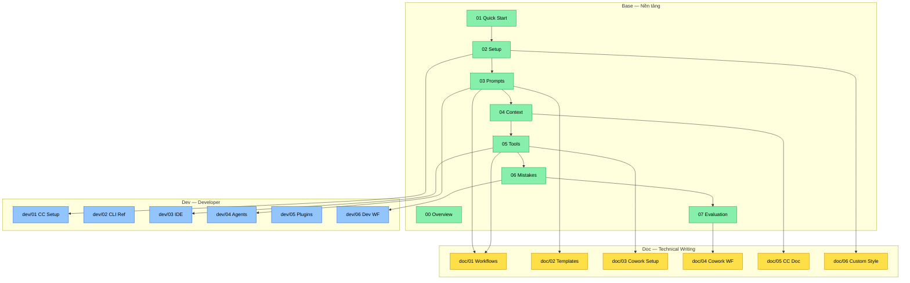

# Claude Guide cho Kỹ sư Phenikaa-X

**Version:** xem [VERSION](../../VERSION) | **Cập nhật:** 2026-03-07
**Claude models:** Opus 4.6 / Sonnet 4.6 / Haiku 4.5

---

## Giới thiệu

[Ứng dụng Kỹ thuật]

Tài liệu này hướng dẫn sử dụng Claude AI hiệu quả cho công việc kỹ thuật hàng ngày -- từ viết prompt cơ bản đến quản lý context trong conversation dài, từ tạo tài liệu chuyên nghiệp đến phân tích lỗi hệ thống.

**Đối tượng chính:** Kỹ sư tự động hóa, R&D, Robotics tại Phenikaa-X (AMR, ROS, SLAM, Lidar).

**Đối tượng mở rộng:** Bất kỳ kỹ sư kỹ thuật nào muốn sử dụng Claude hiệu quả.

---

## Cấu trúc 3-Tier

Tài liệu được tổ chức thành 3 nhóm theo đối tượng sử dụng:

### Base — Kiến thức nền tảng (ai cũng cần)

| Module | Tên | Mô tả |
|--------|-----|-------|
| **00** | Overview (file này) | Mục lục, learning paths, conventions |
| **01** | [Quick Start](01-quick-start.md) | Bắt đầu với Claude trong 15 phút |
| **02** | [Setup & Personalization](02-setup.md) | Projects, Styles, Memory, MCP |
| **03** | [Prompt Engineering](03-prompt-engineering.md) | 6 nguyên tắc, 7 kỹ thuật, Module System |
| **04** | [Context Management](04-context-management.md) | Context Window, Drift, Session Lifecycle, Decision Framework |
| **05** | [Tools & Features](05-tools-features.md) | Tính năng Claude, Desktop, Planning patterns |
| **06** | [Mistakes & Fixes](06-mistakes-fixes.md) | 7 nhóm lỗi phổ biến và cách sửa |
| **07** | [Evaluation](07-evaluation.md) | Framework đánh giá chất lượng output |

### Doc — Technical Writing & Documentation

| Module | Tên | Mô tả |
|--------|-----|-------|
| **01** | [Doc Workflows](../doc/01-doc-workflows.md) | Recipes doc-specific và Cowork recipes |
| **02** | [Template Library](../doc/02-template-library.md) | Templates doc-specific (T-06 đến T-22) |
| **03** | [Cowork Setup](../doc/03-cowork-setup.md) | Cowork config và workflows |
| **04** | [Cowork Workflows](../doc/04-cowork-workflows.md) | 12 Cowork workflows copy-paste |
| **05** | [Claude Code Doc](../doc/05-claude-code-doc.md) | Claude Code cho documentation |
| **06** | [Custom Style](../doc/06-custom-style.md) | Custom Style reference chi tiết |

### Dev — Developer & Automation

| Module | Tên | Mô tả |
|--------|-----|-------|
| **01** | [Claude Code Setup](../dev/01-claude-code-setup.md) | CLI install, auth, config |
| **02** | [CLI Reference](../dev/02-cli-reference.md) | Commands, flags, shortcuts |
| **03** | [IDE Integration](../dev/03-ide-integration.md) | VS Code extension setup & tips |
| **04** | [Agents & Automation](../dev/04-agents-automation.md) | Subagents, Agent Teams, CI/CD |
| **05** | [Plugins](../dev/05-plugins.md) | Discover, install, create plugins |
| **06** | [Dev Workflows](../dev/06-dev-workflows.md) | Git, testing, code review with CC |

### Reference — Tra cứu (ai cũng dùng)

| File | Mô tả |
|------|-------|
| [Model Specs](../reference/model-specs.md) | Bảng so sánh Opus/Sonnet/Haiku |
| [Config Architecture](../reference/config-architecture.md) | Cấu trúc config Claude |
| [Skills List](../reference/skills-list.md) | Lookup table skills |
| [Quick Templates](../reference/quick-templates.md) | 5 templates cơ bản |
| [Workflow Patterns](../reference/workflow-patterns.md) | Patterns tham chiếu |
| [Claude Code Setup](../reference/claude-code-setup.md) | Cheat sheet Claude Code |
| [Ecosystem Overview](../reference/ecosystem-overview.md) | Community tools, MCP servers, plugins |
| [Skills Guide](../reference/skills-guide.md) | Detailed skills & commands descriptions |
| [Cheatsheet Base](../reference/cheatsheet-base.md) | Quick-reference Base tier |
| [Cheatsheet Doc](../reference/cheatsheet-doc.md) | Quick-reference Doc tier |
| [Cheatsheet Dev](../reference/cheatsheet-dev.md) | Quick-reference Dev tier |
| [Prompt Format Guide](../reference/prompt-format-guide.md) | XML tags, brackets, placeholders — khi nào dùng gì |

---

## Dependency Graph



---

## Learning Paths

[Ứng dụng Kỹ thuật]

### Path A: Người mới bắt đầu (1-2 giờ)

Chưa từng dùng Claude hoặc mới dùng vài lần.

```text
base/01 Quick Start (15 phút)
  |
base/02 Setup & Personalization (20 phút)
  |
base/06 Mistakes & Fixes (15 phút)
  |
reference/ — tra cứu khi cần
```

**Kết quả:** Biết cách dùng Claude cơ bản, đã setup workspace, có templates sẵn sàng dùng.

### Path B: Người muốn nâng cao (2-3 giờ)

Đã dùng Claude, muốn hiệu quả hơn.

```text
base/03 Prompt Engineering (25 phút)
  |
base/04 Context Management (15 phút)
  |
base/05 Tools & Features (20 phút)
  |
base/07 Evaluation Framework (10 phút)
```

**Kết quả:** Viết prompt chuyên nghiệp, quản lý conversation dài, có quy trình cho từng loại task.

### Path C: Documentation track (base → doc)

Đã nắm base, muốn chuyên sâu Technical Writing và Cowork.

```text
base/ (tất cả) --> doc/01 Doc Workflows
                     |
                   doc/02 Template Library
                     |
                   doc/03 Cowork Setup
                     |
                   doc/04 Cowork Workflows
                     |
                   doc/05 Claude Code Doc
                     |
                   doc/06 Custom Style
```

**Kết quả:** Thành thạo documentation workflows, Cowork mode, Claude Code cho technical writing.

### Path D: Developer track (base → dev)

Đã nắm base, muốn dùng Claude Code cho development.

```text
base/ (tất cả) --> dev/01 Claude Code Setup
                     |
                   dev/02 CLI Reference
                     |
                   dev/03 IDE Integration
                     |
                   dev/04 Agents & Automation
                     |
                   dev/05 Plugins
                     |
                   dev/06 Dev Workflows
```

**Kết quả:** Setup Claude Code, thao tác CLI, tích hợp IDE, xây dựng automation pipelines.

---

## Conventions trong tài liệu

### Nguồn trích dẫn

| Marker | Nghĩa |
|--------|-------|
| `[Nguồn: Anthropic Docs]` + URL | Thông tin từ tài liệu chính thức Anthropic |
| `[Ứng dụng Kỹ thuật]` | Ví dụ ứng dụng nguyên tắc chính thức vào bối cảnh Phenikaa-X |
| `[Cập nhật MM/YYYY]` | Thông tin mới hoặc thay đổi so với version trước |

### Format

- **Tiếng Việt** là ngôn ngữ chính, thuật ngữ kỹ thuật giữ **tiếng Anh**
- `{{variable_name}}` -- placeholder cần thay bằng giá trị thực
- XML tags trong code blocks -- copy-paste vào Claude
- Mermaid diagrams -- flowcharts và decision trees
- Tables -- so sánh, tra cứu nhanh

### Ký hiệu trạng thái

- BAD/GOOD -- so sánh prompt kém vs tốt
- CẢNH BÁO -- thông tin safety quan trọng
- LƯU Ý -- tips và best practices

### Icon và Emoji

- Tài liệu này chỉ sử dụng icons trong allowlist: ⚠️ ✅ ❌ 🔴 🟡 🟢 🔵
- Icons chỉ xuất hiện trong bảng status và warning markers
- Prose dùng Obsidian callouts: `> [!WARNING]`, `> [!TIP]`, `> [!NOTE]`, `> [!IMPORTANT]`

---

## Thông tin cập nhật

[Cập nhật 03/2026]

### Version 8.5 (03/2026)

- **P4.S28 Prompt Format Guide:** Thêm reference/prompt-format-guide.md — tra cứu XML tags, brackets, placeholders
- **P4.S28 Custom Style mở rộng:** doc/06 thêm advanced patterns (Style + Project Instructions combo, per-task switching, team style library)
- **Version bump:** v8.4 → v8.5

### Version 8.4 (03/2026)

- **P4.S25 Cheatsheet Dev:** Thêm reference/cheatsheet-dev.md — quick-reference card cho dev/ tier
- **Version bump:** v8.3 → v8.4

### Version 8.3 (03/2026)

- **P3 Dev Content complete:** 6 dev modules + reference/ecosystem-overview.md + reference/skills-guide.md
- **P4.S23-S24:** Skills guide + cheatsheets base/doc

### Version 8.0 (03/2026)

- **P2 Structure complete:** 3-tier structure operational — base/ (8), doc/ (6), dev/ (6 placeholders), reference/ (6)
- **Cleanup:** Xóa 13 old guide/*.md files — content đã migrate sang base/doc/dev
- **Navigation:** Prev/next nav links trên toàn bộ files
- **Updated:** CLAUDE.md, project-state.md, llms.txt reflect 3-tier structure

### Version 7.3 (03/2026)

- **P2 Restructure:** Tách guide/ thành 3 tier — base/ (nền tảng), doc/ (technical writing), dev/ (developer)
- **Navigation:** Thêm prev/next nav links toàn bộ files
- **M08 Nhóm 7:** Thêm 5 anti-patterns đặc thù Claude Code
- **P1 Final Review:** Hoàn tất Phase 1 Foundation

### Version 7.2 (03/2026)

- **P1.S4 Prompt format:** Áp dụng convention XML/[]/{{}} nhất quán cho M05, M07
- **Code blocks:** Thêm language tags cho tất cả code blocks còn thiếu

### Version 7.1 (03/2026)

- **P1.S1 Cross-link audit:** Fix broken cross-links, cập nhật URLs
- **P1.S2 Source markers:** Thêm source markers 3-tier cho toàn bộ guide/

### Version 7.0 (03/2026)

- **Thêm Module 12:** Claude Code cho Documentation & Technical Writing
- **Thêm reference/claude-code-setup.md:** Cheat sheet Claude Code
- **Thêm Mermaid dependency graph** và metadata depends-on/impacts

> Lịch sử đầy đủ từ v3.0: xem [CHANGELOG.md](../../CHANGELOG.md)

### Kiểm tra thông tin mới

Thông tin về Claude thay đổi nhanh. Luôn kiểm tra nguồn chính thức:

| Nguồn | URL | Nội dung |
|-------|-----|---------|
| Anthropic Docs | https://platform.claude.com/docs/en | API docs, model specs, prompting guides |
| Anthropic Help Center | https://support.claude.com | Claude.ai features, troubleshooting |
| Anthropic News | https://www.anthropic.com/news | Announcements, new features |
| Models Overview | https://platform.claude.com/docs/en/about-claude/models/overview | Model specs mới nhất |

---

## Files trong bộ tài liệu

```text
guide/
├── base/                    Nền tảng — ai cũng cần
│   ├── 00-overview.md       (file này)
│   ├── 01-quick-start.md    Bắt đầu 15 phút
│   ├── 02-setup.md          Setup & Personalization
│   ├── 03-prompt-engineering.md   Prompt Engineering
│   ├── 04-context-management.md   Context Management
│   ├── 05-tools-features.md      Tools, Features, Planning
│   ├── 06-mistakes-fixes.md      Mistakes & Fixes
│   └── 07-evaluation.md          Evaluation Framework
│
├── doc/                     Technical Writing audience
│   ├── 01-doc-workflows.md       Doc Workflows & Recipes
│   ├── 02-template-library.md    Template Library
│   ├── 03-cowork-setup.md        Cowork Setup & Config
│   ├── 04-cowork-workflows.md    12 Cowork Workflows
│   ├── 05-claude-code-doc.md     Claude Code cho Documentation
│   └── 06-custom-style.md        Custom Style Reference
│
├── dev/                     Developer audience
│   ├── 01-claude-code-setup.md   CLI Setup
│   ├── 02-cli-reference.md       CLI Reference
│   ├── 03-ide-integration.md     VS Code Integration
│   ├── 04-agents-automation.md   Agents & Automation
│   ├── 05-plugins.md             Plugins
│   └── 06-dev-workflows.md       Dev Workflows
│
└── reference/               Tra cứu
    ├── model-specs.md        Model comparison
    ├── config-architecture.md Config structure
    ├── skills-list.md        Skills lookup
    ├── skills-guide.md       Skills detailed guide
    ├── quick-templates.md    Quick templates
    ├── workflow-patterns.md  Workflow patterns
    ├── claude-code-setup.md  CC cheat sheet
    ├── cheatsheet-base.md    Cheatsheet Base tier
    ├── cheatsheet-doc.md     Cheatsheet Doc tier
    ├── cheatsheet-dev.md     Cheatsheet Dev tier
    ├── ecosystem-overview.md Community tools & plugins
    └── prompt-format-guide.md XML tags, brackets, placeholders
```

---

**Bắt đầu:** Nếu bạn mới, đọc [base/01 Quick Start](01-quick-start.md). Nếu đã quen Claude, đọc [base/03 Prompt Engineering](03-prompt-engineering.md).

---

[Tổng quan](00-overview.md) | [Quick Start →](01-quick-start.md)
