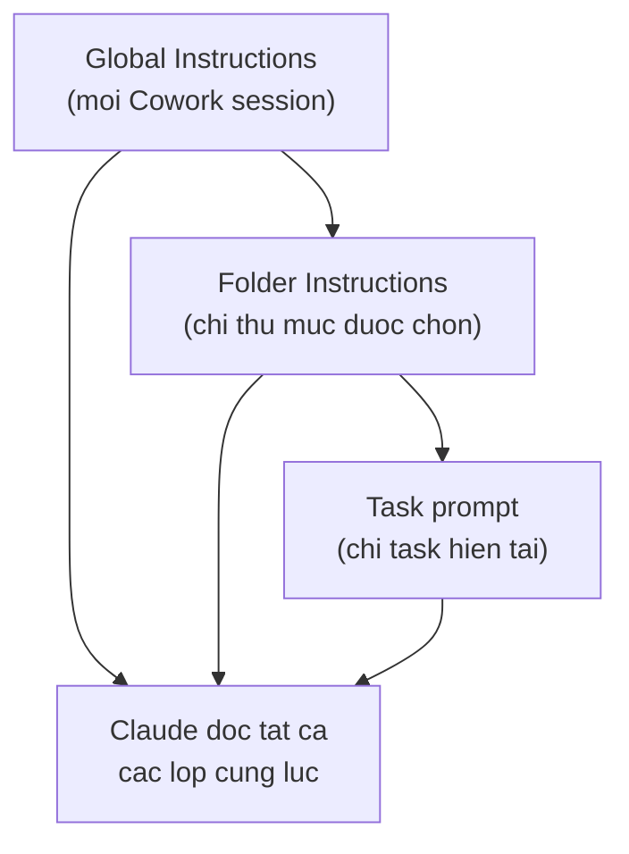
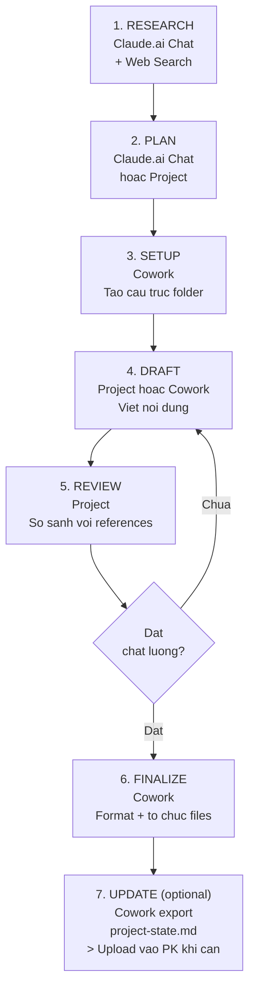
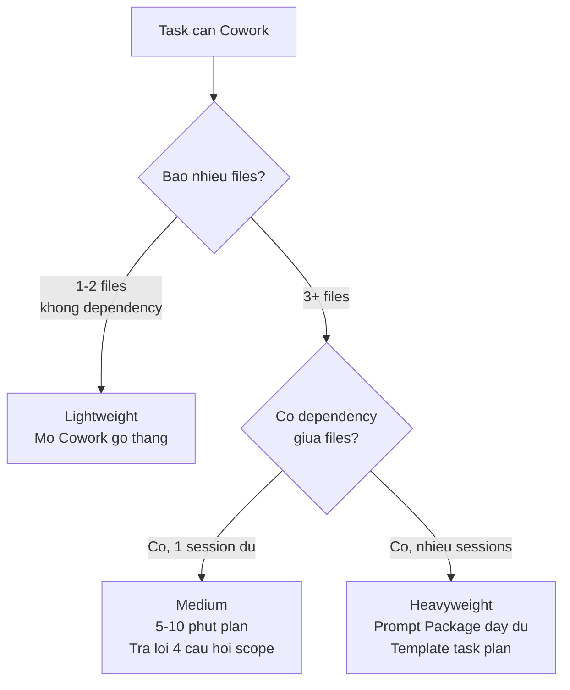

# Tools & Features

**Thời gian đọc:** 30 phút | **Mức độ:** Beginner-Intermediate
**Cập nhật:** 2026-03-07 | Models: xem [specs](../reference/model-specs.md)

---
depends-on: [reference/model-specs, base/04-context-management]
impacts: [base/06-mistakes-fixes, base/07-evaluation]
---

Module này là cheat sheet tra cứu nhanh tất cả tính năng của Claude — từ chọn model đến tools, từ Claude Desktop đến planning patterns cho workflow phức tạp.

---

## 5.1 Tổng quan tính năng theo Plan

Claude có nhiều plan từ Free đến Enterprise với tính năng khác nhau.

Chi tiết plan và features: xem [Model Specs](../reference/model-specs.md#feature-availability-by-plan)

---

## 5.2 Chọn Model

[Cập nhật 03/2026]

**Cách chọn model:** Click tên model ở đầu conversation > Chọn model muốn dùng.

**Quy tắc chọn nhanh:** Bắt đầu với **Sonnet 4.6** cho hầu hết công việc — bao gồm cả agentic tasks và automation workflows. Chuyển sang **Opus 4.6** chỉ khi cần suy luận rất sâu (phân tích pháp lý, nghiên cứu khoa học, multi-system architecture critique). Dùng Haiku 4.5 cho task nhanh không cần chất lượng cao.

Chi tiết và so sánh: xem [Model Specs](../reference/model-specs.md)

---

## 5.3 Extended Thinking

[Cập nhật 03/2026]

[Nguồn: Anthropic Docs - Extended Thinking]
URL: https://platform.claude.com/docs/en/build-with-claude/extended-thinking

> **Lưu ý thuật ngữ:**
> - **Extended thinking** = UI toggle trên Claude.ai ("Search and tools" > "Extended thinking") — đây là tính năng bạn dùng hàng ngày
> - **Adaptive Thinking** = API feature riêng biệt (`thinking: {type: "adaptive"}`) — chỉ dành cho developer dùng API trực tiếp, KHÔNG phải tên khác của Extended thinking

Extended thinking cho phép Claude "suy nghĩ sâu hơn" trước khi trả lời. Claude tạo thinking block nội bộ (hiển thị cho bạn xem trên Claude.ai), sau đó đưa ra câu trả lời dựa trên suy luận đó.

### Cách bật

1. Mở conversation
2. Click "Search and tools" dưới ô nhập tin nhắn
3. Toggle **"Extended thinking"** > ON

### Khi nào bật

| Bật | Không cần |
|-----|-----------|
| Debug lỗi phức tạp trên nhiều hệ thống | Hỏi đáp đơn giản, tra cứu nhanh |
| Phân tích root cause từ log SLAM/Lidar | Viết email ngắn, tóm tắt cơ bản |
| Review code có nhiều dependency | Tạo checklist đơn giản |
| So sánh và đánh giá nhiều giải pháp | Dịch thuật, paraphrase |
| Lập kế hoạch multi-step workflow | Format lại tài liệu có sẵn |

### Tips quan trọng

[Nguồn: Anthropic Docs - Extended Thinking Tips]
URL: https://platform.claude.com/docs/en/build-with-claude/prompt-engineering/extended-thinking-tips

**Bỏ "think step-by-step".** Khi bật Extended thinking, Claude TỰ ĐỘNG suy luận từng bước. Không cần thêm chain-of-thought instructions -- thực tế, thêm vào có thể làm giảm hiệu quả.

**Đơn giản hóa prompt.** Extended thinking hoạt động tốt nhất với prompt rõ ràng, ít "steering". Để Claude tự quyết định cách suy nghĩ.

**Đọc thinking block.** Claude.ai hiển thị thinking process. Đọc để hiểu Claude đang suy luận thế nào, rồi điều chỉnh prompt nếu cần.

**Chấp nhận response time lâu hơn.** Đó là đánh đổi cho chất lượng cao hơn.

---

## 5.4 Web Search và Research

### Web Search

**Khi nào dùng:** Cần thông tin current (sau training cutoff), verify thông tin, check latest docs.

**Cách bật:** Message input > Click "Search and tools" > Toggle "Web Search". Hoặc prompt: "Search the web for..."

**Lưu ý:** Web Search tốn thêm tokens (search results được add vào context).

### Research

[Nguồn: Anthropic Help Center - Research]
URL: https://support.claude.com/en/articles/11088861

**Khi nào dùng:** Cần research sâu với multiple sources, tổng hợp đa nguồn, cần citations.

**Cách bật:** Message input > Click "Search and tools" > Select "Research".

| Aspect | Web Search | Research |
|--------|-----------|---------------|
| Depth | Quick lookup | Deep dive |
| Sources | 1-3 sources | Multiple sources |
| Output | Direct answer | Report có citations |
| Thời gian | Giây | Phút |

---

## 5.5 File Handling

### Upload files trong conversation

[Nguồn: Anthropic Help Center - Uploading Files to Claude]

| Category | Extensions | Max Size |
|----------|-----------|----------|
| Tài liệu | PDF, DOCX, TXT, MD, HTML | 30MB |
| Code | PY, JS, JSON, YAML, XML | 30MB |
| Hình ảnh | PNG, JPG, WEBP, GIF | 30MB |
| Data | CSV, XLSX | 30MB |

**Giới hạn:** Tối đa 20 files per conversation. XLSX yêu cầu bật "Code execution and file creation".

### Tạo files

Claude có thể trực tiếp tạo các loại file:

| Loại | Yêu cầu |
|------|---------|
| Word (.docx) | Bật "Code execution and file creation" |
| Excel (.xlsx) | Bật "Code execution and file creation" |
| PowerPoint (.pptx) | Bật "Code execution and file creation" |
| PDF | Tự động |
| Markdown, Code files | Tự động |

### Paste vs Upload -- Khi nào dùng gì

| Tình huống | Cách tốt nhất | Lý do |
|-----------|---------------|-------|
| Code snippet < 50 dòng | **Paste** trực tiếp | Nhanh, dễ discuss inline |
| Error log < 100 dòng | **Paste** trực tiếp | Claude thấy ngay |
| Full source file | **Upload** file | Giữ structure, line numbers |
| Document cần formatting | **Upload** file | Preserve tables, headers |
| Tài liệu dùng lại nhiều lần | **Project Knowledge** | Không tốn context mỗi chat |

---

## 5.6 Artifacts

Artifacts là output dạng rich content mà Claude tạo ra -- code, documents, diagrams, React components.

**Khi nào Claude tạo Artifact:**

- Code dài (> 15 dòng)
- Documents có formatting
- React components
- Mermaid diagrams
- SVG graphics

**Bạn có thể:** Xem rendered output, copy code, download file, iterate với feedback.

---

## 5.7 MCP Connectors

[Nguồn: Anthropic Help Center - Setting up and using Integrations]

MCP Connectors cho phép Claude truy cập dữ liệu từ dịch vụ bên ngoài.

| Connector | Use case |
|-----------|----------|
| Google Drive | Đọc documents, spreadsheets |
| Slack | Tìm kiếm conversations |
| Gmail | Tham chiếu emails |
| GitHub | Truy cập repositories |
| Notion | Đọc/cập nhật pages |
| Jira | Xem/quản lý tickets |

**Setup:** Settings > Connected Apps > Connect.

**Lưu ý:** Mỗi connector tốn context tokens. Chỉ connect khi thực sự cần. Review quyền truy cập định kỳ.

[Cập nhật 02/2026] Danh sách connectors mở rộng liên tục. Kiểm tra Connected Apps để xem mới nhất.

---

## 5.8 Image Search

Claude có thể tìm kiếm hình ảnh trên web.

**Khi nào dùng:** Minh họa cho tài liệu hoặc presentation. Reference images cho thiết kế. So sánh visual giữa các giải pháp.

**Cách dùng:** Yêu cầu trong prompt: "Tìm hình ảnh về..." hoặc dùng kết hợp với Web Search.

---

## 5.9 Prompt Generator và Prompt Improver

[Nguồn: Anthropic Docs - Prompt Generator & Prompt Improver]
URL (Generator): https://platform.claude.com/docs/en/build-with-claude/prompt-engineering/prompt-generator
URL (Improver): https://platform.claude.com/docs/en/build-with-claude/prompt-engineering/prompt-improver

Hai công cụ trên **Anthropic Console** (console.anthropic.com) -- KHÔNG phải trên Claude.ai chat. Cần Anthropic API account.

### Prompt Generator

Mô tả task bằng ngôn ngữ tự nhiên > Claude tạo prompt hoàn chỉnh với XML tags, variables, best practices.

### Prompt Improver

Paste prompt hiện tại > Claude phân tích điểm yếu và rewrite thành version tối ưu. Các cải thiện: chain-of-thought, XML standardization, example enrichment.

| Tình huống | Dùng gì |
|-----------|---------|
| Bắt đầu task hoàn toàn mới | **Generator** |
| Có prompt nhưng kết quả chưa tốt | **Improver** |
| Migrate prompt từ ChatGPT/Gemini | **Improver** |
| Tạo template cho team dùng chung | **Generator** rồi **Improver** |

---

## 5.10 Structured Outputs

[Nguồn: Anthropic Docs - Structured Outputs]
URL: https://platform.claude.com/docs/en/build-with-claude/structured-outputs

Yêu cầu Claude trả về JSON theo schema cụ thể. Chi tiết và ví dụ: xem [Doc Workflows, mục 1.7](../doc/01-doc-workflows.md#17-recipe-structured-output-cho-automation).

**Claude.ai:** Dùng prompt-based với schema trong `<output_format>`. Thêm "CHỈ JSON, không markdown."

**API:** Dùng Structured Outputs API -- guaranteed 100% schema compliance.

---

## 5.11 Keyboard Shortcuts

| Action | Shortcut |
|--------|----------|
| Conversation mới | Ctrl/Cmd + N |
| Tìm kiếm conversations | Ctrl/Cmd + K |
| Focus vào ô nhập tin nhắn | / |

---

## 5.12 Bảng Quyết Định Nhanh: Tôi Cần Gì?

| Tôi muốn... | Dùng tính năng |
|-------------|----------------|
| Hỏi nhanh 1 câu | Chat thường |
| Claude nhớ cách tôi làm việc | Profile Preferences + Memory |
| Làm project dài nhiều ngày | Projects |
| Output ngắn gọn hơn | Style: Concise |
| Viết tài liệu chính thức | Style: Formal + File Creation |
| Claude đọc file tôi upload | File Upload |
| Claude tìm info mới nhất | Web Search |
| Tạo file Word/Excel/PPT | File Creation |
| Code, diagram, interactive content | Artifacts |
| Nghiên cứu chuyên sâu | Research |
| Claude tương tác với Notion/Gmail | MCP Connectors |
| Task cần phân tích sâu | Extended thinking |

---

## 5.13 Bảng tổng hợp tất cả Tools

| Tool | Cách bật | Tốn thêm tokens? | Khi nào dùng |
|------|---------|-------------------|-------------|
| **Web Search** | Search and tools > Web Search | Có | Thông tin current, verify facts |
| **Research** | Search and tools > Research | Có (nhiều) | Research sâu, đa nguồn |
| **Extended thinking** | Search and tools > Extended thinking | Có | Debug phức tạp, suy luận sâu |
| **File Upload** | Nút clip (đính kèm) | Có | Phân tích files |
| **File Creation** | Yêu cầu trong prompt | Settings required | Tạo docx, xlsx, pptx |
| **Artifacts** | Tự động | Có | Code, diagrams, components |
| **MCP Connectors** | Settings > Connected Apps | Có | Truy cập dịch vụ ngoài |
| **Prompt Generator** | console.anthropic.com | Không | Tạo prompt mới |
| **Prompt Improver** | console.anthropic.com | Không | Cải thiện prompt có sẵn |

**Quy tắc chung:** Mỗi tool bật thêm đều tốn context tokens. Chỉ bật khi cần. Tắt khi xong.

---

---

## 5.14 Claude Desktop vs Claude.ai — Khác gì?

Claude Desktop là ứng dụng native cho macOS và Windows, cung cấp 3 chế độ làm việc:

[Nguồn: Navigating the Claude desktop app: Chat, Cowork, Code]
URL: https://claude.com/resources/tutorials/navigating-the-claude-desktop-app

| Chế độ | Mục đích | Ai dùng |
|--------|----------|---------|
| **Chat** | Giống claude.ai — hỏi đáp, phân tích, viết | Mọi người |
| **Cowork** | Thao tác file, automation, task phức tạp nhiều bước | Knowledge workers, team leads |
| **Code** | Viết code, test, deploy, Git integration | Developers |

**Cách hiểu nhanh:** Chat = hỏi Claude. Cowork = Claude làm việc trên file của bạn. Code = Claude viết code cùng bạn.

### Cowork là gì

[Nguồn: Introducing Cowork]
URL: https://claude.com/blog/cowork-research-preview

Cowork dùng cùng kiến trúc agent với Claude Code, nhưng hướng đến non-coding tasks. Khi bạn bật Cowork và chọn thư mục làm việc, Claude có thể đọc, tạo, sửa, xóa file trong thư mục đó — tự động, nhiều bước, không cần bạn can thiệp từng bước.

**Ví dụ thực tế:**

| Task | Chat (claude.ai) | Cowork |
|------|-------------------|--------|
| Viết SOP cho AMR | Claude viết text, bạn copy-paste vào file | Claude tạo file .md hoặc .docx trực tiếp trong thư mục |
| Review 5 tài liệu | Upload từng file, review từng cái | Claude đọc cả 5 file trong thư mục, tạo báo cáo review |
| Chuyển Word → Markdown | Upload file, copy output | Claude đọc .docx, tạo .md, lưu cạnh nhau |
| Kiểm tra thuật ngữ nhất quán | Paste text + glossary | Claude scan toàn bộ folder theo glossary |

### Yêu cầu

- **Plan:** Pro, Max, Team, hoặc Enterprise (không hỗ trợ Free plan)
- **Nền tảng:** macOS hoặc Windows
- **App:** Claude Desktop (download tại https://claude.ai/download)

> [!NOTE]
> Cowork hiện là **research preview** — tính năng có thể thay đổi. Nội dung cập nhật đến 03/2026.

---

## 5.15 Cấu hình Cowork — 3 lớp instructions

[Nguồn: Anthropic Help Center — Get started with Cowork]

Cowork có 3 lớp cấu hình, xếp theo scope từ rộng đến hẹp:



| Lớp | Scope | Khi nào cấu hình | Ai nên cấu hình |
|-----|-------|-------------------|------------------|
| **Global Instructions** | Mọi Cowork session | 1 lần, update khi đổi role/workflow | Mỗi người dùng |
| **Folder Instructions** | Chỉ khi chọn thư mục đó | Khi thư mục có project riêng | Team lead hoặc project owner |
| **Task prompt** | Chỉ task hiện tại | Mỗi khi bắt đầu task | Mọi người |

**Quy tắc ưu tiên:** Khi có conflict, lớp hẹp hơn được ưu tiên (Folder > Global). Task prompt luôn có quyền cao nhất.

Chi tiết Folder Instructions, Scheduled Tasks, Plugins & Skills: xem [Cowork Setup](../doc/03-cowork-setup.md).

---

## 5.16 Global Instructions

**Vị trí:** Claude Desktop → Settings → Cowork → Click "Edit" bên cạnh "Global instructions"

**Mục đích:** Thiết lập context mặc định cho mọi session — role, ngôn ngữ, file conventions, response rules. Giống "Profile Preferences" của claude.ai nhưng dành cho Cowork.

### Template Global Instructions cho kỹ sư Phenikaa-X

[Ứng dụng Kỹ thuật]

```markdown
# Context — {{Họ tên}} @ Phenikaa-X

## Identity
- Tôi là {{chức vụ/vai trò}} tại Phenikaa-X.
- Lĩnh vực: {{mô tả ngắn — ví dụ: phát triển robot tự hành AMR cho nhà máy}}.

## Language Rules
- Trả lời bằng tiếng Việt. Giữ thuật ngữ kỹ thuật tiếng Anh.
- Khi tôi yêu cầu English output → chuyển hoàn toàn sang tiếng Anh.

## Toolchain & File Conventions
- File format mặc định: {{format — ví dụ: Markdown (.md)}}.
- Khi tạo file mới → dùng {{format}} trừ khi tôi yêu cầu format khác.
- Khi cần output Word/Excel/PPT/PDF → hỏi confirm trước khi tạo.

## Response Rules
1. Khi không chắc chắn → nói rõ + đề xuất cách verify.
2. Khi thao tác file → giải thích ngắn gọn sẽ làm gì trước khi thực hiện.

## File Operations
- KHÔNG tự ý xóa hoặc overwrite file mà không hỏi.
- Khi edit file có sẵn → cho tôi xem thay đổi trước khi save.
```

**Ví dụ đã điền — Team Lead tự động hóa:**

[Ứng dụng Kỹ thuật]

```markdown
# Context — Nguyễn Văn A @ Phenikaa-X

## Identity
- Tôi là Automation Team Leader tại Phenikaa-X.
- Lĩnh vực: triển khai và vận hành hệ thống AMR trong nhà máy.

## Language Rules
- Trả lời bằng tiếng Việt. Giữ thuật ngữ kỹ thuật tiếng Anh
  (AMR, ROS, SLAM, Lidar, navigation, localization).
- Khi tôi yêu cầu English output → chuyển hoàn toàn sang tiếng Anh.

## Toolchain & File Conventions
- File format mặc định: Markdown (.md).
- Khi tạo file mới → dùng Markdown trừ khi tôi yêu cầu format khác.
- Khi cần output Word/Excel/PPT/PDF → hỏi confirm trước khi tạo.
- Naming convention: lowercase, dấu gạch ngang (ví dụ: sop-charging-v1.md).

## Response Rules
1. Khi không chắc chắn → nói rõ + đề xuất cách verify.
2. Khi thao tác file → giải thích ngắn gọn sẽ làm gì trước khi thực hiện.
3. Khi đề xuất → trình bày options có pro/con để tôi quyết định.

## File Operations
- KHÔNG tự ý xóa hoặc overwrite file mà không hỏi.
- Khi edit file có sẵn → cho tôi xem thay đổi trước khi save.
```

---

---

## 5.17 Recipe: Hybrid Workflow — Chat + Project + Cowork

[Cập nhật 03/2026]

**Khi nào dùng:** Dự án kéo dài nhiều ngày, cần cả brainstorm/research (thinking) lẫn tạo file/tổ chức thư mục (executing). Ví dụ: xây dựng bộ tài liệu chuẩn, tạo training package, viết technical specification.

**Setup cần thiết:**
- Claude.ai account với Projects enabled (Pro trở lên)
- Claude Desktop với Cowork
- Thư mục project đã có `.claude/CLAUDE.md` (xem [Claude Code cho Documentation](../doc/05-claude-code-doc.md))
- Project Knowledge chỉ chứa `project-state.md` (xem [Context Management, mục 4.9](04-context-management.md#49-context-sync-practices--quản-lý-knowledge-across-surfaces) — Context Sync Practices)

**Triết lý:** Mỗi công cụ Claude có thế mạnh riêng — dùng đúng công cụ cho đúng giai đoạn, liên kết bằng files.

### Quy trình 6 giai đoạn (+ 1 update optional)



### Chi tiết từng giai đoạn

| Giai đoạn | Công cụ | Tại sao công cụ này | Prompt mẫu |
|-----------|---------|---------------------|------------|
| **1. Research** | Claude.ai Chat (web search) | Memory cross-session giúp continuity; web search cho thông tin mới | "Tìm kiếm và tổng hợp best practices về {{chu_de}}. Focus vào {{khia_canh_1}}, {{khia_canh_2}}." |
| **2. Plan** | Claude.ai Chat hoặc Project | Tương tác qua lại nhanh; Project giữ reference files | "Dựa trên research, đề xuất outline cho {{tai_lieu}}. Mỗi section ghi mục đích + nội dung chính." |
| **3. Setup** | Cowork | Tạo folder structure + files trực tiếp | "Tạo cấu trúc thư mục theo outline đã thống nhất. Tạo file placeholder cho mỗi section." *(xem prompt chi tiết bên dưới)* |
| **4. Draft** | Project (iterate nội dung) hoặc Cowork (ghi file) | Project: Custom Instructions giữ tone nhất quán. Cowork: output thẳng vào file | "Viết section {{ten}} theo outline. Tuân thủ style guide trong Project Knowledge." |
| **5. Review** | Project | So sánh draft với glossary, style guide đã upload | "Review file {{ten}} theo 6 tiêu chí (Recipe 5.2). So sánh với glossary.md." |
| **6. Finalize** | Cowork | Batch operations: chuyển format, tổ chức, rename | "Chuyển tất cả file .md trong drafts/ sang .docx trong output/. Thêm header chuẩn." |
| **7. Update** *(optional)* | Cowork → Project Knowledge | Export trạng thái → upload khi cần briefing Project Chat | "Cập nhật project-state.md từ git log và file system hiện tại. Output sẵn sàng upload vào Project Knowledge." |

### Prompts chi tiết cho từng giai đoạn

**Giai đoạn 3 — Setup folder qua Cowork:**

```text
Đọc CLAUDE.md và git log --oneline -10 nếu có.

Tạo cấu trúc thư mục cho dự án "{{ten_du_an}}":

{{mo_ta_cau_truc}}
- drafts/          — bản nháp đang viết
- output/          — file hoàn chỉnh
- references/      — tài liệu tham khảo
- templates/       — mẫu tài liệu
- .claude/         — Folder Instructions + skills

Tạo file placeholder (.md) cho mỗi section trong outline:
{{danh_sach_sections}}

Mỗi file placeholder chứa: heading, mục đích section (1 dòng), "[TBD]".

Sau khi tạo xong, commit với message mô tả cấu trúc đã tạo.
```

**Giai đoạn 4 — Draft nội dung qua Project Chat:**

```text
Viết section "{{ten_section}}" cho {{ten_tai_lieu}}.

Tuân thủ:
- Style guide trong Project Knowledge
- Glossary trong Project Knowledge
- Outline đã thống nhất: {{outline_hoac_link_file}}

Nếu cần thông tin chưa cung cấp, đánh dấu [TBD: mô tả] và tiếp tục.

Output: nội dung Markdown hoàn chỉnh cho section này.
```

*Sau khi review xong nội dung ở Project Chat → copy sang Cowork để ghi file, hoặc dùng Cowork trực tiếp nếu đã quen.*

**Chuyển context từ Chat/Project sang Cowork:**

Khi cần mang kết quả từ Chat/Project vào Cowork, tạo file trung gian:

```text
Tóm tắt kết quả research/decisions đã thảo luận thành format
có thể paste vào file. Cấu trúc:

1. Key findings (bullet points)
2. Decisions đã chốt (decision + rationale)
3. Outline/plan đã thống nhất
4. Constraints và requirements

Output: text sẵn sàng copy vào file .md
```

*Paste output vào file trong thư mục project (ví dụ: `references/research-summary.md`) → Cowork đọc được ở session sau.*

### Khi nào KHÔNG cần Hybrid Workflow

| Tình huống | Dùng gì thay thế |
|-----------|-------------------|
| Task xong trong 1 session, không cần file output | Chat thông thường |
| Chỉ cần tạo files, không cần research/iterate | Cowork alone |
| Task đơn giản, 1 file output | Chat + download hoặc Cowork |
| Team collaboration cần audit trail | Project alone (có chat history) |

### Tips thực tế

1. **Không cần dùng đủ 3 công cụ cho mọi task.** Hybrid Workflow là framework linh hoạt — bỏ qua giai đoạn không cần thiết.

2. **Sync context bằng files, không bằng memory.** Copy-paste kết quả quan trọng vào file trong thư mục project. Cowork đọc file, không đọc Chat/Project history.

3. **Áp dụng Context Sync Practices khi files thay đổi thường xuyên qua Cowork** (xem [Context Management, mục 4.9](04-context-management.md#49-context-sync-practices--quản-lý-knowledge-across-surfaces)). Project Knowledge chỉ chứa `project-state.md` — không upload working documents sẽ bị stale.

4. **Update `project-state.md` khi cần** — sau milestone hoặc trước khi dùng Project Chat cho task mới. Không cần theo lịch cố định. Chi tiết: [Cowork Setup](../doc/03-cowork-setup.md).

**Ví dụ:** Xây dựng Documentation Package cho tính năng phần mềm mới — gồm User Guide + API Reference + Release Notes. Giai đoạn 1: Chat research doc versioning best practices. Giai đoạn 2: Plan outline trong Project Chat, Project Knowledge chứa style guide + glossary. Giai đoạn 3: Cowork setup thư mục (`docs/user-guide/`, `docs/api-ref/`, `docs/release-notes/`). Giai đoạn 4: Draft từng section ở Project Chat, copy nội dung về Cowork ghi file. Giai đoạn 5: Project Review — so sánh với style guide, check terminology. Giai đoạn 6: Cowork finalize — chuyển sang `.docx`, thêm headers chuẩn. Giai đoạn 7: Export `project-state.md` → upload vào Project Knowledge để brief session tiếp theo.

> [!NOTE] **AMR Context**
> Áp dụng recipe này cho xây dựng Training Package AMR.
> Thay: giai đoạn 1 research safety standards (ISO 3691-4), giai đoạn 3 setup `training/operator-guide/`, `training/maintenance/`, `training/quick-ref/`. Project Knowledge chứa AMR spec sheet + existing SOPs làm references.

> [!TIP] **Model:** Sonnet 4.6 cho hầu hết giai đoạn. Opus 4.6 cho giai đoạn 1 (Research) và 5 (Review tài liệu phức tạp). Xem [decision flowchart](../reference/model-specs.md#chọn-model)

---

## 5.18 Recipe: Task Planning trước khi chạy Chain Prompt

[Ứng dụng Kỹ thuật]

**Khi nào dùng:** Task cần chain ≥ 3 prompts, có dependency giữa các bước. Planning trước giúp xác định rõ thứ tự, input/output mỗi bước, và review checkpoint — thay vì chạy prompt rồi mới phát hiện thiếu context hoặc sai hướng.

### Bước 1 — Scope + Dependencies

Trả lời 3 câu hỏi trong 1 prompt trước khi bắt đầu chain:

```text
Tôi cần {{mo_ta_task_tong_the}}.

Trước khi bắt đầu, trả lời 3 câu hỏi:

1. Output cuối cùng mong muốn là gì?
   (Mô tả cụ thể: file gì, format gì, ai dùng, dùng để làm gì)

2. Files/artifacts nào sẽ được tạo hoặc sửa trong quá trình?
   (Liệt kê từng file, không gộp chung "các file liên quan")

3. Phần nào phụ thuộc phần nào?
   (Step A phải xong trước khi Step B bắt đầu?
    Hay Step B và C có thể song song?)
```

### Bước 2 — Tạo Task Map

Yêu cầu Claude tạo bảng task map từ câu trả lời ở bước 1:

```text
Dựa trên scope analysis trên, tạo bảng task map:

| Step | Mục tiêu | Input từ step trước | Output cần có | Review checkpoint |
|------|----------|---------------------|---------------|-------------------|

Mỗi step phải có stopping criteria rõ ràng — step này XONG khi nào?
Đánh dấu step nào cần review kỹ trước khi tiếp.
```

### Bước 3 — Validate plan trước khi chạy

Checklist 5 items trước khi bắt đầu chain:

```text
- [ ] Số steps hợp lý? (không quá nhỏ gộp nhiều việc, không quá lớn chia quá mịn)
- [ ] Dependency map đúng thứ tự? (step trước tạo đúng output step sau cần)
- [ ] Mỗi step có clear stopping criteria?
- [ ] Review checkpoint được định nghĩa? (biết check gì sau step nào)
- [ ] Biết bước nào cần backup trước khi thực hiện?
```

**Ví dụ:** Planning chain prompt để tạo User Guide cho phần mềm mới — 5 steps: (1) research conventions, (2) tạo outline, (3) viết từng section, (4) review + fix, (5) publish. Scope analysis: output cuối = User Guide 20 trang (.docx); artifacts = `outline.md`, `draft-sections/`, `review-notes.md`, `user-guide-v1.docx`; dependency = step 3 cần outline từ step 2, step 4 cần draft từ step 3, còn step 1 và 2 có thể làm nối tiếp ngay. Task map có review checkpoint sau step 2 (outline đủ rõ chưa?) và step 4 (chất lượng đạt chưa?). Nếu bỏ qua planning, thường phát hiện ở step 3 rằng outline chưa rõ scope → phải quay lại step 2.

> [!NOTE] **AMR Context**
> Áp dụng recipe này cho planning chain prompt tạo báo cáo đánh giá hiệu suất AMR 3 tháng.
> Step 1: thu thập và chuẩn hóa data từ 3 nguồn (fleet management, maintenance log, incident report). Step 2: phân tích trends theo KPIs. Step 3: tạo bảng so sánh target vs actual. Step 4: viết executive summary + recommendations. Step 5: format thành report hoàn chỉnh. Review checkpoint sau Step 1 (data đủ chưa?) và Step 3 (số liệu khớp chưa?).

> [!TIP] **Model:** Sonnet 4.6 cho planning và chain prompts thông thường. Chuyển Opus 4.6 khi task map có nhiều dependencies phức tạp cần phân tích kỹ. Xem [decision flowchart](../reference/model-specs.md#chọn-model)

---

## 5.19 Recipe: Multi-file Editing Workflow

[Ứng dụng Kỹ thuật]

**Khi nào dùng:** Cần sửa nhiều files liên quan nhau — trong Cowork hoặc chain prompt dài. Rủi ro lớn nhất: sửa file A nhưng file B, C vẫn reference nội dung cũ của A.

### Giai đoạn 1 — Pre-edit: Impact Analysis

Trước khi sửa bất kỳ file nào, scan impact trước:

```text
Trước khi sửa {{ten_file_section}}, scan toàn bộ thư mục và liệt kê:

1. Files nào có reference đến {{noi_dung_se_thay_doi}}
2. Với mỗi file: reference cụ thể ở đâu (section, dòng, nội dung)

Chưa sửa gì — chỉ report impact.
```

### Giai đoạn 2 — Edit: thực hiện sửa với explicit scope

Nguyên tắc: luôn list đầy đủ tên files sẽ sửa và khóa scope rõ ràng.

```text
Thực hiện thay đổi sau:
- File: {{ten_file}}
- Thay đổi: {{mo_ta_cu_the}}

Files sẽ sửa trong bước này:
1. {{file_1}}
2. {{file_2}}

KHÔNG chạm files khác ngoài danh sách này.
```

### Giai đoạn 3 — Post-edit: Cascade Update + Verification

Sau khi sửa xong, update tất cả references:

```text
Vừa sửa {{file_A}}: {{mo_ta_thay_doi}}.

Scan toàn bộ thư mục, tìm tất cả chỗ reference đến {{noi_dung_cu}}.
Liệt kê: [tên file] → [nội dung cần update].
Sau đó sửa từng chỗ.
```

Verification prompt cuối cùng:

```text
Chạy consistency check toàn bộ:
1. Cross-references còn valid không? (links, "xem mục X", "xem file Y")
2. Terminology nhất quán không? (cùng concept dùng cùng từ)
3. Version/date đã update ở tất cả files đã sửa chưa?
4. Index/README phản ánh đúng state hiện tại không?

Liệt kê mọi inconsistency tìm được.
```

**Ví dụ:** Rename endpoint trong API spec — `POST /device/status` đổi thành `POST /device/state`. Impact Analysis: endpoint này được reference trong `api-reference.md`, `integration-guide.md`, `changelog.md`, và 3 code examples trong tutorial. Giai đoạn 2 edit với explicit scope: sửa `api-reference.md` và `changelog.md` trước, giữ nguyên tutorial code examples đến khi code base confirm rename. Giai đoạn 3 cascade update: scan tìm 7 references còn lại, update từng chỗ. Consistency check cuối: cross-references valid, `state` thay `status` nhất quán ở tất cả files đã sửa. Không chạy Impact Analysis trước → dễ bỏ sót reference trong tutorial.

> [!NOTE] **AMR Context**
> Áp dụng recipe này khi đổi tên module hoặc interface trong tài liệu AMR.
> Ví dụ: đổi `navigation_manager` → `path_planner` trong tài liệu ROS2. Impact Analysis quét qua API docs, SOP vận hành, maintenance manual, training slides. Cascade update đảm bảo không file nào còn reference tên cũ.

> [!TIP] **Model:** Sonnet 4.6 cho multi-file editing — tác vụ chủ yếu là search-and-update, không cần reasoning sâu. Xem [decision flowchart](../reference/model-specs.md#chọn-model)

**Cross-reference:** [Template T-21](../doc/02-template-library.md#t-21-multi-file-consistency-check) (Multi-file Consistency Check) là phiên bản template của recipe này.

---

## 5.20 Recipe: Cowork Session Planning Checklist

[Ứng dụng Kỹ thuật]

**Khi nào dùng:** Trước khi mở Cowork cho task phức tạp (≥ 3 files hoặc ≥ 2 sessions). Planning 5–10 phút trước khi bắt đầu tiết kiệm 30+ phút sửa lỗi sau.

### Decision framework — chọn mức planning



### 4 câu hỏi scope analysis

Trả lời trước khi mở Cowork:

```text
- [ ] Output mong muốn là gì? (files cụ thể, format, nơi lưu)
- [ ] Files nào bị tạo mới / sửa / chỉ đọc?
- [ ] Task nào phải hoàn thành trước task nào?
- [ ] Backup plan là gì nếu output sai? (rollback thế nào?)
```

### Template prompt cho 1 Cowork task (heavyweight planning)

Dùng template này cho mỗi task trong chuỗi nhiều sessions:

```text
## Task {{so}} / {{tong_so_tasks}}

Mục tiêu: {{ket_qua_mong_doi}}

Files sẽ sửa: {{danh_sach_day_du}}
Files tham khảo (chỉ đọc): {{danh_sach}}
Input từ task trước: {{handover_file}}

Output expected: {{mo_ta_output}}
Stopping criteria: Task này xong khi {{dieu_kien_done}}

KHÔNG làm: {{scope_gioi_han}}
```

**Ví dụ:** Planning update bộ tài liệu kỹ thuật cho software release v4.0 — 12 files, nhiều cross-references. Áp dụng 4 câu hỏi scope: output = 12 files updated + release notes mới; files sửa theo nhóm = nội dung (modules 03, 04, 08, 09, 05) → cross-refs (modules 02, 07) → metadata (README, CHANGELOG); thứ tự rõ ràng: nội dung trước, cross-refs sau, metadata cuối; backup = git commit trước mỗi batch. Planning 8 phút phát hiện step "update cross-refs" bị bỏ thiếu nếu không plan — nếu sửa nội dung xong rồi mới nghĩ đến cross-refs sẽ mất thêm 1 pass scan.

### Prompt Package Pattern

Prompt Package là cách viết tất cả prompts cho tất cả tasks vào 1 file trước khi chạy bất kỳ task nào. Thay vì mở tool rồi nghĩ prompt, bạn nghĩ trước khi bắt đầu — giống như chuẩn bị mise en place trong nấu ăn: mọi nguyên liệu sẵn sàng trước khi lên bếp. Kết quả là mỗi task chạy nhanh hơn, ít ambiguity hơn, và dễ resume nếu bị gián đoạn.

| Dùng Prompt Package | Overkill — không cần |
|---------------------|----------------------|
| 3+ tasks, nhiều files, span nhiều ngày | Task 1 lần, xong trong 1 session |
| Nhiều người luân phiên làm trên cùng project | Mục tiêu chưa rõ, cần exploration trước |
| Task phải theo thứ tự chặt (output task trước là input task sau) | Task đơn giản, < 3 files |
| Cần review/approve từng bước trước khi chạy tiếp | Task thử nghiệm, không quan trọng |

**Xem Template T-22 (Module 07) để biết cấu trúc Prompt Package đầy đủ.**

### Case Study — Guide v3.3 → v3.4

[Ứng dụng Kỹ thuật]

Update Guide v3.3 → v3.4 được chia thành 5 tasks thay vì 1 task lớn hay 10 tasks nhỏ — đây là quyết định có chủ ý. Task 1 xử lý Module 03, 04, và 08 vì đây là nội dung foundation không phụ thuộc vào module nào khác: có thể viết ngay mà không cần biết nội dung module khác thay đổi thế nào. Task 2 xử lý Module 09 và 05 (recipes và evaluation) sau Task 1 vì recipes reference nội dung mới từ các modules foundation — viết trước sẽ phải sửa lại. Task 3 xử lý Module 07 (templates) sau cùng trong nhóm content vì templates phải phản ánh đúng workflow đã được cập nhật ở Task 1 và 2: template sai thì không ai dùng được.

Task 4 dành riêng cho Module 10 với lý do rủi ro cao: re-numbering sections (10.9 → 10.10, thêm 10.9 mới) là thao tác dễ gây lỗi cascade nếu làm chung với content updates — tách riêng để dễ verify và rollback nếu cần. Task 5 (README + cascade check) luôn là task cuối cùng vì README phải phản ánh toàn bộ thay đổi đã confirmed — không thể viết trước khi biết kết quả cuối.

Tại sao không làm 1 task: context window đầy ở module thứ 3-4, quality giảm rõ rệt — kinh nghiệm từ các lần update trước. Tại sao không làm 10 tasks: các sections liên quan (ví dụ Module 08 Nhóm 6 và các recovery patterns) cần được viết trong cùng 1 context để đảm bảo coherence; tách quá nhỏ làm mất coherence đó.

> [!NOTE] **AMR Context**
> Áp dụng recipe này cho planning update tài liệu AMR khi nâng cấp firmware.
> Scope: User Guide + SOP + Maintenance Manual + Quick Reference (4 files có dependency). Thứ tự: update specs kỹ thuật trước → cập nhật SOP procedure → update Quick Reference cuối. Backup: git commit trước mỗi file group.

> [!TIP] **Model:** Sonnet 4.6 cho session planning — structured analysis, không cần deep reasoning. Xem [decision flowchart](../reference/model-specs.md#chọn-model)

**Cross-reference:** [Template T-22](../doc/02-template-library.md#t-22-cowork-task-plan-prompt-package) (Cowork Task Plan).

---

← [Context Management](04-context-management.md) | [Tổng quan](00-overview.md) | [Mistakes & Fixes →](06-mistakes-fixes.md)
