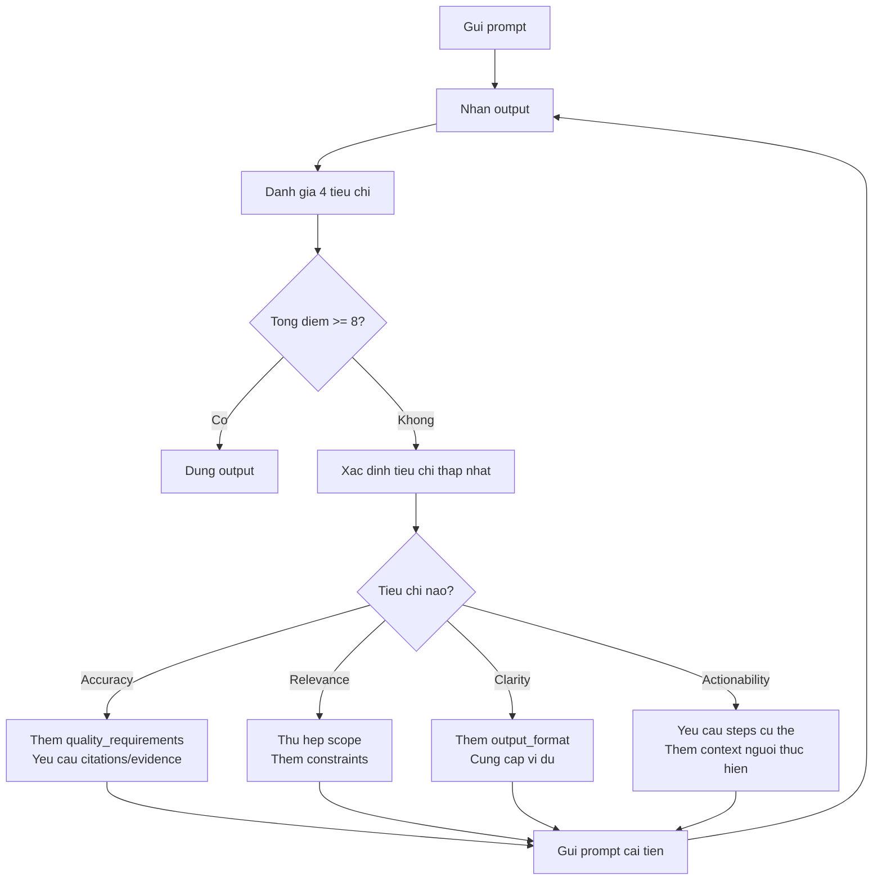
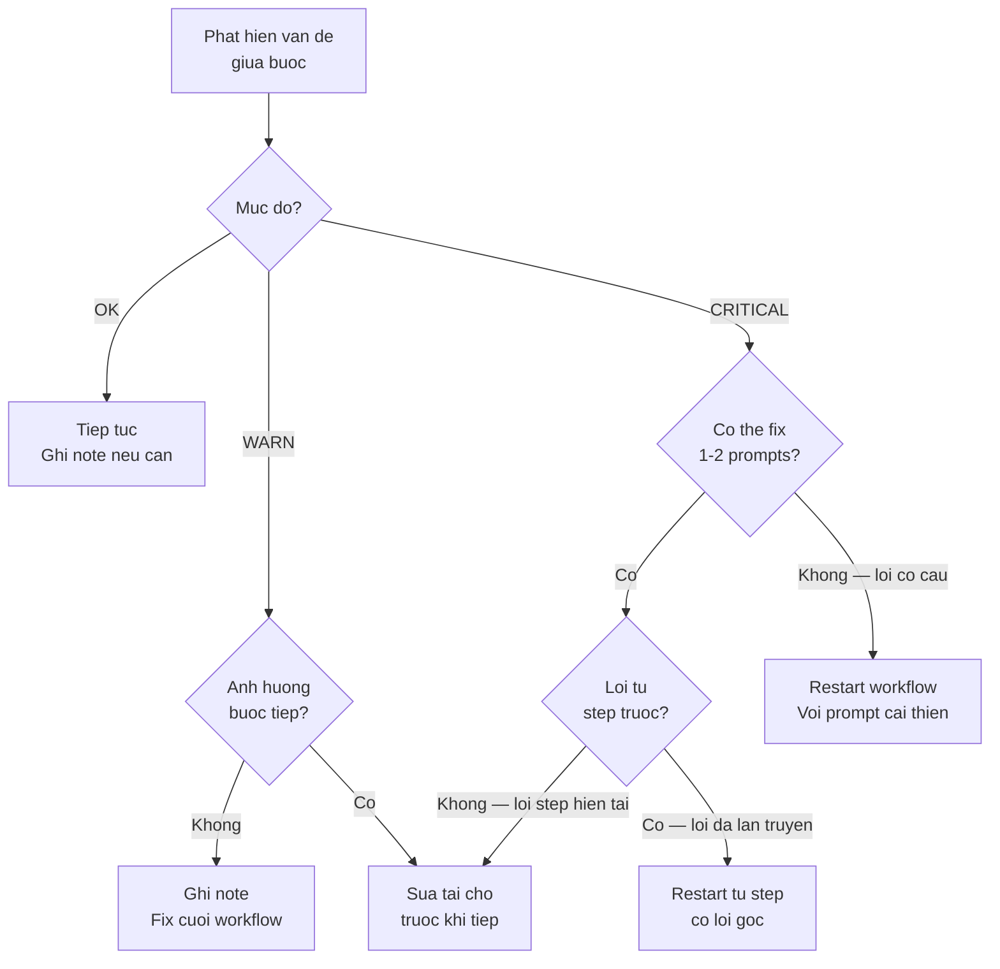

# Đánh giá chất lượng Output

**Thời gian đọc:** 10 phút | **Mức độ:** Intermediate
**Cập nhật:** 2026-03-01 | Models: xem [specs](../reference/model-specs.md)

---
depends-on: [reference/model-specs, 10-claude-desktop-cowork]
impacts: [base/06-mistakes-fixes, 11-cowork-workflows]
---

Module này cung cấp framework đánh giá chất lượng output từ Claude. Thay vì cảm tính "tốt" hay "chưa tốt", bạn sẽ có tiêu chí cụ thể để đánh giá và cải thiện prompts.

---

## 9.1 Bộ 4 tiêu chí đánh giá

[Ứng dụng Kỹ thuật]

Mỗi output từ Claude có thể đánh giá theo 4 tiêu chí. Dùng thang điểm 1-3 cho đơn giản.

| Tiêu chí | 1 -- Chưa đạt | 2 -- Chấp nhận được | 3 -- Tốt |
|----------|--------------|-------------------|----------|
| **Accuracy** (Chính xác) | Có thông tin sai, hallucination, hoặc thiếu cơ sở | Đúng nhưng thiếu chi tiết hoặc có chỗ cần verify | Chính xác, có cơ sở, không hallucination |
| **Relevance** (Phù hợp) | Lạc đề, không trả lời đúng câu hỏi | Trả lời đúng hướng nhưng có phần thừa hoặc thiếu | Trả lời đúng, đủ, không thừa |
| **Clarity** (Rõ ràng) | Khó hiểu, cấu trúc lộn xộn, audience không đọc được | Hiểu được nhưng cần đọc lại | Rõ ràng, dễ hiểu ngay lần đọc đầu |
| **Actionability** (Thực thi được) | Không biết phải làm gì tiếp | Có hướng nhưng thiếu steps cụ thể | Có steps rõ ràng, copy-paste được |

### Cách dùng

Sau khi nhận output từ Claude, tự đánh giá nhanh:

```text
Output này:
- Accuracy:    [1] [2] [3]
- Relevance:   [1] [2] [3]
- Clarity:     [1] [2] [3]
- Actionability: [1] [2] [3]
```

**Tổng 8-12:** Output tốt, dùng được.
**Tổng 5-7:** Cần iterate -- feedback cho Claude để cải thiện.
**Tổng 4:** Cần viết lại prompt từ đầu.

---

## 9.2 Quy trình cải thiện Prompt

[Nguồn: Anthropic Docs - Prompt Engineering Overview]

Khi output chưa đạt, thay vì viết lại prompt hoàn toàn, dùng quy trình iterate:



### Feedback cụ thể theo từng tiêu chí

**Accuracy thấp -- Thêm vào prompt:**

```xml
<quality_requirements>
- Chỉ đưa thông tin bạn chắc chắn
- Đánh dấu [FACT] cho thông tin xác minh được
- Đánh dấu [INFERENCE] cho suy luận
- Nếu không có data, nói rõ
</quality_requirements>
```

**Relevance thấp -- Thêm vào prompt:**

```text
Focus CHỈ vào [topic cụ thể].
KHÔNG đề cập [những gì không cần].
Scope: [giới hạn rõ ràng].
```

**Clarity thấp -- Thêm vào prompt:**

```text
Output format: [mô tả cụ thể format mong muốn]
Audience: [người đọc là ai, trình độ nào]
```

Hoặc cung cấp ví dụ (xem [Module 03, Nguyên tắc 2: Use Examples](03-prompt-engineering.md)).

**Actionability thấp -- Thêm vào prompt:**

```text
Mỗi recommendation phải có:
1. Action cụ thể (làm gì)
2. Nơi thực hiện (ở đâu, file nào, command nào)
3. Expected result (kết quả mong đợi)
```

---

## 9.3 Self-Check -- Yêu cầu Claude tự đánh giá

[Nguồn: Anthropic Docs - Reduce hallucinations]

Bạn có thể yêu cầu Claude tự review output của mình. Đây là kỹ thuật hiệu quả để bắt hallucinations và gaps.

### Prompt Self-Check

```text
Review lại response trước và đánh giá:

1. Có thông tin nào bạn không chắc chắn 100% không?
   Nếu có, đánh dấu và đề xuất cách verify.

2. Có assumption nào bạn đã đưa ra mà chưa confirm với tôi?

3. Có thiếu edge case hoặc exception nào quan trọng không?

4. Response có actionable cho {{audience}} không?
   Nếu chưa, bổ sung steps cụ thể.
```

### Khi nào dùng Self-Check

| Dùng | Không cần |
|------|-----------|
| Output sẽ dùng cho quyết định quan trọng | Q&A nhanh, informal |
| Technical spec hoặc config sẽ deploy | Brainstorming, idea generation |
| Tài liệu cho khách hàng | Draft nội bộ, notes |
| Phân tích root cause sẽ dùng để fix | Tóm tắt tài liệu đã có |

---

## 9.4 So sánh BAD vs GOOD Prompt -- 3 ví dụ

[Ứng dụng Kỹ thuật]

### Ví dụ 1: Phân tích lỗi

**BAD (Accuracy: 1, Actionability: 1):**

```text
Robot bị lỗi, fix giúp tôi.
```

**GOOD (Accuracy: 3, Actionability: 3):**

```text
Robot AMR-003 chạy ROS2 Humble, SLAM cartographer.
Lỗi: mất localization sau 2 giờ vận hành.

Log error:
[paste log ở đây]

Đã thử: restart SLAM node, re-calibrate Lidar -- vẫn lỗi.

Hãy phân tích root cause và đề xuất fix.
Mỗi solution ghi rõ: thay đổi gì, file nào, risk level.
```

### Ví dụ 2: Viết tài liệu

**BAD (Relevance: 1, Clarity: 2):**

```text
Viết tài liệu cho robot.
```

**GOOD (Relevance: 3, Clarity: 3):**

```text
Viết section "Quy trình sạc pin" cho User Manual của AMR-003.
Audience: kỹ thuật viên bảo trì, biết cơ bản về robot.
Format: numbered steps, mỗi step có expected result.
Include: CẢNH BÁO cho safety, thời gian ước tính mỗi step.
Độ dài: 1-2 trang.
```

### Ví dụ 3: So sánh giải pháp

**BAD (Actionability: 1):**

```text
Cartographer hay AMCL tốt hơn?
```

**GOOD (Actionability: 3):**

```text
So sánh Cartographer SLAM và AMCL cho use case:
- Nhà máy 5000m2, layout thay đổi mỗi tháng
- 10 robot AMR chạy đồng thời
- Yêu cầu accuracy localization < 5cm

Tiêu chí: accuracy, performance (CPU/RAM), khả năng xử lý dynamic environments,
ease of configuration, community support.

Đề xuất option nào phù hợp và tại sao. Ghi rõ trade-offs.
```

---

## 9.5 Checklist đánh giá nhanh

[Ứng dụng Kỹ thuật]

Dùng checklist này khi review output quan trọng:

- [ ] **Accuracy:** Không có hallucination hoặc thông tin sai?
- [ ] **Accuracy:** Có phân biệt rõ FACT vs INFERENCE?
- [ ] **Relevance:** Trả lời đúng câu hỏi, không lạc đề?
- [ ] **Relevance:** Không thừa thông tin không cần?
- [ ] **Clarity:** Audience có hiểu được ngay?
- [ ] **Clarity:** Format rõ ràng, dễ scan?
- [ ] **Actionability:** Biết phải làm gì tiếp?
- [ ] **Actionability:** Steps cụ thể, copy-paste được?

**Nếu bất kỳ item nào chưa check:** Feedback cho Claude bằng cách chỉ rõ item nào chưa đạt và yêu cầu cải thiện.

---

## 9.6 Review giữa các bước — In-Progress Review

[Ứng dụng Kỹ thuật]

Mục 9.1–9.5 tập trung đánh giá output cuối cùng — khi Claude đã trả kết quả hoàn chỉnh. Mục này bổ sung chiều quan trọng hơn: review TRONG QUÁ TRÌNH — giữa các bước trong chain prompt hoặc giữa các Cowork tasks. Review giữa bước bắt lỗi sớm trước khi chúng lan truyền sang các bước tiếp theo, tiết kiệm đáng kể thời gian so với phát hiện lỗi ở output cuối (xem [Module 06, Nhóm 6: Lỗi lan truyền](06-mistakes-fixes.md#86-nhóm-6-lỗi-lan-truyền-trong-workflow-nhiều-bước)).

### 9.6.1 Checklist review theo loại output

Mỗi loại output có những điểm dễ sai riêng. Dùng bảng tương ứng để review nhanh sau mỗi bước.

**Bảng 1 — Document/Report**

| Kiểm tra | Dấu hiệu vấn đề | Action |
|----------|------------------|--------|
| Structure đúng outline không? | Section thiếu hoặc sai thứ tự so với plan | Yêu cầu Claude thêm section thiếu hoặc reorder |
| Tone nhất quán không? | Phần đầu formal, phần sau conversational | "Adjust tone section X to match section Y" |
| Cross-reference valid không? | "Xem Section 3" nhưng Section 3 không tồn tại | Fix reference trước khi tiếp tục |
| Audience level đúng không? | Quá technical cho end-user hoặc quá đơn giản cho engineer | Clarify audience trong prompt tiếp và yêu cầu revise |
| Có hallucination số liệu? | Số liệu cụ thể không có trong source đã cung cấp | Flag ngay, yêu cầu cite source hoặc ghi [CẦN XÁC MINH] |

**Bảng 2 — Restructured/Reformatted file**

| Kiểm tra | Dấu hiệu vấn đề | Action |
|----------|------------------|--------|
| Không có nội dung bị mất? | Sections ít hơn original, đoạn văn biến mất | "So sánh với original, liệt kê nội dung bị thiếu" |
| Format target đạt chưa? | Vẫn còn format cũ xen lẫn format mới | Chỉ rõ format cụ thể cần áp dụng cho từng phần |
| Meaning không bị thay đổi? | Paraphrase làm sai nghĩa kỹ thuật (ví dụ: "tolerance" bị đổi thành "error") | Verify manual các thuật ngữ chuyên ngành quan trọng |

**Bảng 3 — Data/Table output**

| Kiểm tra | Dấu hiệu vấn đề | Action |
|----------|------------------|--------|
| Row count đúng? | Ít rows hơn input (Claude truncate hoặc bỏ sót) | Báo số lượng chênh lệch, yêu cầu bổ sung |
| Column mapping đúng? | Data nhầm cột (value của cột A nằm ở cột B) | Spot-check 3–5 rows ngẫu nhiên |
| Tính toán đúng? | Tổng, tỷ lệ phần trăm, trung bình sai | Verify manual ít nhất 2 cells bằng calculator |

**Bảng 4 — Config/Code suggestion**

| Kiểm tra | Dấu hiệu vấn đề | Action |
|----------|------------------|--------|
| Parameter names đúng với hệ thống? | Tên param khác với official docs (ví dụ: `max_vel` thay vì `max_velocity`) | Verify đối chiếu official documentation |
| Values trong range hợp lệ? | Timeout = -1, frequency = 0 Hz, hoặc giá trị vô nghĩa | Check against specs và valid ranges |
| Có [CẦN XÁC MINH] trong output? | Claude tự đánh dấu phần không chắc chắn | Verify từng item trước khi apply vào hệ thống |

**Bảng 5 — Multi-file edit (Cowork)**

| Kiểm tra | Dấu hiệu vấn đề | Action |
|----------|------------------|--------|
| Files đã sửa đúng danh sách? | Diff cho thấy file khác với kỳ vọng | "Liệt kê tất cả files đã thay đổi trong session này" |
| File nào bị sửa ngoài scope? | File không nằm trong danh sách được yêu cầu nhưng bị touch | Rollback ngay, kiểm tra lại scope prompt |
| Backup có chưa? | Không có bản gốc để so sánh hoặc rollback | Xem [Module 10, mục 10.7](../10-claude-desktop-cowork.md) về quy trình backup |

### 9.6.2 Phân loại lỗi cần bắt giữa bước

Không phải mọi vấn đề đều cần dừng lại. Phân loại giúp quyết định nhanh: tiếp tục, ghi note, hay dừng.

**CRITICAL — dừng ngay, không tiếp tục bước tiếp:**
Data bị mất là lỗi critical phổ biến nhất — số items trong output ít hơn input mà không có giải thích. Nghĩa kỹ thuật bị thay đổi (ví dụ: "precision" bị paraphrase thành "accuracy" trong context robotics, hai khái niệm khác nhau) có thể gây hiểu sai toàn bộ tài liệu. Trong Cowork, file sai bị sửa (ngoài danh sách scope) có thể phá vỡ code hoặc config đang chạy. Hallucination số liệu cụ thể (ví dụ: "robot đạt throughput 500 units/giờ" khi source không có con số này) đặc biệt nguy hiểm vì trông rất đáng tin.

**WARN — ghi note, fix trong step tiếp hoặc cuối workflow:**
Format inconsistency giữa các sections (heading levels lộn xộn, bảng vs. prose không nhất quán) ảnh hưởng chất lượng nhưng không làm sai nội dung. Tone shift (formal → conversational giữa chừng) gây khó chịu cho người đọc nhưng sửa được ở bước review cuối. Cross-reference sai ("xem mục 3.2" nhưng nội dung ở mục 3.4) cần fix nhưng không block workflow. Thiếu section nhỏ không ảnh hưởng logic tổng thể.

**OK — chấp nhận, tiếp tục:**
Word choice khác (synonyms) miễn không thay đổi nghĩa kỹ thuật. Độ dài section lệch ±20% so với kỳ vọng. Thứ tự bullet points khác plan ban đầu nhưng nội dung đầy đủ.

### 9.6.3 Decision — tiếp tục / sửa tại chỗ / restart

Khi phát hiện vấn đề giữa bước, dùng flowchart sau để quyết định:



### 9.6.4 Quick review vs Deep review

Không phải mọi output đều cần review cùng mức độ. Chọn approach theo risk level của task:

| Risk Level | Ví dụ | Review Approach | Thời gian ước tính |
|------------|-------|-----------------|-------------------|
| **Low** | Draft nội bộ, notes cá nhân, brainstorm | Scan 30 giây: check structure tổng, đủ sections chưa | 30 giây |
| **Medium** | Tài liệu team, email quan trọng, meeting notes | Đọc kỹ từng section, checklist ngắn (3–5 items) | 2–5 phút |
| **High** | Tài liệu khách hàng, SOP, config file | Full checklist theo loại output (mục 9.6.1), verify cross-references | 10–15 phút |
| **Critical** | Safety documentation, config production, tài liệu pháp lý | Full review + verify nguồn + người thứ 2 review độc lập | 30+ phút |

> [!TIP] **Doc audience:** Template T-20 (In-Progress Review Checklist) trong [Doc Template Library](../doc/02-template-library.md#t-20-in-progress-review-checklist) là phiên bản printable của mục này.

---

**Tiếp theo:**

- [Prompt Engineering](03-prompt-engineering.md) -- nắm vững nguyên tắc để output đạt chất lượng cao từ đầu
- [Mistakes & Fixes](06-mistakes-fixes.md) -- khắc phục lỗi cụ thể
