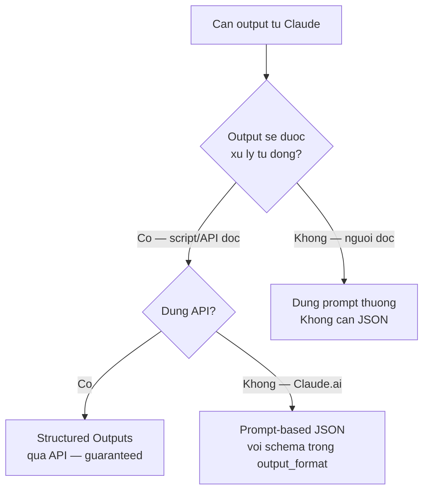
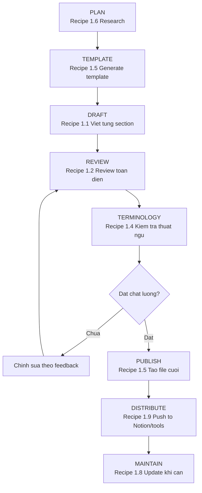

# Doc Workflows & Recipes

**Thời gian đọc:** 25 phút | **Mức độ:** Intermediate
**Cập nhật:** 2026-03-07 | Models: xem [specs](../reference/model-specs.md)

---
depends-on: [reference/model-specs, base/04-context-management, doc/02-template-library, doc/03-cowork-setup]
impacts: [base/03-prompt-engineering, doc/03-cowork-setup, doc/04-cowork-workflows]
---

Recipes thực hành cho documentation workflows. Mỗi recipe bao gồm: khi nào dùng, setup cần thiết, prompts cụ thể, và tips thực tế.

> [!NOTE] Giả định đã đọc [base/](../base/) — đặc biệt [Prompt Engineering](../base/03-prompt-engineering.md) và [Context Management](../base/04-context-management.md). Module này không lặp lại kiến thức nền tảng.

---

## 1.1 Recipe: Viết tài liệu từ đầu (Document Drafting)

[Ứng dụng Kỹ thuật]

**Khi nào dùng:** Cần viết tài liệu mới -- user guide, SOP, technical spec, training material.

**Setup:** Nên dùng trong Project đã có style guide và template uploaded. Style: Custom "Technical" hoặc Formal preset.

### Quy trình 4 bước

**Bước 1 -- Brief và Outline:**

```text
Tôi cần viết {{loai_tai_lieu}} cho {{san_pham_he_thong}}.

Background:
- {{mo_ta_ngan_san_pham}}
- {{phien_ban_release}}

Target audience: {{mo_ta_nguoi_doc}}

Mục tiêu: Sau khi đọc xong, người đọc có thể {{ket_qua_mong_doi}}.

Đề xuất outline chi tiết. Chỉ outline -- chưa viết nội dung.
Với mỗi section, note ngắn 1 dòng về nội dung chính.
```

**Bước 2 -- Review và điều chỉnh outline:**

```text
Điều chỉnh outline:
- {{them_bo_gop_tach_sections}}
- {{thay_doi_thu_tu_neu_can}}

Confirm outline cuối cùng trước khi viết.
```

**Bước 3 -- Viết từng section:**

```text
Viết section "{{ten_section}}" theo outline đã thống nhất.

Tuân thủ:
- {{quy_tac_viet_cu_the}}
- Nếu cần thông tin tôi chưa cung cấp, đánh dấu [TBD: mô tả thông tin cần]
  và tiếp tục viết phần còn lại.
```

**Bước 4 -- Review tổng thể:**

```text
Đọc lại toàn bộ tài liệu từ đầu đến cuối và kiểm tra:

1. Consistency: thuật ngữ, capitalization, format
2. Completeness: có thiếu step hay thông tin quan trọng nào không?
3. Flow: logic trình bày có smooth không?
4. Audience: ngôn ngữ có phù hợp target audience không?

Liệt kê mọi issue tìm được.
```

**Tip thực tế:** Ở bước 3, viết từng section riêng lẻ trong các messages khác nhau. Không nên yêu cầu Claude viết hết cả tài liệu 20-30 trang trong một message -- chất lượng sẽ giảm ở các phần cuối do context dài.

**Ví dụ:** Viết Style Guide cho team documentation. Bước 1 brief — `{{loai_tai_lieu}}` = "Style Guide", `{{san_pham_he_thong}}` = "bộ tài liệu kỹ thuật nội bộ", `{{mo_ta_nguoi_doc}}` = "kỹ sư và technical writer, trình độ tiếng Anh B2+", `{{ket_qua_mong_doi}}` = "viết tài liệu đúng format, terminology, và tone thống nhất". Bước 2 — tách "Terminology Rules" và "Formatting Rules" thành 2 sections riêng thay vì gộp. Bước 3 — viết từng section: Scope → Terminology → Formatting → Tone & Voice → Examples → Checklist.

> [!NOTE] **AMR Context**
> Áp dụng recipe này cho viết User Guide AMR hoặc SOP vận hành robot.
> Thay: `{{loai_tai_lieu}}` = "User Guide", `{{san_pham_he_thong}}` = "AMR-500, nhà máy sản xuất linh kiện điện tử", `{{mo_ta_nguoi_doc}}` = "kỹ thuật viên vận hành, quen xe nâng, chưa có background lập trình".

> [!TIP] **Model:** Sonnet 4.6 cho viết tài liệu có cấu trúc — cân bằng chất lượng và tốc độ. Xem [decision flowchart](../reference/model-specs.md#chọn-model)

> [!TIP] **Skill:** `doc-coauthoring` — workflow co-authoring tài liệu, tự động chia bước outline → draft → review.

---

## 1.2 Recipe: Review và cải thiện tài liệu (Document Review)

[Ứng dụng Kỹ thuật]

**Khi nào dùng:** Cần review tài liệu do đồng nghiệp viết, hoặc cải thiện tài liệu cũ.

**Setup:** Upload file tài liệu cần review (PDF, Word, hoặc paste text). Nếu có style guide: upload vào Project Knowledge.

### Review toàn diện

```text
[Upload file]

Review tài liệu này theo các tiêu chí sau.
Đánh giá theo thang: [Pass] / [Needs Improvement] / [Fail]

Tiêu chí:
1. ACCURACY -- Thông tin có chính xác, up-to-date không?
2. CLARITY -- Target audience ({{mo_ta_audience}}) có hiểu được không?
3. CONSISTENCY -- Thuật ngữ, format, tone có nhất quán không?
4. COMPLETENESS -- Có thiếu thông tin quan trọng nào không?
5. STRUCTURE -- Tổ chức logic có hợp lý không?
6. GRAMMAR & STYLE -- Ngữ pháp, chính tả, style có chuẩn không?

Output format:
Bảng tóm tắt assessment > Chi tiết từng issue > Overall recommendation.
```

### Review chuyên sâu cho procedures

```text
[Upload file hướng dẫn sử dụng]

Đóng vai {{persona_nguoi_dung}} đọc tài liệu này lần đầu.
"Đi qua" từng step trong procedures và kiểm tra:

- Có step nào bị thiếu giữa chừng không? (gap analysis)
- Có step nào giả định người đọc đã biết điều chưa được giải thích?
- Có thuật ngữ nào xuất hiện mà chưa được define?
- Expected results sau mỗi step có được nêu rõ không?
- Error cases có được đề cập không?

Liệt kê mọi vấn đề tìm được, sắp xếp theo thứ tự xuất hiện trong tài liệu.
```

**Ví dụ:** Review SOP draft của đồng nghiệp theo rubric. Upload SOP "Quy trình xuất bản tài liệu kỹ thuật" + style guide của team. Dùng prompt "Review toàn diện" với `{{mo_ta_audience}}` = "technical writer mới, chưa quen quy trình nội bộ". Claude đánh giá 6 tiêu chí, phát hiện: Accuracy [Pass], Clarity [Needs Improvement] — 3 thuật ngữ không nhất quán, 2 steps thiếu expected result. Dùng tiếp prompt "Review chuyên sâu cho procedures" với `{{persona_nguoi_dung}}` = "nhân viên mới ngày đầu" → phát hiện step 4 giả định người đọc biết dùng Git mà chưa giải thích.

> [!NOTE] **AMR Context**
> Áp dụng recipe này cho review SOP vận hành AMR.
> Thay: `{{mo_ta_audience}}` = "kỹ thuật viên vận hành, quen xe nâng, chưa từng dùng robot tự hành", `{{persona_nguoi_dung}}` = "kỹ thuật viên mới ngày đầu nhận robot".

> [!TIP] **Model:** Sonnet 4.6 cho review tài liệu — đủ khả năng phát hiện issues mà không cần deep reasoning. Xem [decision flowchart](../reference/model-specs.md#chọn-model)

> [!TIP] **Skill:** `doc-coauthoring` — hỗ trợ structured review với rubric và feedback có cấu trúc.

---

## 1.3 Recipe: Troubleshooting có cấu trúc

[Ứng dụng Kỹ thuật]

**Khi nào dùng:** Debug lỗi hệ thống, phân tích log, xác định root cause.

**Setup:** Nên bật Extended thinking cho các case phức tạp (nhiều module liên quan). Upload log files trực tiếp.

### Prompt chuẩn

```xml
<role>
{{vai_tro}} chuyên troubleshooting {{linh_vuc}}.
</role>

<task>
Phân tích {{loai_data}} dưới đây và xác định root cause.
</task>

<context>
- Hệ thống: {{ten_he_thong}}
- Môi trường: {{mo_ta_moi_truong}}
- Vấn đề: {{mo_ta_van_de}}
- Thời gian xuất hiện: {{thoi_gian}}
- Đã thử: {{cac_buoc_da_thu}}
</context>

<input_data>
{{log_data_hoac_error_messages}}
</input_data>

<requirements>
- Xác định root cause chính (không chỉ liệt kê symptoms)
- Phân biệt rõ: nguyên nhân gốc vs. hệ quả
- Đề xuất solutions xếp theo mức ưu tiên
- Mỗi solution ghi rõ: thay đổi gì, ở đâu, risk level
</requirements>
```

### Khi nào bật Extended thinking

| Bật Extended thinking | Không cần |
|----------------------|-----------|
| Log có nhiều warning từ nhiều module | Lỗi đơn giản, error message rõ ràng |
| Cần phân biệt nguyên nhân gốc vs. hệ quả dây chuyền | Đã biết nguyên nhân, chỉ cần fix |
| Tương tác giữa nhiều subsystems | Lỗi nằm trong 1 module duy nhất |

**Ví dụ:** Phân tích validation report của bộ tài liệu kỹ thuật — 47 warnings từ 3 công cụ check (broken links, format violations, terminology mismatches). Setup: `{{vai_tro}}` = "Senior Technical Writer", `{{linh_vuc}}` = "documentation quality". Upload validation log → Claude xác định root cause: file `api-reference.md` bị rename gây cascade 32 broken links (68% warnings). 10 terminology warnings do glossary chưa update sau khi team đổi thuật ngữ. 5 format violations cần fix riêng. Phân biệt rõ: rename file là nguyên nhân gốc, broken links là hệ quả.

> [!NOTE] **AMR Context**
> Áp dụng recipe này cho troubleshoot lỗi hệ thống AMR.
> Thay: `{{vai_tro}}` = "Senior Robotics Engineer", `{{linh_vuc}}` = "hệ thống AMR", `{{ten_he_thong}}` = "AMR-500", `{{loai_data}}` = "ROS2 log + Lidar diagnostics".

> [!TIP] **Model:** Sonnet 4.6 cho troubleshooting thông thường. Chuyển Opus 4.6 khi log có nhiều module tương tác phức tạp. Xem [decision flowchart](../reference/model-specs.md#chọn-model)

---

## 1.4 Recipe: Chuẩn hóa thuật ngữ (Terminology Management)

[Ứng dụng Kỹ thuật]

**Khi nào dùng:** Tạo hoặc cập nhật glossary, đảm bảo team dùng thuật ngữ nhất quán.

### Tạo glossary từ tài liệu hiện có

```text
[Upload 3-5 tài liệu mẫu của team]

Phân tích các tài liệu đã upload và:

1. Trích xuất tất cả thuật ngữ kỹ thuật/chuyên ngành
2. Xác định các trường hợp cùng concept nhưng dùng từ khác nhau
   (ví dụ: "robot" vs "AMR" vs "mobile robot" vs "xe tự hành")
3. Đề xuất thuật ngữ chuẩn cho mỗi concept

Output dạng bảng:
| Thuật ngữ chuẩn | Định nghĩa | Viết tắt | Thuật ngữ cần tránh | Ghi chú |

Sắp xếp theo alphabet.
```

### Kiểm tra tính nhất quán

```text
[Upload file tài liệu + glossary]

So sánh tài liệu với glossary đã upload.
Tìm mọi trường hợp thuật ngữ trong tài liệu không khớp với glossary:
- Dùng thuật ngữ sai
- Dùng cách viết/viết hoa khác
- Dùng thuật ngữ chưa có trong glossary (cần bổ sung?)

Báo cáo dạng bảng với vị trí cụ thể (section + paragraph).
```

**Ví dụ:** Chuẩn hóa terminology cho bộ tài liệu kỹ thuật đa ngôn ngữ. Team dùng lẫn "user guide" / "user manual" / "hướng dẫn người dùng" / "tài liệu hướng dẫn" — 4 cách gọi cho cùng 1 loại tài liệu — trong 6 files khác nhau. Upload 6 files → Claude trích xuất glossary → chuẩn hóa: "User Guide" (tiếng Anh) và "Hướng dẫn Người dùng" (tiếng Việt) là thuật ngữ chính thức, không viết tắt, không dùng "manual". Dùng prompt "Kiểm tra tính nhất quán" → phát hiện 31 chỗ cần fix.

> [!NOTE] **AMR Context**
> Áp dụng recipe này cho chuẩn hóa terminology AMR trong bộ tài liệu R&D.
> Thay: upload SOP + maintenance manual + incident report + training material → chuẩn hóa "AMR" là thuật ngữ chính thức, "AGV" chỉ dùng khi so sánh công nghệ cũ (dây chuyền guided wire).

> [!TIP] **Model:** Sonnet 4.6 cho extract và compare terminology — tác vụ này không cần deep reasoning. Xem [decision flowchart](../reference/model-specs.md#chọn-model)

---

## 1.5 Recipe: Tạo file chuyên nghiệp (Document Generation)

[Ứng dụng Kỹ thuật]

**Khi nào dùng:** Cần output là file thật (Word, Excel, PowerPoint) chứ không chỉ text.

### Tạo report Word

```text
Tạo file Word (.docx) cho {{loai_bao_cao}}:

Thông tin:
- {{noi_dung_chinh}}

Format:
- Header: tên công ty + tên dự án + ngày
- Table of contents
- Professional formatting với heading styles
- Bảng summary ở trang đầu
- Page numbers ở footer
```

### Tạo Excel tracking

```text
Tạo file Excel (.xlsx) cho {{muc_dich_tracking}}:

Columns:
- {{danh_sach_columns}}

Thêm:
- Conditional formatting: {{quy_tac_mau}}
- Filter on all columns
- Summary sheet với dashboard
```

### Tạo presentation

```text
Tạo file PowerPoint (.pptx) cho {{muc_dich_presentation}}.

Nội dung {{so_slides}} slides:
{{danh_sach_slides}}

Style: clean, professional, ít text trên mỗi slide, dùng diagrams khi có thể.
```

**Lưu ý:** Cần bật "Code execution and file creation" trong Settings > Capabilities để tạo file xlsx, docx.

**Ví dụ:** Tạo Quarterly Documentation Audit Report. `{{loai_bao_cao}}` = "Q1 2026 Technical Documentation Audit", nội dung gồm danh sách tài liệu review, compliance rate theo tiêu chí, issues phân loại theo severity, recommended actions. Output `.docx` với header công ty, ToC tự động, bảng summary ở trang đầu, page numbers.

> [!NOTE] **AMR Context**
> Áp dụng recipe này cho tạo báo cáo AMR định kỳ.
> Thay: `{{loai_bao_cao}}` = "Monthly AMR Fleet Performance Report", `{{noi_dung_chinh}}` = dữ liệu từ fleet management system (uptime, mission success rate, incidents). Tạo Excel tracking với conditional formatting: uptime < 95% → đỏ, 95–99% → vàng, ≥ 99% → xanh.

> [!TIP] **Model:** Sonnet 4.6 cho tạo file report — không cần deep reasoning, chủ yếu là formatting. Xem [decision flowchart](../reference/model-specs.md#chọn-model)

---

## 1.6 Recipe: Research và tổng hợp

**Khi nào dùng:** Cần tìm hiểu thông tin trước khi viết hoặc ra quyết định.

### Research nhanh (Web Search)

```text
Tìm kiếm và tổng hợp thông tin về {{chu_de}}:

1. {{khia_canh_1}}
2. {{khia_canh_2}}
3. {{khia_canh_3}}

Với mỗi source, nêu rõ: tên, nguồn, và key takeaway.
Cuối cùng: đề xuất approach tốt nhất cho trường hợp cụ thể của tôi.
```

### Research

[Nguồn: Anthropic Help Center - Research]
URL: https://support.claude.com/en/articles/11088861

Khi cần research kỹ hơn -- competitive analysis, technology landscape, industry standards -- dùng Research. Claude tự động tìm kiếm nhiều nguồn, tổng hợp, và tạo báo cáo chi tiết.

```text
Sử dụng Research để nghiên cứu:
{{chu_de_can_research}}

Focus vào:
- {{khia_canh_1}}
- {{khia_canh_2}}
- {{khia_canh_3}}

Tạo báo cáo tổng hợp với citations.
```

| Aspect | Web Search | Research |
|--------|-----------|---------------|
| Depth | Quick lookup, 1-3 sources | Deep dive, multiple sources |
| Output | Direct answer | Report có citations |
| Thời gian | Nhanh (giây) | Lâu hơn (phút) |
| Dùng khi | Tra cứu nhanh, verify thông tin | Nghiên cứu sâu, tổng hợp đa nguồn |

**Cách bật:** Message input > Click "Search and tools" > Chọn "Web Search" hoặc "Research".

**Ví dụ:** Research toolchain cho technical documentation — so sánh Confluence, Notion, MkDocs cho team kỹ thuật 15 người. Dùng Web Search quick lookup cho pricing và feature list. Dùng Research deep dive để tổng hợp: setup complexity, search capability, versioning, export formats, và integration với CI/CD. Output: báo cáo so sánh có citations, recommendation cụ thể theo context của team.

> [!NOTE] **AMR Context**
> Áp dụng recipe này cho research công nghệ hoặc tiêu chuẩn AMR.
> Thay: `{{chu_de}}` = "AMR safety standards — ISO 3691-4 và ANSI/ITSDF B56.5", focus vào requirements cho facility layout, speed limits, warning systems. Hoặc research so sánh SLAM algorithms (GMapping vs Cartographer vs RTAB-Map) cho warehouse environment.

> [!TIP] **Model:** Sonnet 4.6 cho web search nhanh. Chuyển Opus 4.6 khi cần tổng hợp báo cáo dài từ nhiều nguồn phức tạp. Xem [decision flowchart](../reference/model-specs.md#chọn-model)

---

## 1.7 Recipe: Structured Output cho automation

[Nguồn: Anthropic Docs - Structured Outputs]
URL: https://platform.claude.com/docs/en/build-with-claude/structured-outputs

**Khi nào dùng:** Output cần parse tự động bởi script, dashboard, hoặc pipeline -- không phải người đọc.

### Prompt-based JSON (Claude.ai)

```xml
<task>
Phân tích {{loai_data}} và trả kết quả dưới dạng JSON.
</task>

<input_data>
{{data_input}}
</input_data>

<output_format>
Trả về CHỈ JSON, không markdown, không giải thích.
Theo đúng schema sau:

{
  "document_id": "string",
  "validated_at": "string (ISO 8601)",
  "violations": [
    {
      "type": "string (broken_link | format | terminology | missing_section)",
      "severity": "string (critical | warning | info)",
      "location": "string (section + line)",
      "message": "string"
    }
  ],
  "summary": { "pass": "number", "fail": "number", "total": "number" },
  "recommendation": "string"
}
</output_format>
```

**Tip:** Thêm "Trả về CHỈ JSON, không markdown, không giải thích" để tránh Claude wrap output trong code block.

**Ví dụ:** Parse kết quả từ documentation linting tool (Vale, markdownlint) sang JSON để feed vào CI/CD dashboard. `{{loai_data}}` = "Vale lint output", `{{data_input}}` = paste raw lint output. Claude phân tích và trả về JSON theo schema trên: document_id, violations (type, severity, location), summary (pass/fail count), recommendation. Dashboard tự động highlight file nào có fail > 5 violations.

> [!NOTE] **AMR Context**
> Áp dụng recipe này cho parse log AMR dạng JSON.
> Thay: `{{loai_data}}` = "ROS2 diagnostic log", `{{data_input}}` = paste Lidar/SLAM error output. Schema: robot_id, timestamp, errors (module: lidar | slam | navigation | motor, severity, message, suggested_fix), root_cause, recommended_action.

> [!TIP] **Model:** Sonnet 4.6 cho structured output — tác vụ rule-based, không cần reasoning sâu. Xem [decision flowchart](../reference/model-specs.md#chọn-model)

### Khi nào dùng



---

## 1.8 Recipe: Convert và migrate tài liệu

[Ứng dụng Kỹ thuật]

**Khi nào dùng:** Chuyển đổi format hoặc cấu trúc lại tài liệu cũ.

### Convert Word sang Markdown

```text
[Upload file Word]

Chuyển tài liệu Word này sang Markdown format:
- Giữ nguyên cấu trúc heading hierarchy
- Bảng > Markdown tables
- Hình ảnh > placeholder [Image: mô tả]
- Bold/italic > **bold** / *italic*
- Cross-references > [Section Name](#section-name)

Output: file Markdown hoàn chỉnh.
```

### Restructure tài liệu cũ

```text
[Upload file tài liệu cũ]

Tài liệu này được viết {{thoi_gian}} trước và cần cập nhật.

Hãy:
1. Phân tích cấu trúc hiện tại và chỉ ra vấn đề
2. Đề xuất cấu trúc mới phù hợp hơn
3. Đánh dấu nội dung nào:
   - [Keep] Giữ nguyên (còn chính xác)
   - [Review] Cần review (có thể đã outdated)
   - [Rewrite] Cần viết lại
   - [Add] Cần bổ sung (thiếu)

Chưa cần viết lại -- chỉ cần assessment và migration plan.
```

**Ví dụ:** Migration 20 SOP Word docs sang Markdown để đưa vào MkDocs knowledge base. Dùng "Convert Word → Markdown" với quy tắc chuẩn — phát hiện 4 files có embedded images cần xử lý thủ công, tách riêng. Dùng "Restructure tài liệu cũ" cho 3 SOPs viết từ 2019: Claude đánh dấu 40% nội dung [Review] (procedure đã thay đổi), 20% [Rewrite] (tool outdated), 15% [Add] (thiếu sections theo tiêu chuẩn mới) — tạo migration plan trước khi bắt tay viết lại.

> [!NOTE] **AMR Context**
> Áp dụng recipe này cho migration tài liệu AMR.
> Thay: convert maintenance manuals từ Word → Markdown để đưa vào internal knowledge base; hoặc restructure SOP vận hành viết từ 2020 — đánh dấu phần procedure đã thay đổi sau khi nâng cấp phần mềm AMR.

> [!TIP] **Model:** Sonnet 4.6 cho convert và restructure — không cần reasoning phức tạp. Xem [decision flowchart](../reference/model-specs.md#chọn-model)

---

## 1.9 Recipe: Sử dụng MCP Connectors trong workflow

[Nguồn: Anthropic Help Center - Setting up and using Integrations]

**Khi nào dùng:** Muốn Claude tương tác trực tiếp với tools bạn đang dùng -- không cần copy-paste qua lại.

### Connectors hữu ích

| Connector | Dùng để |
|-----------|---------|
| **Google Drive** | Đọc documents, spreadsheets trực tiếp |
| **Notion** | Tạo/update pages trong Notion workspace |
| **Slack** | Tìm kiếm conversations, context |
| **GitHub** | Truy cập repositories, review code |
| **Gmail** | Tham chiếu emails, draft responses |
| **Jira** | Xem và quản lý tickets |

### Workflow ví dụ

```text
Tôi cần tạo một trang Notion mới với nội dung:
- Title: "Documentation Standards v2.0"
- Sections: {{danh_sach_sections}}
- Bảng comparison giữa standard cũ và mới
```

**Setup:** Settings > Connected Apps > Connect service cần thiết.

**Lưu ý:** Mỗi connector tốn context tokens khi fetch data. Chỉ connect khi thực sự cần.

**Ví dụ:** Đồng bộ kết quả documentation audit vào Notion team workspace. Kết nối Google Drive để đọc audit report, tạo Notion page "Documentation Audit Q1 2026" với sections: Executive Summary, Issues by Module, Action Items. Sau khi tạo xong, push link vào Slack #docs-team. Thay vì copy-paste thủ công qua 3 tools, toàn bộ quy trình xong trong 1 prompt.

> [!NOTE] **AMR Context**
> Áp dụng recipe này cho workflow AMR documentation.
> Thay: kết nối GitHub để đọc open issues từ ROS2 repo, tổng hợp thành Notion page "AMR Software Issues — Tuần X". Hoặc: sau khi tạo incident report, push tóm tắt vào Slack #amr-ops.

> [!TIP] **Model:** Sonnet 4.6 cho connector workflows — tác vụ chủ yếu là read/write data, không cần reasoning phức tạp. Xem [decision flowchart](../reference/model-specs.md#chọn-model)

---

## 1.10 Document Lifecycle -- Workflow tổng hợp

[Ứng dụng Kỹ thuật]

Kết hợp các recipes thành quy trình hoàn chỉnh cho một tài liệu từ ý tưởng đến published.



### Checklist cho mỗi giai đoạn

| Giai đoạn | Checklist |
|-----------|----------|
| **Plan** | Audience xác định? Scope rõ ràng? Research đủ? |
| **Draft** | Viết từng section? [TBD] markers cho info thiếu? |
| **Review** | 6 tiêu chí đều Pass? Procedures đi qua được? |
| **Terminology** | Khớp glossary? Thuật ngữ nhất quán? |
| **Publish** | Format đúng? Metadata đầy đủ? Version đúng? |
| **Maintain** | Review date đặt? Owner assigned? |

**Ví dụ:** Tạo Technical Specification cho module cảm biến mới — đi qua đủ các giai đoạn: Research (1.6) tìm datasheet + communication protocol → Template (1.5) tạo boilerplate spec `.docx` → Draft (1.1) viết từng section: Overview, Electrical Interface, Software API, Test Criteria → Review (1.2) 6 tiêu chí → Terminology (1.4) đối chiếu glossary → Publish (1.5) export `.pdf` → Distribute (1.9) push lên Confluence qua MCP → Maintain (1.8) lên lịch review sau mỗi firmware release.

> [!NOTE] **AMR Context**
> Áp dụng workflow này cho tạo SOP vận hành AMR-500 từ đầu — đặc biệt khi cần tạo đồng thời User Guide + Maintenance Manual + Quick Reference Card cho cùng một sản phẩm.

> [!TIP] **Model:** Chọn model theo giai đoạn: Sonnet 4.6 cho Draft, Review, Terminology. Opus 4.6 khi Research cần tổng hợp nhiều nguồn phức tạp. Xem [decision flowchart](../reference/model-specs.md#chọn-model)

---

## 1.11 Recipe: Cowork Batch Processing

[Cập nhật 03/2026]

**Khi nào dùng:** Xử lý nhiều files cùng lúc trong Cowork — convert format hàng loạt, extract thông tin từ nhiều tài liệu, tổ chức lại cấu trúc thư mục lớn.

### Quy trình 4 bước

**Bước 1 — Chọn folder và scope:**

```text
Đọc danh sách files trong {{thu_muc}}:
- Liệt kê tất cả files có extension {{ext}}
- Tổng số: bao nhiêu files?
- Preview 3 files đầu để confirm format đúng trước khi chạy full batch.
```

**Bước 2 — Mô tả input/output:**

```text
Input: {{mo_ta_format_hien_tai}}
Output mong muốn: {{mo_ta_format_dich}}
Quy tắc convert: {{quy_tac_convert}}
Đặt file output vào: {{thu_muc_dich}}
```

**Bước 3 — Review plan trước khi chạy:**

```text
Trước khi bắt đầu, liệt kê:
1. Số files sẽ xử lý
2. Files nào có thể gặp vấn đề (format không chuẩn, kích thước lớn)
3. Thứ tự xử lý nếu có dependency

Đề xuất batch size hợp lý.
Chưa chạy — chờ approve.
```

**Bước 4 — Approve và chạy batch:**

```text
OK, chạy batch convert theo plan đã thống nhất.
Sau mỗi {{N}} files, báo cáo trạng thái: đã xong X/total, lỗi nếu có.
```

### Prompt template: Batch convert Word → Markdown

```text
Trong thư mục {{input_folder}}, convert tất cả file .docx sang Markdown:

Quy tắc:
- Heading styles (H1→H3) → # / ## / ###
- Bold/Italic → **bold** / *italic*
- Tables → Markdown table
- Hình ảnh → [Image: {{ten_file_goc}}]
- Footnotes → ghi chú ở cuối section

Output: lưu file .md vào {{output_folder}}, giữ tên file gốc.
Báo cáo khi hoàn thành: số thành công, số lỗi, danh sách file lỗi nếu có.
```

### Tips

- **Chia batch nếu > 20 files.** Xử lý quá nhiều cùng lúc tăng rủi ro lỗi giữa chừng và khó track kết quả.
- **Dùng Sonnet cho batch tasks.** Opus không cần thiết cho convert/extract — Sonnet nhanh hơn và tiết kiệm quota.
- **Preview 3 files trước khi chạy full batch.** Phát hiện vấn đề format sớm, tránh phải redo toàn bộ.
- **Backup thư mục input trước khi chạy** nếu script có thể ghi đè — dùng Git commit hoặc copy thủ công.

**Ví dụ:** Convert 45 SOP Word docs sang Markdown để đưa vào MkDocs knowledge base. Bước 1: scan `docs/sop/`, liệt kê 45 file `.docx`, preview 3 files đầu xác nhận Word heading styles được map đúng. Bước 2: input = `.docx` với Word styles, output = `.md` với `#/##/###`, hình ảnh → `[Image: tên file]`, lưu vào `docs/sop-md/`. Bước 3: plan phát hiện 3 files có embedded images cần xử lý thủ công — tách khỏi batch chính. Bước 4: chạy 3 batch 14 files, báo cáo sau mỗi batch. Kết quả: 42 files convert thành công, 3 files embedded images xử lý riêng mà không block batch còn lại.

> [!NOTE] **AMR Context**
> Áp dụng recipe này cho batch convert tài liệu AMR.
> Thay: convert maintenance manuals + SOP AMR từ Word → Markdown để đưa vào internal knowledge base. Preview 3 files đầu để xác nhận heading styles đúng trước khi chạy full batch. Chia batch nhỏ (10–15 files) nếu files có nhiều hình ảnh kỹ thuật.

> [!TIP] **Model:** Sonnet 4.6 cho batch tasks — convert và extract không cần reasoning sâu, Sonnet nhanh hơn và tiết kiệm quota. Xem [decision flowchart](../reference/model-specs.md#chọn-model)

---

## 1.12 Recipe: Cowork + Scheduled Tasks cho báo cáo định kỳ

[Cập nhật 03/2026]

**Khi nào dùng:** Cần tạo output tự động theo lịch định kỳ — weekly test report, monthly summary, daily log digest — không cần mở Cowork thủ công mỗi lần.

**Yêu cầu:** Claude Desktop với Cowork (Pro plan trở lên). Máy phải đang bật vào thời điểm scheduled task chạy.

### Quy trình 3 bước

**Bước 1 — Tạo prompt template:**

Viết prompt hoàn chỉnh với tất cả instructions. Scheduled task chạy prompt này tự động — không có người ở đó để clarify, nên prompt phải self-contained.

```text
[Scheduled task — chạy mỗi {{ngay}} lúc {{gio}}]

Đọc files trong {{thu_muc_data}}:
- {{file_pattern_1}} — chứa {{loai_data_1}}
- {{file_pattern_2}} — chứa {{loai_data_2}}

Tổng hợp thành báo cáo tuần:
1. Tóm tắt executive: 3-5 điểm chính
2. Metrics so với tuần trước: {{danh_sach_KPI}}
3. Issues phát sinh: list với severity
4. Actions needed: ai cần làm gì trước {{deadline}}

Lưu báo cáo tại: {{output_folder}}/report-{{ngay}}.md
Format ngày: YYYY-MM-DD
```

**Bước 2 — Test manual trước khi schedule:**

```text
Chạy thử prompt báo cáo này một lần với data hiện tại.
Confirm: output format đúng, file được lưu đúng chỗ, không có lỗi.
```

**Bước 3 — Setup Scheduled Task trong Cowork:**

Trong Claude Desktop > Cowork > Scheduled Tasks:

1. Tạo task mới
2. Paste prompt template
3. Chọn schedule: Daily / Weekly / Monthly + thời điểm
4. Cron syntax nếu cần lịch phức tạp:

| Lịch | Cron syntax |
|------|-------------|
| Mỗi thứ Hai 8:00 AM | `0 8 * * 1` |
| Mỗi thứ Sáu 5:00 PM | `0 17 * * 5` |
| Ngày 1 hàng tháng 9:00 AM | `0 9 1 * *` |
| Mỗi ngày trong tuần 9:00 AM | `0 9 * * 1-5` |

### Prompt template: Weekly test report

```text
[Scheduled task — chạy mỗi thứ Sáu 5:00 PM]

Đọc tất cả file log trong tests/results/ từ tuần này (thứ Hai đến hôm nay).
File pattern: test-*.log

Tạo Weekly Test Report:

## Summary
- Tổng test cases: X passed / Y failed / Z skipped
- Pass rate: X%

## Failed Tests
| Test | Error | Module | Priority |
|------|-------|--------|----------|
[liệt kê từng test fail]

## Trends so tuần trước
[so sánh pass rate, module có nhiều fail nhất]

## Actions Needed
[issues cần fix trước release tiếp theo]

Lưu tại: reports/weekly/test-report-{{YYYY-MM-DD}}.md
```

### Tips

- **Máy phải đang bật.** Scheduled Tasks chạy trên máy local — không chạy được nếu máy tắt hoặc ngủ.
- **Cron syntax chuẩn 5 trường:** `phút giờ ngày_tháng tháng ngày_tuần`. Sai cú pháp → task không chạy.
- **Prompt phải self-contained.** Không dùng "như đã nói", "nhớ lần trước" — mỗi lần chạy là conversation mới.
- **Test manual ít nhất 1 lần** trước khi để chạy tự động. Kiểm tra: file được lưu đúng path, format đúng.
- **Đặt output vào folder có Git** để track lịch sử báo cáo theo thời gian.

**Ví dụ:** Tự động tạo Weekly Documentation Audit Report mỗi thứ Sáu 5:00 PM. Prompt đọc validation output từ `docs/validation-results/` (Vale + markdownlint), tổng hợp: tổng violations theo module, so sánh với tuần trước, liệt kê files vượt threshold (> 5 violations), action items. Lưu tại `reports/weekly/doc-audit-{{YYYY-MM-DD}}.md`. Test manual lần đầu xác nhận format đúng → setup cron `0 17 * * 5`. Sau 4 tuần: team phát hiện trend Module 08 consistently nhiều violations → ưu tiên fix.

> [!NOTE] **AMR Context**
> Áp dụng recipe này cho tổng hợp SLAM performance log tự động.
> Prompt đọc `slam-*.log` từ tuần trước, tạo bảng so sánh localization accuracy, loop closure rate, và mapping drift theo ngày. Output `.md` trong `reports/weekly/` → commit vào Git → team xem trên GitHub. Cron: `0 8 * * 1` (mỗi sáng thứ Hai 8:00 AM).

> [!TIP] **Model:** Sonnet 4.6 cho scheduled tasks — đọc log, tổng hợp, và format báo cáo không cần reasoning phức tạp. Xem [decision flowchart](../reference/model-specs.md#chọn-model)

**Chi tiết Scheduled Tasks:** Xem [Cowork Setup, mục 3.2](03-cowork-setup.md#32-scheduled-tasks--tự-động-hóa-định-kỳ).

---

**Xem thêm:**

- [Doc Template Library](02-template-library.md) -- templates copy-paste cho doc tasks
- [Quick Start Templates](../reference/quick-templates.md) -- 5 templates cơ bản dùng ngay
- [Tools & Features](../base/05-tools-features.md) -- tra cứu nhanh tính năng Claude
- [Planning Patterns](../base/05-tools-features.md#516-recipe-hybrid-workflow--chat--project--cowork) -- Hybrid Workflow, Task Planning, Multi-file Editing

---

← [Tổng quan](../base/00-overview.md) | [Template Library →](02-template-library.md)
