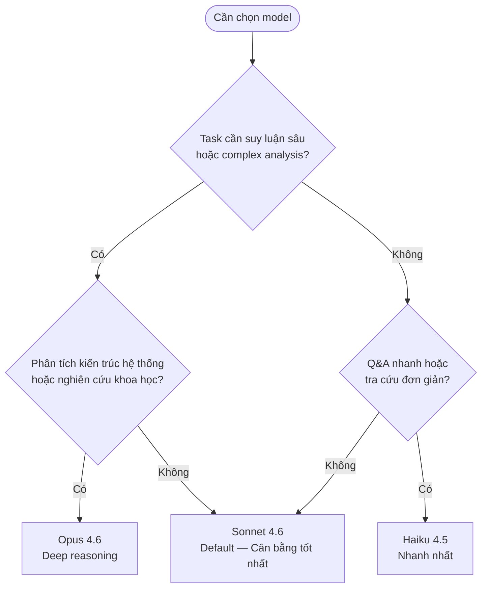

# Model Specs & Platform Data

[Snapshot 03/2026] — File này chứa thông tin thay đổi theo thời gian.
Cập nhật khi Anthropic release model mới hoặc thay đổi pricing/features.

Nguồn chính thức:
- Model specs: https://docs.anthropic.com/en/docs/about-claude/models/overview
- Pricing: https://www.anthropic.com/pricing
- Feature updates: https://www.anthropic.com/news

## Chọn Model

**Nguyên tắc đơn giản:** Nếu không chắc → dùng **Sonnet 4.6**. Switch sang Opus khi cần suy luận kiến trúc phức tạp. Switch sang Haiku chỉ khi cần trả lời nhanh, không cần độ sâu.

### Ví dụ thực tế

| Task | Model | Lý do |
|------|-------|-------|
| Đánh giá trade-off 3 thuật toán SLAM cho kho xưởng | Opus 4.6 | Cần so sánh kiến trúc, suy luận kỹ thuật sâu |
| Viết tài liệu kỹ thuật cho navigation stack | Sonnet 4.6 | Viết tài liệu — cân bằng chất lượng/tốc độ |
| Review code Python cho ROS2 node | Sonnet 4.6 | Code review — agentic task thường ngày |
| Tra cứu: Haiku 4.5 có Extended Thinking không? | Haiku 4.5 | Q&A đơn giản, cần trả lời nhanh |
| Tạo draft SOP quy trình AMR deployment | Sonnet 4.6 | Viết tài liệu có cấu trúc, không cần deep reasoning |

## Model Comparison

[Cập nhật 03/2026]

| Model | Điểm mạnh | Khi nào dùng | Tốc độ |
|-------|-----------|-------------|--------|
| **Claude Opus 4.6** | Suy luận sâu nhất, Extended thinking | Reasoning chuyên sâu: phân tích pháp lý, nghiên cứu khoa học, đánh giá kiến trúc hệ thống phức tạp | Chậm nhất |
| **Claude Sonnet 4.6** | Cân bằng tốc độ và chất lượng, Extended thinking, 1M context (beta) | Công việc hàng ngày, viết tài liệu, code review, agentic tasks và automation | Trung bình |
| **Claude Haiku 4.5** | Nhanh nhất, chi phí thấp | Q&A nhanh, tra cứu, task đơn giản | Nhanh nhất |

Sonnet và Opus đạt điểm tương đương trên agentic benchmarks. Opus chỉ vượt trội rõ ràng ở deep reasoning tasks.

**Cách chọn model:** Click tên model ở đầu conversation > Chọn model muốn dùng.

### Context Window

| Model             | Context Window                           | Tương đương                 |
| ----------------- | ---------------------------------------- | --------------------------- |
| Claude Opus 4.6   | 200,000 tokens (chuẩn), 1M tokens (beta) | 500–700 / 2,500–3,500 trang |
| Claude Sonnet 4.6 | 200,000 tokens (chuẩn), 1M tokens (beta) | 500–700 / 2,500–3,500 trang |
| Claude Haiku 4.5  | 200,000 tokens                           | 500–700 trang               |

[Nguồn: Anthropic Docs - Models Overview]

## Nguyên tắc chọn nhanh

Bắt đầu với **Sonnet 4.6** cho hầu hết công việc — bao gồm cả agentic tasks và automation workflows. Chuyển sang **Opus 4.6** chỉ khi cần suy luận rất sâu (phân tích pháp lý, nghiên cứu khoa học, multi-system architecture critique). Dùng **Haiku 4.5** cho task nhanh không cần chất lượng cao.

## Feature Availability by Plan

[Cập nhật 03/2026]

Xem pricing tại https://www.anthropic.com/pricing

| Tính năng | Free | Pro | Max | Team | Enterprise |
|-----------|------|-----|-----|------|------------|
| Chat cơ bản | Có | Có | Có | Có | Có |
| Web Search | Có | Có | Có | Có | Có |
| Artifacts | Có | Có | Có | Có | Có |
| Upload files | Có | Có | Có | Có | Có |
| Projects | 5 projects | Không giới hạn | Không giới hạn | + Shared | + Admin |
| File Creation (docx, pptx...) | Có | Có | Có | Có | Có |
| Styles (preset + custom) | Có | Có | Có | Có | Có |
| Memory | Có | Có | Có | Có | Có |
| Extended Thinking | Hạn chế | Có | Có | Có | Có |
| Chọn model | Không | Có | Có + Opus mặc định | Có | Có |
| MCP Connectors | Không | Có | Có | Có | Có |
| Research | Không | Có | Có | Có | Có |
| Dung lượng sử dụng | Thấp | 5x Free | Cao hơn | 5x Free | Custom |

> [!NOTE]
> Bảng cập nhật đến 03/2026. Anthropic thường xuyên cập nhật features — kiểm tra claude.ai cho thông tin mới nhất. Memory hiện có trên Free plan từ Q1/2026.

## Lịch sử cập nhật

| Ngày | Thay đổi |
|------|---------|
| 03/2026 | Khởi tạo — Opus 4.6, Sonnet 4.6, Haiku 4.5 |
